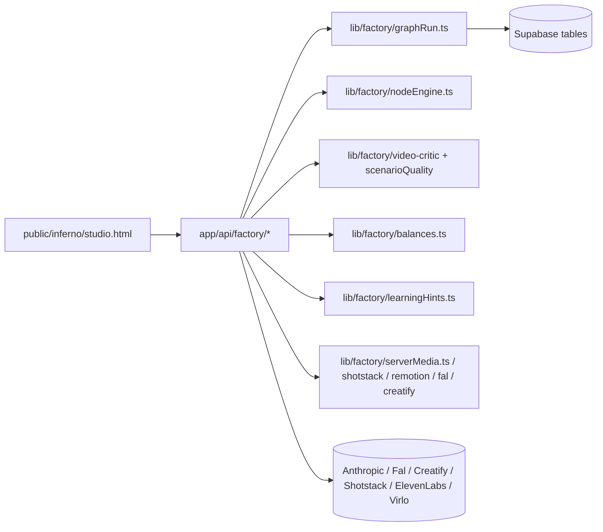

# AI Content Factory Architecture Audit

Дата аудита: 2026-06-25  
Фокус: стабильный MVP для Shorts / TikTok / Reels, а не расширение функций.

## Executive Summary

Система уже умеет собирать видео, гонять ОТК и банковать результат, но сейчас она слишком многословна сама с собой: несколько параллельных контуров запуска, несколько слоёв регенерации, legacy-экраны, batch-оркестрация и learning-контуры создают больше точек отказа, чем дают пользы для MVP.

Для MVP нужен один основной путь:

1. выбрать товар / нишу;
2. разобрать одного конкурента;
3. собрать 3-5 нод;
4. сделать preview / render;
5. пройти ОТК;
6. сохранить лучший результат в библиотеку.

Всё остальное сейчас должно либо стать пассивным, либо быть временно выключено.

## Current Architecture

### Main entry points

- `public/inferno/studio.html`
- `app/api/factory/graph-run/route.ts`
- `app/api/factory/graph-run/tick/route.ts`
- `app/api/factory/decompose/route.ts`
- `app/api/factory/video-critic/route.ts`
- `app/api/factory/balances/route.ts`
- `app/api/factory/batch/route.ts`
- `app/api/factory/batch-build/route.ts`
- `app/api/factory/self-heal/route.ts`

### Core runtime

- `lib/factory/graphRun.ts`
- `lib/factory/nodeEngine.ts`
- `lib/factory/shotstack.ts`
- `lib/factory/remotionRender.ts`
- `lib/factory/falVideo.ts`
- `lib/factory/creatify.ts`
- `lib/factory/elevenlabs.ts`
- `lib/factory/serverMedia.ts`
- `lib/factory/balances.ts`
- `lib/factory/scenarioQuality.ts`
- `lib/factory/learningHints.ts`
- `lib/factory/reelVariants.ts`
- `lib/factory/graphWatchdog.ts`
- `lib/factory/genHistory.ts`

## Component Inventory

Legend:
- MVP: must stay for the first stable release.
- Quality: directly affects the quality of the resulting ролик.
- Complexity: how much instability / maintenance overhead the component adds.
- Disable now: whether it can be turned off temporarily without breaking MVP.

### UI / surfaces

| Component | Role | MVP | Quality | Complexity | Disable now | Notes |
|---|---|---:|---:|---:|---:|---|
| `public/inferno/studio.html` | Main studio UI | Yes | High | High | No | Monolith, but it is the primary surface. Keep, but trim dead controls. |
| `public/inferno/patrick-legacy.html` | Legacy studio | No | Low | High | Yes | Legacy maintenance surface; confusing for MVP. |
| `app/inferno/*` | Content-factory pages | Mixed | Medium | Medium | Maybe | Keep only if they are actually used as part of the main flow. |
| `app/carousel/*` | Carousel editor | No | Medium | Medium | Yes | Separate format, not MVP for video stability. |
| `app/video-overlay/*` | Overlay editor | No | Medium | Medium | Yes | Useful later, not needed for the narrow MVP. |

### Orchestration / jobs

| Component | Role | MVP | Quality | Complexity | Disable now | Notes |
|---|---|---:|---:|---:|---:|---|
| `app/api/factory/graph-run/*` | Main graph executor | Yes | High | High | No | This is the core loop; simplify, do not multiply entry points. |
| `app/api/factory/graph-run/tick` | One-step runner | Yes | High | High | No | Keep one self-chaining path. |
| `app/api/factory/graph-run/cron` | Safety cron | Yes | Medium | Medium | No | Keep as fallback only; Sprint 1 rescue is sequential and capped to a small batch. |
| `app/api/factory/graph-run/watchdog` | Wake stale runs | Maybe | Medium | High | Yes, partly | Useful, but can create duplicate wakeups. In Sprint 1 it is reduced to a disabled stub route. |
| `app/api/factory/self-heal` | Manual repair helper | Maybe | Medium | Medium | Yes | Good ops tool, not core MVP flow. In Sprint 1 it is reduced to a disabled stub route. |
| `app/api/factory/batch` | Batch generation | No | Medium | High | Yes | Too much combinatorics and failure amplification for MVP. |
| `app/api/factory/batch-build` | Batch drafting | No | Medium | High | Yes | Same story: useful later, not for first stable loop. In Sprint 1 it is reduced to a disabled stub route, same for `batch-build/tick`. |
| `app/api/factory/jobs/*` | Old pipeline queue | No | Low | Low | Already | Legacy self-chaining pipeline overlapped with graph-run. Repo-level callers are removed, routes are now disabled stubs, and the remaining work is doc cleanup rather than runtime stabilization. |

### Content intelligence / analysis

| Component | Role | MVP | Quality | Complexity | Disable now | Notes |
|---|---|---:|---:|---:|---:|---|
| `app/api/factory/decompose` | Competitor to typed nodes | Yes | High | Medium | No | Important for workflow entrance. |
| `app/api/factory/video-critic` | OTK / quality gate | Yes | High | High | No | Must stay, but harden its failure handling. |
| `app/api/factory/artifact-check` | Visual artifact gate | Yes | High | Medium | No | Keep, but only once per render path. |
| `app/api/factory/scenario-quality` | Text gate | Maybe | Medium | Medium | Yes | Useful for text-only pipelines, not core stable render loop. |
| `app/api/factory/scenario-rewrite` | Rewrite weak сценарий | Maybe | Medium | Medium | Yes | Nice-to-have, but adds another LLM failure point. In Sprint 1 it is reduced to a disabled stub route. |
| `app/api/factory/hook-judge` | Hook tournament | Maybe | Medium | Medium | Yes | Not required to reach 10 stable runs. In Sprint 1 it is reduced to a disabled stub route. |
| `app/api/factory/variations` / `recipe-variants` | Variant generation | No | Medium | High | Yes | A/B logic, not MVP. In Sprint 1 both are reduced to disabled stub routes. |
| `app/api/factory/assistant` | Conversational guide | No | Low | Medium | Yes | Not part of the production path. |

### Persistence / ops

| Component | Role | MVP | Quality | Complexity | Disable now | Notes |
|---|---|---:|---:|---:|---:|---|
| `app/api/factory/gen-save` | Store finished media | Yes | High | Medium | No | Essential library sink. |
| `app/api/factory/winners` / `reject` | Human feedback loop | Yes | High | Medium | No | Keep because it closes the learning loop. |
| `app/api/factory/generation-history` | Lineage / attempt history | No, but desirable | Medium | Medium | Maybe | Strong candidate for next refactor, because dedupe kills history. |
| `app/api/factory/post-metrics` | Real market signal | Later | High | Medium | Yes | Important strategically, but not needed for MVP stability. |
| `app/api/factory/observer` | Read-only ops dashboard | Maybe | Low | Low | Yes | Nice for visibility, not core. |
| `app/api/factory/balances` | Spend / balance guard | Yes | High | Medium | No | Keep, but avoid turning it into a second control plane. |
| `app/api/factory/worker-state` | Worker heartbeat | Maybe | Low | Low | Yes | Operationally useful, not required for MVP output. |

### External tool adapters

| Component | Role | MVP | Quality | Complexity | Disable now | Notes |
|---|---|---:|---:|---:|---:|---|
| `lib/factory/falVideo.ts` | video generation | Yes | High | High | No | One of the core spend centers. |
| `lib/factory/creatify.ts` | UGC / avatar generation | Yes | High | High | No | Keep only the parts actually used in MVP. |
| `lib/factory/shotstack.ts` | assembly | Yes | High | High | No | Stable path for MVP. |
| `lib/factory/remotionRender.ts` | alt render engine | No for MVP | Medium | High | Yes | Keep behind feature flag only. |
| `lib/factory/elevenlabs.ts` | voiceover | Maybe | High | Medium | Maybe | Keep if voiceover is part of the MVP format; otherwise gate it off. |
| `lib/factory/serverMedia.ts` | frame extraction / media utils | Yes | High | Medium | No | Needed for OTK and artifact check. |
| `lib/factory/assetBind.ts` | auto-binding assets | Yes | High | Medium | No | Good utility, but can be simplified. |
| `lib/factory/learningHints.ts` | prompt grounding | Maybe | Medium | Medium | Yes | Helpful, but not essential for stability. |
| `lib/factory/reelVariants.ts` | variant management | No | Medium | Medium | Yes | Not MVP. |
| `lib/factory/graphWatchdog.ts` | stale-run wakeup | Maybe | Medium | High | Yes, partly | Keep only one wake mechanism. |
| `lib/factory/genHistory.ts` | generation journal | Soon | Medium | Medium | No | Very useful next step: stop losing iteration lineage. |

## What is likely redundant or harmful right now

### Redundant / overlapping

- Historical finding: `graph-run`, `jobs/tick`, `batch`, and `batch-build` used to read like competing self-chaining orchestration layers; Sprint 1 keeps `graph-run` as the runtime runner, with legacy jobs disabled and batch-build stubbed.
- `graph-run/route` and `graph-run/tick` both know how to wake the chain.
- historically `self-heal`, `watchdog`, cron, and GET-based resurrection all poked the same run loop;
- Sprint 1 repo-truth now removes GET-based resurrection and leaves only `graph-run/tick` self-chain plus cron fallback as active wake paths.
- `scenario-quality`, `scenario-rewrite`, `hook-judge`, `variations`, `recipe-variants` sit on top of the same idea-gate layer and are not needed for a stable MVP.
- `assistant` is a conversation layer, not a production control surface.

### Likely sources of instability

- Multiple wake sources for the same recipe can collide and create duplicate work.
- Regen-on-fail is useful, but it can become a loop if the culprit selection keeps landing on the same bad node.
- The current system mixes “pipeline orchestration” and “product guidance” too tightly.
- Large monolithic UI state in `studio.html` increases the chance of hidden dead branches and stale controls.

## Failure Handling Audit

### 1) Empty LLM responses

Observed pattern:
- `decompose` returns an error if Claude does not produce nodes.
- `video-critic` has schema/tool-use protection, but still falls back to loose JSON parsing and can 502.
- `scenario-rewrite` falls back to heuristic rewrite if Claude fails.
- `assistant` retries once without streaming.

Risk:
- Empty or partial responses can stop the run, or worse, produce inconsistent state depending on the route.

Fix:
- Introduce one shared wrapper for LLM calls:
  - timeout;
  - one retry;
  - strict JSON mode when possible;
  - classification of retryable vs fatal errors;
  - compact error object written into the run plan.

Priority: P0 for routes in the main render path, P1 for helper routes.

### 2) Invalid JSON

Observed pattern:
- `video-critic` already uses tool-use schema plus a loose parser fallback.
- `decompose` and `scenario-rewrite` rely on post-hoc JSON extraction.

Risk:
- Loose JSON parsing can silently accept malformed output, which then flows into node graphs or OTK state.

Fix:
- Make schema-validated tool-use the default for every route that expects structured output.
- Keep loose parsing only as a last-resort compatibility fallback, never as the primary path.

Priority: P0 for `decompose` and `video-critic`, P1 elsewhere.

### 3) Timeouts

Observed pattern:
- `graph-run` has multiple long-running steps and re-entry points.
- `balances` already caps live API work at ~9s per service.
- `after()` is used to continue the chain asynchronously.

Risk:
- Long requests can die mid-step, leaving the system half-written and then resurrected from several places.

Fix:
- Reduce the number of async continuation points.
- One self-chain mechanism per queue is enough.
- Keep a single cron fallback.
- Prefer idempotent step writes and explicit step status over background side effects.

Priority: P0/P1 depending on the route.

### 4) API errors

Observed pattern:
- `balances.ts` is already best-effort and falls back to snapshots.
- `decompose`, `video-critic`, `gen-save`, and `shotstack` return a hard error if the upstream service fails.

Risk:
- Upstream errors are currently mixed with domain failures.

Fix:
- Standardize error shape:
  - `retryable`;
  - `service`;
  - `step`;
  - `message`.
- Persist the last error in `run_plan.error`.

Priority: P1.

### 5) Infinite regeneration loops

Observed pattern:
- `graphRun` has regen-on-fail logic with a `MAX_RENDERS` ceiling.
- The same run can be resumed by multiple wake mechanisms.

Risk:
- The render budget is bounded, but the orchestration layer still has enough moving parts to make failures look random.

Fix:
- Keep only one active wake source for the main queue.
- Ensure every regen path decrements the same budget and writes the culprit / reason into the plan.
- If the same node fails twice, stop and surface the root cause instead of re-trying the same idea forever.

Priority: P0.

### 6) OTK crashes / weak verdicts

Observed pattern:
- `video-critic` can fail on empty frames, empty JSON, or API issues.
- `graphRun` will often treat critic failure as a step failure, then retry the step several times.

Risk:
- If OTK fails, the whole run can get stuck between “render done” and “bank”.

Fix:
- Distinguish:
  - render failure;
  - OTK failure;
  - artifact failure;
  - bank failure.
- Never hide a successful render behind a broken OTK step without preserving the output.

Priority: P0.

## Known issues worth keeping on the radar

- `app/api/factory/products/route.ts` previously loaded a heavy analysis blob and caused memory pressure; that has already been corrected by selecting lighter fields only.
- `graphRun` currently contains a lot of business policy in the executor itself. That is workable, but it should be reduced to a minimal scheduler + step engine over time.
- `public/inferno/studio.html` still contains legacy labels and latent UI branches. They are not necessarily bugs, but they do increase maintenance cost.

## Recommended MVP Architecture

### Keep

- `public/inferno/studio.html`
- `app/api/factory/decompose`
- `app/api/factory/graph-run`
- `app/api/factory/graph-run/tick`
- `app/api/factory/video-critic`
- `app/api/factory/artifact-check`
- `app/api/factory/gen-save`
- `app/api/factory/winners`
- `app/api/factory/reject`
- `app/api/factory/balances`
- `lib/factory/graphRun`
- `lib/factory/nodeEngine`
- `lib/factory/shotstack`
- `lib/factory/falVideo`
- `lib/factory/creatify`
- `lib/factory/serverMedia`
- `lib/factory/assetBind`
- `lib/factory/elevenlabs` if voiceover is part of the MVP format

### Temporarily disable or keep dark

- `app/api/factory/batch`
- `app/api/factory/batch-build`
- `app/api/factory/jobs/*`
- `app/api/factory/scenario-quality`
- `app/api/factory/scenario-rewrite`
- `app/api/factory/hook-judge`
- `app/api/factory/variations`
- `app/api/factory/recipe-variants`
- `app/api/factory/assistant`
- `app/api/factory/post-metrics`
- `app/api/factory/self-heal`
- `app/api/factory/observer`
- `lib/factory/remotionRender` unless the feature flag is explicitly needed
- `lib/factory/reelVariants`
- `lib/factory/learningHints` if prompt length or instability becomes a problem

### Suggested minimal flow

1. Product / niche selection.
2. Competitor decompose.
3. Manual adjustment of 3-5 nodes.
4. One preview cache keyed by node hash.
5. One generation run.
6. Artifact check.
7. OTK.
8. Bank into `gen-save`.
9. Human feedback via `winners` / `reject`.

## Step-by-step Refactor Plan

### Phase 1. Stabilize the loop

- Reduce the main queue to one wake path plus one cron fallback.
- Remove duplicated resurrection logic from non-essential endpoints.
- Make every step write an explicit error classification.
- Preserve the best render even when later steps fail.

### Phase 2. Remove dead weight

- Turn off batch and batch-build for MVP.
- Hide legacy assistant and old pipeline surfaces from the primary navigation.
- Leave the routes on disk if needed, but keep them out of the default flow.
- Where a route is intentionally off for Sprint 1, prefer a tiny disabled stub over a full legacy implementation hidden behind an early return.
- For `jobs/*`, the runtime migration is now done: `patrick-legacy.html` and `/api/sync/all` no longer depend on that queue, routes are stubbed, and the remaining safe work is deleting stale roadmap/spec language.
- The concrete migration sequence is tracked in [`docs/factory-jobs-migration-backlog.md`](/Users/maksimpankratov/finance-panel/docs/factory-jobs-migration-backlog.md).

### Phase 3. Simplify the data model

- Add or use a generation history table so attempts are not lost to dedupe.
- Keep `cf_signals` as the event log, but do not use it as a second control plane.
- Preserve lineage between original competitor, recipe, render, OTK, and banked asset.

### Phase 4. Tighten LLM contracts

- Use schema-validated structured output everywhere structured output is expected.
- Normalize LLM failures into one error format.
- Add bounded retries only where the retry is actually meaningful.

### Phase 5. Re-enable only what proves value

- Re-enable batch only after the single-run path reaches 10 successful runs.
- Re-enable quality helpers only when they reduce manual work instead of adding ambiguity.
- Re-enable learning / A/B machinery only once there is enough real signal.

## Prioritized Findings

### P0 Initial Risks

- Multiple wake / self-heal paths can collide and create duplicate work.
- Regen-on-fail needs a single budget and a hard stop.
- OTK failures must not erase successful renders or create dead-end runs.
- Main render path LLM calls need strict structured-output handling.

Sprint 1 status:

- Closed for the MVP path in the current working set.
- Current verification and remaining watchlist live in [`STABILITY_REPORT.md`](/Users/maksimpankratov/finance-panel/STABILITY_REPORT.md).
- The remaining production-like validation is HTTP smoke/stress in a normal runtime; this sandbox blocks localhost bind with `listen EPERM`.

### P1 Initial Risks

- Batch / batch-build are too heavy for the MVP loop.
- Legacy `jobs/*` pipeline duplicates orchestration logic.
- `scenario-quality`, `scenario-rewrite`, `hook-judge`, and variants helpers are additional failure surfaces.
- Error classification is inconsistent across routes.
- historical `jobs/*` mentions still preserve the old two-pipeline story in docs, even though runtime has already been simplified.

Sprint 1 status:

- Batch/build/variant/rewrite/helper surfaces are disabled or fail-open for MVP where they are not required for MP4.
- Legacy `jobs/*` live callers were removed or reduced to compatibility contracts.
- Error classification and ops/stress context are covered by `ops`, `stability`, `worker-state`, `execution_log`, and factory unit guards.
- T-003 `scenario-rewrite` remains intentionally deferred because it increases LLM failure surface and is not required for MP4.

### P2 Current Direction

- `generation-history` should exist as a proper lineage record.
- `observer` and other dashboard-only endpoints are useful but nonessential.
- Prompt grounding helpers are helpful, but only after stability is proven.

## Bottom line

The system does not need more agents right now. It needs fewer moving parts, one canonical run loop, and a strict separation between:

- orchestration;
- LLM judgment;
- persistence;
- human approval.

The shortest path to a stable MVP is to keep the single-run content factory sharp and temporarily put the rest into the garage.
