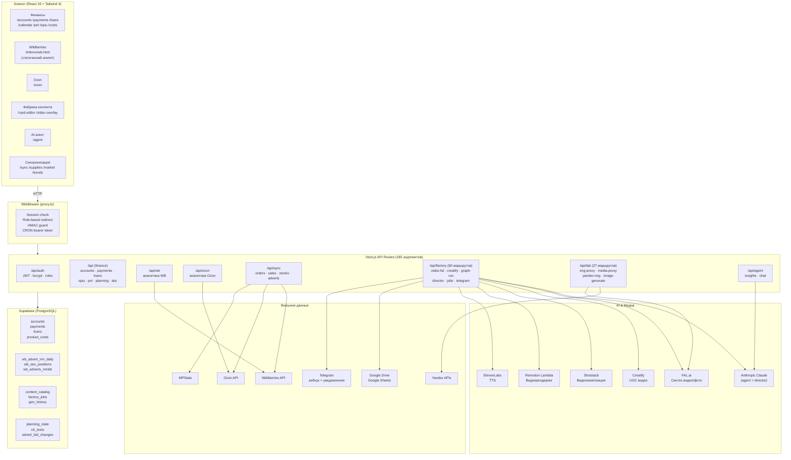
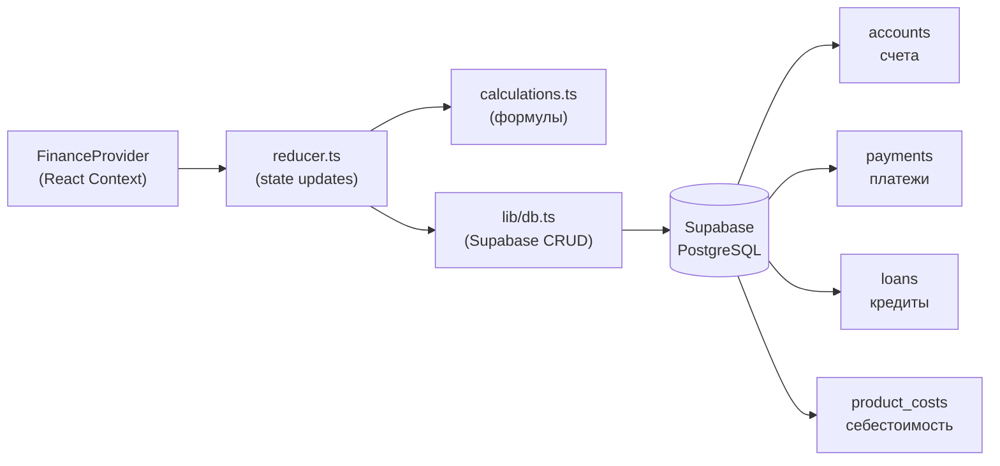
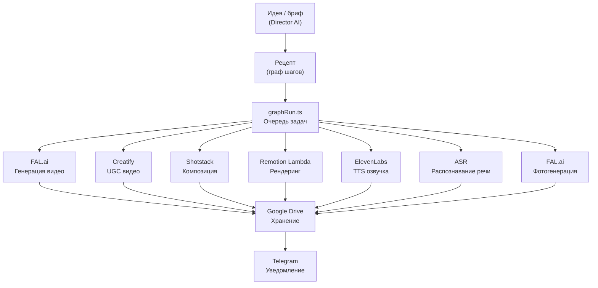
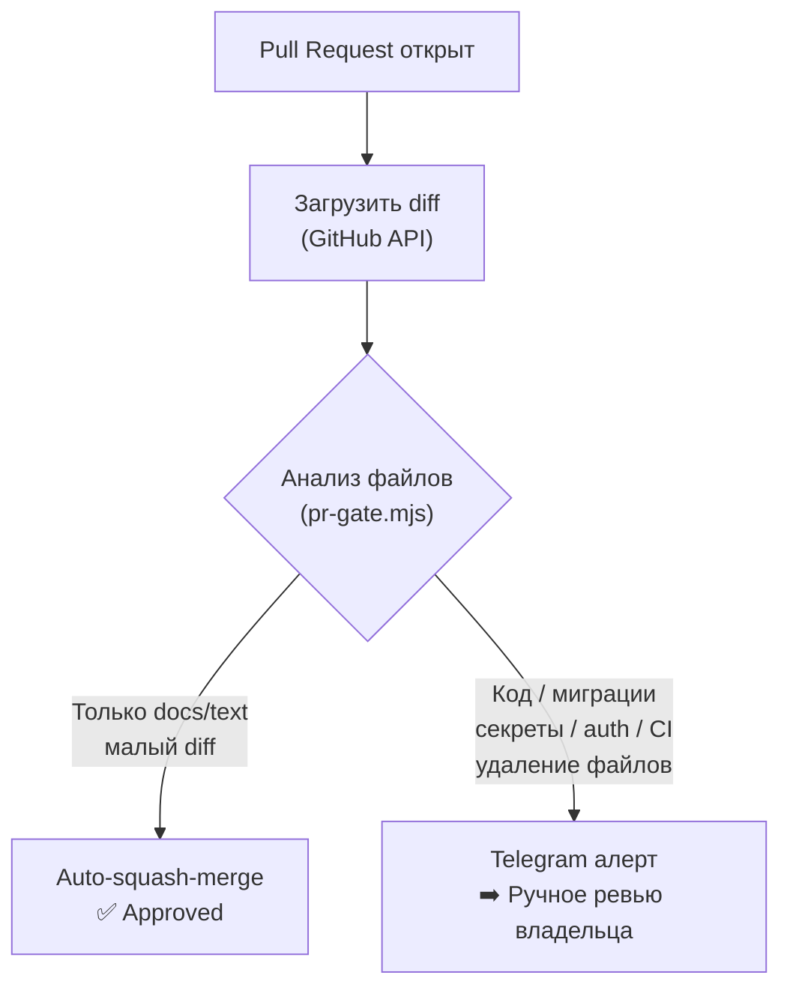

# Структура репозитория Finance-Panel

> Платформа аналитики маркетплейсов и финансового управления на Next.js 16 (App Router).  
> Русскоязычный интерфейс, мультикабинетная архитектура, AI-агент на Claude.

---

## Архитектурная схема



---

## Стек технологий

| Слой | Технология | Версия |
|------|-----------|--------|
| Фреймворк | Next.js (App Router) | 16.2.7 |
| UI | React | 19.2.4 |
| Стили | Tailwind CSS | 4 |
| Иконки | Lucide React | 1.17.0 |
| Графики | Recharts | 3.8.1 |
| База данных | Supabase (PostgreSQL) | 2.108.0 |
| JWT | jose | 6.2.3 |
| Пароли | bcryptjs | 3.0.3 |
| AI (текст) | Anthropic Claude SDK | 0.104.1 |
| AI (видео) | FAL.ai, Creatify, Shotstack | — |
| AI (TTS) | ElevenLabs | — |
| Видеорендер | Remotion / Remotion Lambda | 4.0.477 |
| HTTP клиент | undici | 8.4.1 |
| Язык | TypeScript | 5 |
| Деплой | Vercel | — |
| CI/CD | GitHub Actions (AI-gate) | — |

---

## Структура папок

```
/
├── app/                          # Next.js App Router
│   ├── layout.tsx                # Корневой layout
│   ├── page.tsx                  # Главная / Dashboard
│   ├── api/                      # 185 API-маршрутов
│   │   ├── auth/                 # Логин, логаут, сессия, статус
│   │   ├── agent/                # AI-агент (Claude, insights)
│   │   ├── factory/              # Фабрика контента (60 маршрутов)
│   │   ├── lab/                  # Лаборатория (27 маршрутов)
│   │   ├── sync/                 # Синхронизация данных
│   │   ├── wb/                   # Wildberries аналитика
│   │   ├── ozon/                 # Ozon аналитика
│   │   ├── opiu/                 # П&У (прибыль и убытки)
│   │   ├── planning/             # Финансовое планирование
│   │   ├── adverts/              # Управление рекламой
│   │   ├── seo/                  # SEO-позиции
│   │   ├── cabinets/             # Мультикабинеты
│   │   └── ...                   # abc, market, trends, unit, rnp
│   │
│   ├── accounts/                 # Счета
│   ├── payments/                 # Платежи / ДДС
│   ├── loans/                    # Кредиты
│   ├── calendar/                 # Платёжный календарь
│   ├── pnl/                      # P&L детализация
│   ├── opiu/                     # ОПиУ по продуктам
│   ├── costs/                    # Затраты
│   ├── ozon/                     # Ozon кабинет
│   ├── sync/                     # UI синхронизации
│   ├── supplies/                 # Снабжение
│   ├── agent/                    # AI-агент UI
│   ├── card-editor/              # Редактор карточек
│   ├── video-overlay/            # Видеоредактор
│   ├── market/                   # Анализ рынка
│   ├── trends/                   # Тренды
│   ├── users/                    # Управление командой
│   └── login/                    # Авторизация
│
├── components/                   # React-компоненты
│   ├── AppLayout.tsx             # Обёртка с Sidebar
│   ├── Sidebar.tsx               # Навигация
│   ├── CabinetSwitcher.tsx       # Переключатель кабинетов
│   ├── FinanceTabs.tsx           # Финансовые вкладки
│   ├── providers/
│   │   └── FinanceProvider.tsx   # Глобальный стейт финансов
│   ├── payments/                 # Компоненты платежей
│   ├── accounts/                 # Компоненты счетов
│   ├── loans/                    # Компоненты кредитов
│   ├── opiu/                     # Компоненты ОПиУ
│   ├── analytics/                # Графики, таблицы
│   ├── agent/                    # AI-агент UI
│   └── ui/                       # Базовые UI-элементы
│
├── lib/                          # Бизнес-логика и утилиты
│   ├── db.ts                     # Supabase CRUD
│   ├── reducer.ts                # Finance state reducer
│   ├── calculations.ts           # Финансовые расчёты
│   ├── constants.ts              # Категории, типы, метки
│   ├── types.ts                  # TypeScript-типы
│   ├── supabase.ts               # Supabase client
│   ├── supabaseAdmin.ts          # Admin client
│   ├── internalFetch.ts          # Внутренний fetcher
│   ├── auth/                     # Авторизация
│   │   ├── session.ts            # JWT HS256
│   │   ├── apiGuard.ts           # API-мидлвар
│   │   ├── roles.ts              # RBAC
│   │   ├── proxyAuth.ts          # HMAC валидация
│   │   └── proxySign.ts          # HMAC подпись
│   ├── agent/                    # AI-агент
│   │   ├── client.ts             # Anthropic SDK
│   │   ├── gatherContext.ts      # Сбор контекста
│   │   └── rules.ts              # Системный промпт
│   ├── factory/                  # Фабрика контента (27 модулей)
│   │   ├── graphRun.ts           # Граф вычислений
│   │   ├── nodeEngine.ts         # Node-движок
│   │   ├── jobs.ts               # Очередь задач
│   │   ├── creatify.ts           # Creatify API
│   │   ├── falVideo.ts           # FAL.ai видео
│   │   ├── shotstack.ts          # Shotstack
│   │   ├── remotionRender.ts     # Remotion
│   │   ├── elevenlabs.ts         # TTS
│   │   ├── asr.ts                # Распознавание речи
│   │   ├── brandKit.ts           # Бренд-кит
│   │   ├── rehostImage.ts        # Рехостинг фото
│   │   ├── contentDisks.ts       # Google Drive
│   │   ├── telegram.ts           # Telegram
│   │   └── toolSchemas.ts        # Tool-схемы для Claude
│   ├── opiu/                     # П&У расчёты
│   ├── sync/                     # Синхронизация
│   ├── wb/                       # WB интеграция
│   ├── ozon/                     # Ozon интеграция
│   ├── mpstats/                  # MPStats клиент
│   ├── llm/                      # Gemini, OpenRouter
│   ├── google/                   # Google Drive/Sheets
│   ├── yandex/                   # Yandex APIs
│   ├── fal/                      # FAL.ai клиент
│   └── xlsx/                     # Excel-экспорт
│
├── public/
│   ├── inferno/
│   │   ├── wb.html               # Статический кокпит WB
│   │   ├── patrick.html          # Статический кокпит Patrick
│   │   └── studio.html           # Studio UI
│   ├── fonts/                    # Шрифты
│   ├── lab/                      # Лаб-ассеты
│   └── share/                    # Публичный шаринг
│
├── supabase/
│   ├── schema.sql                # Базовая схема БД
│   └── migrations/               # 18+ SQL-миграций
│
├── remotion/                     # Конфиг видеорендеринга
├── render-service/               # Сервис рендеринга
├── tools/
│   └── account-runner/           # Anti-ban изоляция (Python + Playwright)
├── scripts/
│   └── pr-gate.mjs               # AI PR-гейт
├── docs/                         # Документация (25 файлов)
├── .agents/skills/               # 38 кастомных навыков Claude Code
├── .github/workflows/
│   └── ai-gate.yml               # CI: двухуровневый AI-гейт
├── proxy.ts                      # Next.js middleware
├── vercel.json                   # Vercel config
└── .mcp.json                     # MCP: Virlo интеграция
```

---

## Модуль RITA / AI-агент

RITA — это имя пользователя-владельца репозитория (`git user: RITA`). Самостоятельного бота с таким именем нет, но в системе реализованы несколько AI-компонентов:

### 1. Аналитический AI-агент (`/agent`)

```
lib/agent/
├── client.ts          → Anthropic SDK, модель claude-*
├── gatherContext.ts   → собирает данные WB/Ozon/финансы
└── rules.ts           → системный промпт аналитика маркетплейсов

app/api/agent/route.ts → POST: анализ / чат
app/api/agent/insights → GET: кэшированные инсайты
```

**Что делает:** принимает контекст (SKU, заказы, реклама, финансы) → возвращает список инсайтов с уровнями `info / warning / critical` по модулям `ads | supplies | finance | analytics`.

### 2. Director Cockpit (`/api/factory/director`)

AI-агент для творческого управления фабрикой контента. Claude генерирует:
- Креативные брифы и хуки
- Скрипты для видео
- Оркестрирует Creatify / FAL.ai / Shotstack

### 3. Node-граф (`lib/factory/graphRun.ts`)

Детерминированный граф выполнения задач (рецептов). Поддерживает:
- Параллельные шаги
- Повторный запуск зависших задач (cron-страховка)
- Привязку к брендовым активам

### 4. Account Runner (`tools/account-runner/`)

Python-скрипт на базе Playwright + ShardBrowser для изоляции fingerprint аккаунтов. Статус: прототип.

---

## Модуль Finance-Panel (ДДС и финансы)



### Страницы и их назначение

| Страница | Путь | Функция |
|----------|------|---------|
| Счета | `/accounts` | Банк, маркетплейс, касса. Балансы. |
| Платежи / ДДС | `/payments` | Доходы/расходы по категориям, статусы |
| Кредиты | `/loans` | Учёт займов, ежедневные проценты |
| Календарь | `/calendar` | Расписание предстоящих платежей |
| P&L | `/pnl` | Детализированный отчёт прибыли/убытков |
| ОПиУ | `/opiu` | П&У по продуктам/категориям, понедельно |
| Затраты | `/costs` | Управление статьями расходов |
| Планирование | `/api/planning` | Финансовый план |
| АВС-анализ | `/abc` | Рентабельность по SKU |

### Схема базы данных (основные таблицы)

```sql
accounts      (id, name, type, currency, balance, created_at)
payments      (id, name, amount, type, category, account_id, date, status, counterparty)
loans         (id, creditor, principal, rate_per_day, start_date, due_date, status)
product_costs (article PK, wb_barcode, brand, name, cost_rub, warehouse_expenses)
opiu_warehouse_costs (entity, month, week_start PK, amount)
```

### Авторизация и роли

| Роль | Доступ |
|------|--------|
| `director` | Полный доступ ко всем страницам |
| `finance` | Финансовые страницы (ДДС, кредиты, счета, P&L) |
| `manager` | Операционные страницы |

Сессия: `fp_session` (cookie, httpOnly, 7 дней, JWT HS256).

---

## Фабрика контента



---

## CI/CD: AI PR-гейт



---

## Что можно доработать через голосового ассистента (RITA)

Ниже — конкретные точки интеграции голосового управления:

### 1. Голосовой ввод платежей
**Эндпоинт:** `POST /api/payments` (через `lib/db.ts`)  
**Сценарий:** "Запиши расход 15 000 рублей, Яндекс Логистика, склад"  
→ ASR → intent-парсинг через Claude → создание записи в `payments`

### 2. Голосовые инсайты агента
**Эндпоинт:** `POST /api/agent`  
**Сценарий:** "Что происходит с рекламой этой недели?"  
→ TTS ответ через ElevenLabs (уже интегрирован в `lib/factory/elevenlabs.ts`)

### 3. Голосовое управление фабрикой
**Эндпоинт:** `POST /api/factory/director`  
**Сценарий:** "Сделай видео для артикула 123456 в стиле lifestyle"  
→ Голос → Claude Director → запуск графа рецепта → уведомление в Telegram

### 4. Голосовой статус кабинета
**Эндпоинт:** `GET /api/agent/insights` + `/api/sync/`  
**Сценарий:** "Покажи сводку по продажам за вчера"  
→ Сбор данных из уже работающего `gatherContext.ts` → TTS-ответ

### 5. Голосовые уведомления через Telegram
**Эндпоинт:** `POST /api/factory/telegram`  
**Инфраструктура уже есть** — Telegram webhook настроен.  
Достаточно добавить обработку voice-messages (Telegram поддерживает audio/voice) + пайплайн ASR → intent.

### 6. Голосовое планирование
**Эндпоинт:** `POST /api/planning`  
**Сценарий:** "Запланируй закупку на 20 июля, 500 000 рублей"  
→ Распознавание дат и сумм → запись в `planning_state`

---

## Переменные окружения (необходимые)

| Переменная | Назначение |
|-----------|-----------|
| `AUTH_SECRET` | JWT-секрет для сессий |
| `CRON_SECRET` | Bearer-токен для машина-машина |
| `SUPABASE_URL` | URL базы данных |
| `SUPABASE_KEY` | Ключ Supabase |
| `ANTHROPIC_API_KEY` | Claude AI |
| `VIRLO_TOKEN` | MCP-интеграция Virlo |
| Прочие | FAL, Creatify, Shotstack, ElevenLabs, Google, Telegram API-ключи |

---

*Документ сгенерирован 2026-06-22 на основе полного анализа репозитория.*
