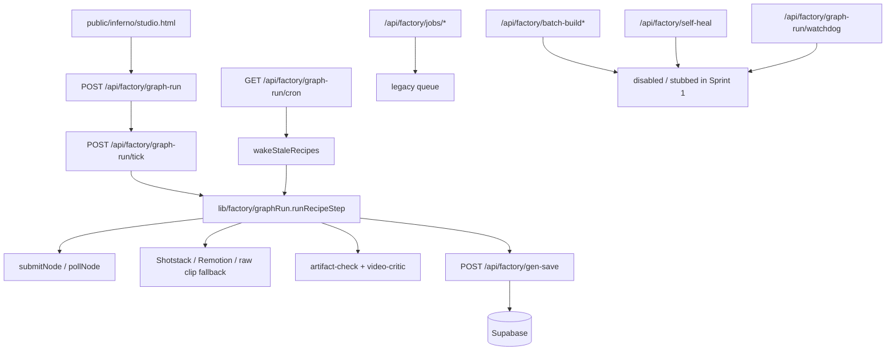

# System Execution Map

Дата: 2026-06-25  
Спринт: `Sprint 1 — Stabilization First`

## Scope

Карта покрывает только контент-завод и только исполняющий контур, который влияет на выпуск MP4:

- точки входа;
- cron-задачи;
- watchdog/self-heal/resurrection;
- полный путь одного ролика;
- места записи состояния;
- места, где прогон может сломаться.

## High-Level Picture

## Primary MP4 Path

### 1. Studio launch

Node: `public/inferno/studio.html`

- Who calls it:
  - Browser / user.
- Who it calls:
  - `/api/factory/products`
  - `/api/factory/decompose`
  - `/api/factory/recipes`
  - `/api/factory/graph-run`
  - `/api/factory/graph-run?recipe_id=...`
  - `/api/factory/balances`
  - helper routes like `node-preview`, `tool-schema`, `worker-state`.
- What it saves:
  - Nothing directly, except via called routes.
- What can break:
  - Broken JS state in monolithic page.
  - UI controls calling disabled helper routes.
  - Stale state if route responses differ from expected shape.

### 2. Create recipe

Node: `POST /api/factory/recipes`

- Who calls it:
  - `studio.html`
  - batch builders in legacy/disabled paths.
- Who it calls:
  - Supabase inserts into `node_recipes`
  - Supabase inserts into `node_recipe_nodes`
- What it saves:
  - recipe head
  - recipe nodes
  - `graph_doc`
- What can break:
  - missing `template_id` or `nodes`
  - schema mismatch in `node_recipes` / `node_recipe_nodes`
  - malformed transferred node payloads

### 3. Start graph execution

Node: `POST /api/factory/graph-run`

- Who calls it:
  - `studio.html`
  - `/api/factory/batch` in batch mode
- Who it calls:
  - `buildRunPlan(...)`
  - `POST /api/factory/graph-run/tick`
- What it saves:
  - `node_recipes.run_plan`
  - `node_recipes.status = running`
  - resets `otk_verdict`, `otk_score`, `output_url`, `render_id`
  - Sprint 1: `run_id`, `warnings`, `execution_log`
- What can break:
  - recipe not found
  - recipe has no nodes
  - Supabase write failure
  - tick kick-off failure

### 4. Tick executor

Node: `POST /api/factory/graph-run/tick`

- Who calls it:
  - `/api/factory/graph-run`
  - itself via self-chain
- Who it calls:
  - `claimNextRecipe(...)`
  - `runRecipeStep(...)`
  - itself again via `internalFetch`
- What it saves:
  - updates `run_plan`
  - updates `status`
  - increments step `attempts` on crash
- What can break:
  - claim race
  - continuation interruption between ticks
  - run step throwing before state is persisted
- Sprint 1 note:
  - тик больше не зависит от `after()` как от единственного способа продолжения;
  - один шаг выполняется синхронно, а зависший ран может быть разбужен только через self-chain `graph-run/tick` или cron fallback;
  - `GET /api/factory/graph-run` теперь read-only и не участвует в orchestration.

## Core Execution Path

### Node: `lib/factory/graphRun.ts`

This is the real state machine. Current steps:

1. `autofill`
2. `submit`
3. `gen-poll`
4. `assemble`
5. `render-submit`
6. `render-poll`
7. `otk`
8. `bank`
9. `done` / `failed`

### Step: `autofill`

- Who calls it:
  - `graph-run/tick`
- Who it calls:
  - `/api/factory/autofill`
  - Supabase re-read of `node_recipe_nodes`
- What it saves:
  - rebuilt `plan.nodes`
  - `step = submit`
  - execution log row
- What can break:
  - autofill route timeout
  - Supabase read failure
  - malformed autofill output
- Sprint 1 note:
  - still enabled, but best-effort only

### Step: `submit`

- Who calls it:
  - `graph-run/tick`
- Who it calls:
  - `autoBindAssets(...)`
  - `submitNode(...)`
  - external adapters: Fal / Creatify / ElevenLabs
- What it saves:
  - per-node `token`, `status`, `url`, `error`
  - `renderCount`
  - `step = gen-poll`
  - execution log row
- What can break:
  - missing asset binding
  - external provider reject
  - per-node bad params
  - duplicate submit if token persistence fails

### Step: `gen-poll`

- Who calls it:
  - `graph-run/tick`
- Who it calls:
  - `pollNode(...)`
- What it saves:
  - node done/error states
  - `pollCount`
  - `step = assemble` or `failed`
  - execution log row
- What can break:
  - provider polling timeout
  - no nodes complete
  - partial progress lost if run plan is overwritten

### Step: `assemble`

- Who calls it:
  - `graph-run/tick`
- Who it calls:
  - `persistClips(...)`
  - `buildReelProps(...)`
  - `buildEdit(...)`
  - Shotstack / Remotion decision logic
- What it saves:
  - `backup_url`
  - `edit_json`
  - `render_engine`
  - `step = render-submit` or direct `otk`
  - execution log row
- What can break:
  - zero visual nodes
  - missing Shotstack
  - missing Remotion service
  - invalid edit JSON
- Sprint 1 note:
  - fail-open fallback now prefers raw clip if renderer path is unavailable

### Step: `render-submit`

- Who calls it:
  - `graph-run/tick`
- Who it calls:
  - `shotstackSubmit(...)`
  - `remotionSubmit(...)`
- What it saves:
  - `render_id`
  - `step = render-poll`
  - or `output_url = backup_url` on fail-open fallback
  - execution log row
- What can break:
  - renderer rejects request
  - render service unavailable
  - missing `edit_json`

### Step: `render-poll`

- Who calls it:
  - `graph-run/tick`
- Who it calls:
  - `shotstackStatus(...)`
  - `remotionStatus(...)`
- What it saves:
  - `output_url`
  - `pollCount`
  - `step = otk`
  - or fallback to `backup_url`
  - execution log row
- What can break:
  - timeout
  - non-retryable renderer error
  - provider status drift

### Step: `otk`

- Who calls it:
  - `graph-run/tick`
- Who it calls:
  - `extractFrames(...)`
  - `/api/factory/artifact-check`
  - `/api/factory/video-critic`
- What it saves:
  - `otk_verdict`
  - `otk_score`
  - `warnings`
  - `bestScore` / `bestUrl`
  - `step = bank`
  - execution log row
- What can break:
  - frame extraction failure
  - artifact-check failure
  - critic failure
  - malformed critic output
- Sprint 1 note:
  - switched from `fail closed` to `fail open`
  - failures become warnings, run continues
  - regen-on-fail behavior removed from the primary path

### Step: `bank`

- Who calls it:
  - `graph-run/tick`
- Who it calls:
  - `/api/factory/gen-save`
  - `logSignal(...)`
  - optional Telegram review
- What it saves:
  - final catalog asset
  - final recipe status
  - warning state if quality checks failed
  - execution log row
- What can break:
  - storage upload failure
  - duplicate insert race
  - final signal write failure

## Supporting Routes In The MP4 Path

### `POST /api/factory/decompose`

- Who calls it:
  - `studio.html`
  - previously batch-build
- Who it calls:
  - Claude
  - optional `learningHints(...)`
  - Supabase insert into `node_templates`
- What it saves:
  - template row
- What can break:
  - empty description
  - Claude returns invalid JSON
  - `node_templates` table mismatch

### `POST /api/factory/video-critic`

- Who calls it:
  - `graphRun.otk`
  - legacy jobs pipeline
  - some studio helper flows
- Who it calls:
  - Claude structured tool-use
  - optional corpus / reject hints from Supabase
- What it saves:
  - nothing directly
- What can break:
  - no frames
  - LLM timeout
  - invalid structured output
- Sprint 1 note:
  - no longer allowed to block banking if it fails

### `POST /api/factory/artifact-check`

- Who calls it:
  - `graphRun.otk`
- Who it calls:
  - Claude vision
- What it saves:
  - nothing directly
- What can break:
  - no frames
  - LLM timeout
  - hallucinated artifact decisions
- Sprint 1 note:
  - now warning-only

### `POST /api/factory/gen-save`

- Who calls it:
  - `graphRun.bank`
  - legacy jobs pipeline
  - rejudge route
- Who it calls:
  - remote video download
  - Supabase Storage
  - Supabase `content_assets`
  - `logGeneration(...)`
- What it saves:
  - durable video
  - catalog row
  - generation history
- What can break:
  - remote fetch timeout
  - upload failure
  - duplicate source race

## Cron Tasks

### `GET /api/factory/graph-run/cron`

- Purpose:
  - wake stale graph runs synchronously
  - advance them sequentially, not as a parallel rescue burst
  - cap one rescue pass to a small batch (`maxWake=3`) for Sprint 1 stability
- Who calls it:
  - Vercel cron
- Who it calls:
  - `wakeStaleRecipes(...)`
- What it saves:
  - `cf_signals.event = graph_resurrect`
  - recipe state updates if stale run advances
- What can break:
  - CRON auth
  - Supabase unavailable
  - stale detection too aggressive or too slow

### `GET /api/factory/jobs/corpus-cron`

- Purpose:
  - corpus maintenance, not MP4 generation
- Who calls it:
  - Vercel cron
- Who it calls:
  - `/api/factory/corpus/sync-all-orbits`
  - `/api/factory/jobs/corpus-tick`
  - `/api/factory/corpus/build-missing-playbooks`
- What it saves:
  - corpus tables / playbooks
- What can break:
  - Virlo/API issues
  - playbook refresh timeout

### `GET /api/factory/jobs/balances-cron`

- Purpose:
  - balance snapshots, not MP4 generation
- Who calls it:
  - Vercel cron
- Who it calls:
  - `/api/factory/jobs/balances-tick`
- What it saves:
  - balance history snapshots
- What can break:
  - external billing APIs

## Watchdog / Self-Heal / Resurrection

### Active in Sprint 1

- `graph-run` self-chain:
  - `/api/factory/graph-run/tick` calls itself after each step
- `graph-run/cron`:
  - wakes stale recipes

### Disabled in Sprint 1

- `/api/factory/graph-run/watchdog`
  - duplicate wake path over `wakeStaleRecipes(...)`
  - current state: disabled stub route
- `/api/factory/self-heal`
  - duplicate manual wake / rejudge path
  - current state: disabled stub route
- `/api/factory/batch-build`
  - separate async orchestrator
  - current state: disabled stub route
- `/api/factory/batch-build/tick`
  - historical secondary self-chaining queue candidate
  - current state: disabled stub route
- `/api/factory/variations`
  - not needed for MP4 path
  - current state: disabled stub route
- `/api/factory/recipe-variants`
  - not needed for MP4 path
  - current state: disabled stub route
- `/api/factory/hook-judge`
  - not needed for MP4 path
  - current state: disabled stub route
- `/api/factory/scenario-rewrite`
  - not needed for MP4 path
  - current state: disabled stub route

### Legacy resurrection still present outside main path

- `/api/factory/jobs/list`
  - current state: disabled stub route
- `/api/factory/jobs/enqueue`
  - current state: disabled stub route
- `/api/factory/jobs/tick`
  - current state: disabled stub route

These are not the canonical MP4 path anymore and no longer carry runtime orchestration logic.

Current state:

- repo больше не держит известных product/runtime callers на `jobs/*`
- сами routes сведены к disabled stub уровню
- `lib/factory/jobs.ts` удалён из runtime surface

So this contour is currently `disabled stub`, not `compatibility-live`.

Migration backlog:

- [`docs/factory-jobs-migration-backlog.md`](/Users/maksimpankratov/finance-panel/docs/factory-jobs-migration-backlog.md)

## Full Path Of One Video

1. User selects competitor and creates a recipe.
2. `POST /api/factory/graph-run` builds `run_plan`.
3. `POST /api/factory/graph-run/tick` claims recipe.
4. `runRecipeStep(submit)` sends nodes to engines.
5. `runRecipeStep(gen-poll)` waits until at least one node is ready.
6. `runRecipeStep(assemble)` builds final assembly or chooses fallback raw clip.
7. `runRecipeStep(render-submit)` starts final render.
8. `runRecipeStep(render-poll)` waits for final render or falls back to raw clip.
9. `runRecipeStep(otk)` runs artifact + critic checks, but only writes warnings on failure.
10. `runRecipeStep(bank)` stores the result via `gen-save`.
11. Final state becomes `otk_pass` or `warning`, not hard failure due to critic/gate issues.

## Duplicate Orchestrators

### Necessary now

- `POST /api/factory/graph-run`
- `POST /api/factory/graph-run/tick`
- `GET /api/factory/graph-run/cron`
- `lib/factory/graphRun.ts`

### Duplicating or overlapping

- `/api/factory/graph-run/watchdog`
- `/api/factory/self-heal`
- `/api/factory/batch-build`
- `/api/factory/batch-build/tick`
- `/api/factory/jobs/*`

Note:

- `watchdog`, `self-heal`, `batch-build`, `batch-build/tick`, `variations`, `recipe-variants`, `hook-judge`, and `scenario-rewrite` are now reduced to disabled stub routes for Sprint 1.
- they no longer carry hidden orchestration logic in runtime, even though their endpoints still exist as compatibility contracts.
- `jobs/*` has now joined the disabled-stub group: repo-level callers are gone, runtime logic removed, and only historical/API-contract traces remain.

## Main Failure Modes

### P0 Initial Failure Modes

- Renderer fails after successful node generation.
- Critic fails after successful render.
- Multiple wake paths race on the same run.
- Storage/banking fails after a successful output exists.

Sprint 1 status:

- Main MVP path now treats critic/storage degradation as `warning` where an output exists.
- Duplicate wake paths are reduced to one active runner plus bounded cron fallback; explicit watchdog/self-heal are disabled compatibility routes.
- Banking/storage failures preserve output context through `catalog_error`, warning state, and execution log rather than erasing the completed render.
- Current verification and sandbox limitation are tracked in [`STABILITY_REPORT.md`](/Users/maksimpankratov/finance-panel/STABILITY_REPORT.md).

### P1 Current Risks / Docs Debt

- Historical `jobs/*` mentions in docs can still confuse ops dashboards and future contributors.
- `studio.html` still carries product logic and orchestration assumptions in one file.
- Some disabled compatibility endpoints still exist by contract and can confuse future contributors unless the docs stay explicit.
- `jobs/*` уже сведён к stub-уровню, но старые spec/roadmap mentions ещё требуют дочистки, чтобы не поддерживать ментально второй pipeline.

Sprint 1 status:

- These are no longer MVP-blocking P1 runtime defects; they are documentation/product-surface debt.
- Active task queue status is tracked in [`docs/factory-railway-task-queue.md`](/Users/maksimpankratov/finance-panel/docs/factory-railway-task-queue.md).

## Sprint 1 Direction

The execution model after stabilization should be:

- one recipe runner;
- one self-chain;
- one cron fallback;
- warning-based quality checks;
- one execution log per run;
- no auxiliary quality sub-pipelines in the default path.
