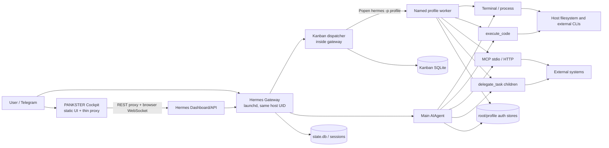
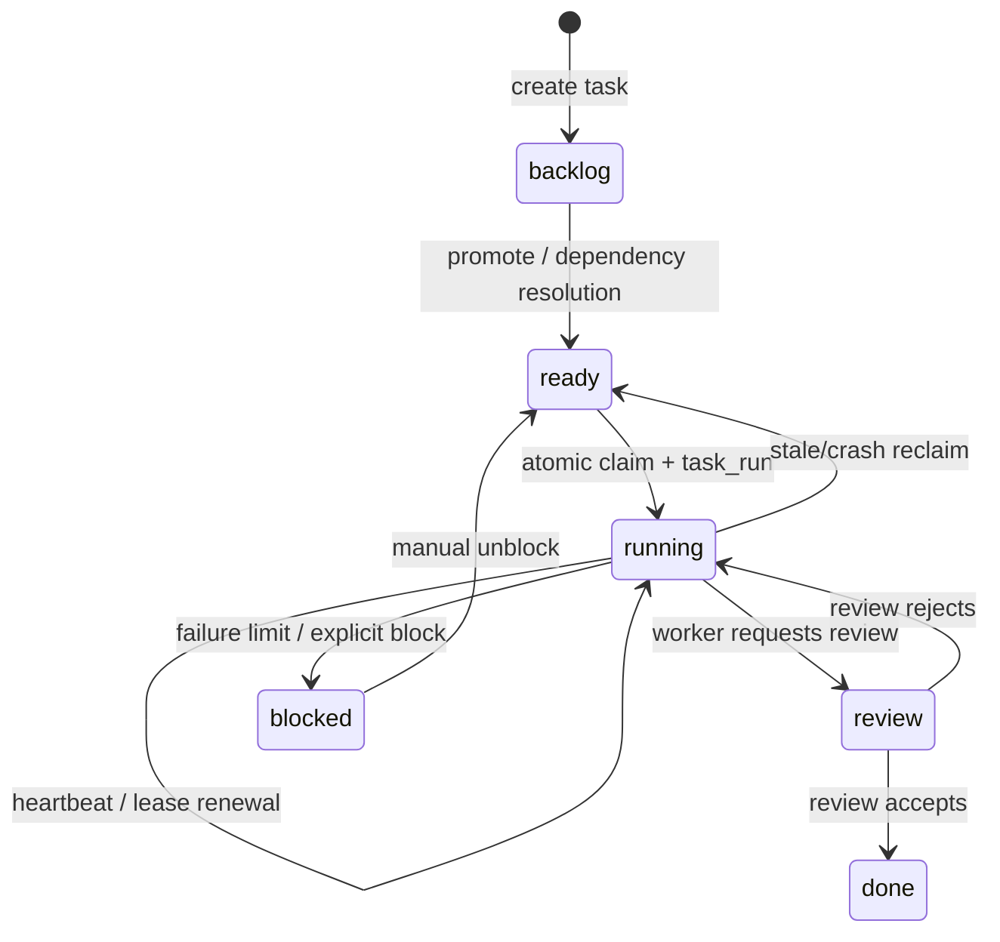
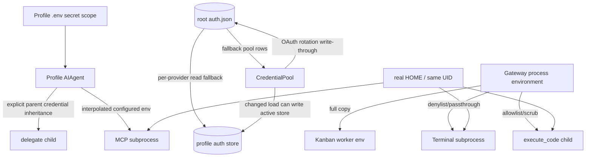

# Current State: PANKSTER Agent Platform

Status: `awaiting_review`
Scope: Phase 0, evidence-backed baseline only. Architecture is not approved by this document.

## Component map

Evidence: installed gateway and worker paths at `<HERMES_SOURCE>/gateway/run.py:1580-1612`, `<HERMES_SOURCE>/hermes_cli/kanban_db.py:8169-8355`, and live Cockpit at `<COCKPIT_ROOT>/serve.py:1-121`.

## Runtime topology

| Component | Runtime | Binding / launch | Isolation |
|---|---|---|---|
| Hermes gateway | Python 3.11.15, Hermes 0.18.2 | launchd, `python -m hermes_cli.main gateway run --replace` | Same macOS user and filesystem. |
| Hermes dashboard | Python/Hermes | launchd, localhost `9119` | Same UID; dashboard owns broad control APIs. |
| PANKSTER Cockpit | system Python 3.9 | launchd, localhost `9120` | Thin HTTP proxy; no separate identity or datastore. |
| gbrain auth adapter | Hermes venv Python | launchd, localhost `3132` | Same UID. |
| Named profile worker | Hermes CLI subprocess | Kanban `_default_spawn` | New process/session, but same UID and host filesystem. |
| Terminal/background process | login shell or PTY | direct local subprocess | Same UID; no container tool detected. |
| execute_code | Python child plus local RPC | direct subprocess | Environment scrub, but still same UID and host filesystem. |
| MCP stdio | configured command, watchdog wrapper | MCP event-loop thread | Same UID; filtered baseline env plus explicit server env. |
| Temporary subagent | in-process `AIAgent` on worker threads | delegation executors | No process or security boundary. |

Host evidence: [EVIDENCE_INDEX.md](EVIDENCE_INDEX.md), `E-HOST-01`, `E-RUNTIME-01`, `E-RUNTIME-02`, `E-ISO-01`.

## Profile lifecycle

1. Named profiles live under `<HERMES_HOME>/profiles/<name>`. Hermes creates memories, sessions, skills, logs, workspace, cron, and a compatibility `home` directory (`hermes_cli/profiles.py:39-53`).
2. Profile configuration, persona, and state are filesystem-scoped: `config.yaml`, `SOUL.md`, memories, sessions, and optional `auth.json`. The installed named profiles currently have no `auth.json`; root does (`E-PROFILE-01`, `E-AUTH-01`).
3. `resolve_profile_env()` maps `-p <name>` to profile `HERMES_HOME` (`hermes_cli/profiles.py:2209-2225`).
4. On host installs, subprocess `HOME` defaults to the real OS home, not `<profile>/home` (`hermes_constants.py:770-832`). This preserves user CLI config but exposes same-user credential locations.
5. All observed profile and gateway processes run as the same UID. A profile directory is a namespace, not an OS security boundary.
6. `profile.yaml` metadata supports only description fields (`hermes_cli/profiles.py:815-870`). There is no `runtime_enabled` field in installed code.
7. `profiles_to_serve(multiplex=True)` scans every valid profile directory and does not consult a runtime gate (`hermes_cli/profiles.py:949-987`). The installed root config does not enable multiplexing, so this is latent for gateway multiplexing but directly relevant to future activation.
8. The installed named profiles select provider `openai-codex` and enable composite `hermes-cli` plus `kanban` (safe structural config evidence, `EVIDENCE_INDEX.md`). The composite contains terminal, process, file, code execution, and delegation (`toolsets.py:29-81`).

## Kanban lifecycle

- Board paths are shared across profiles by design. Default is `<root>/kanban.db`; named boards are `<root>/kanban/boards/<slug>/kanban.db` (`hermes_cli/kanban_db.py:371-391`, `516-560`).
- Tasks, task events, and task runs are durable SQLite records (`hermes_cli/kanban_db.py:840-1097`, `1196-1227`).
- Claim is an atomic `ready` to `running` transition with a claim lock/run record; heartbeat renews the lease (`hermes_cli/kanban_db.py:3484-3709`).
- Reclaim returns stale/crashed work to dispatchable state; manual reclaim resets failure state (`hermes_cli/kanban_db.py:3712-3924`).
- The gateway dispatcher is enabled in root config (`dispatch_in_gateway: true`). Each tick performs reclaim/promotion/assignment/spawn and survives individual tick failure (`hermes_cli/kanban_db.py:7439-7904`, `8362-8414`).
- The spawn guard checks only that an assignee exists as a profile. No `runtime_enabled` check appears immediately before either normal or review spawn (`hermes_cli/kanban_db.py:7439-7904`).
- Review uses the same task assignee and force-loads `sdlc-review`; it does not establish worker/reviewer identity independence (`hermes_cli/kanban_db.py:7824-7895`).
- Worker output is conveyed through task status, comments/events, result fields, attachments, workspace/PR references, and per-task logs. There is no immutable, hash-bound Evidence Pack contract owned by Kanban.

## Delegation lifecycle

| Type | Persistence | Execution | Inheritance | Boundary |
|---|---|---|---|---|
| Single `delegate_task` | Result in parent conversation; optional durable async completion | Child `AIAgent`, then a one-worker daemon executor | Parent model/provider/API key/fallback by default; toolsets are intersected | In-process thread, not security isolation. |
| Batch delegation | Aggregated result | Parallel daemon executor, one child per item | Same as single; no explicit context wrapper at inner batch submit | In-process threads. |
| Background delegation | Record in profile `state.db`, completion queue restored after restart | Outer async executor uses `propagate_context_to_thread` | Outer context is copied; child run creates another executor | Durable delivery, not durable worker identity. |
| Nested delegation | Configurable orchestrator role and max depth | Child may receive delegation toolset | Kill switch and depth bound | Still same process/UID. |

Evidence:

- Child credentials and fallback inheritance: `tools/delegate_tool.py:1199-1260`, `1320-1404`.
- Toolset intersection and role/depth controls: `tools/delegate_tool.py:1102-1188`.
- Child run uses a fresh daemon executor without `propagate_context_to_thread`: `tools/delegate_tool.py:1971-2013`.
- Batch submits `_run_single_child` directly: `tools/delegate_tool.py:2602-2635`.
- Background outer executor does copy context: `tools/async_delegation.py:438-562`, `645-749`.
- Durable async records and abandoned-owner recovery: `tools/async_delegation.py:83-152`, `219-290`.

The installed implementation therefore partially fixed the earlier “background loses context” concern at the outer executor, but single child execution and batch fan-out still introduce unwrapped worker-thread hops.

## Spawn matrix

| Path | Function and evidence | Environment policy | CWD / HOME / HERMES_HOME | Identity/isolation | Timeout, cancellation, logs |
|---|---|---|---|---|---|
| Kanban worker | `_default_spawn`, `hermes_cli/kanban_db.py:8169-8355` | Starts with `dict(os.environ)`; injects profile/Kanban fields; removes only `HERMES_TUI` | Task workspace; real `HOME` inherited; profile `HERMES_HOME` set | Same UID, new session | Runtime-derived terminal timeout; output appended to board task log; PID tracked/reclaimed. |
| Foreground terminal | `_make_run_env` and `_run_bash`, `tools/environments/local.py:1110-1177`, `1333-1401` | Provider/tool denylist with explicit passthrough exceptions | Session cwd; host-real `HOME` by default; ContextVar `HERMES_HOME` injected if present | Same UID/process group | Foreground timeout and process-group kill; merged output. |
| Background terminal | `spawn_local`, `tools/process_registry.py:689-826` | Same `_sanitize_subprocess_env` family | Requested cwd; same HOME contract; context HOME only if calling thread retains it | Same UID; PTY or Popen | Checkpointed; output buffer/log; kill supported while handle exists. |
| Background recovery | `recover_from_checkpoint`, `tools/process_registry.py:1919-2010` | Does not rebuild env; adopts surviving PID after start-time check | Original process continues | Same UID, detached | Output handle is lost; status/kill only; watcher can resume. |
| execute_code | `_scrub_child_env` and Popen, `tools/code_execution_tool.py:135-264`, `1320-1407` | Safe prefixes + four exact Hermes location vars; secret-name deny; configured passthrough can override | temp/project cwd; real HOME contract; `HERMES_HOME` may survive | Same UID, local RPC token | Wall timeout, interrupt, process-group termination, bounded stdout/stderr. |
| MCP stdio | `_build_safe_env`, `_run_stdio`, `tools/mcp_tool.py:351-446`, `2212-2277` | Small baseline allowlist plus unrestricted configured `user_env` after interpolation | Server-defined command; process HOME baseline; no `NO_PROXY`; profile HOME ContextVar used for config lookup | Same UID; watchdog process group | Retry/reconnect/circuit breaker; sanitized error patterns; OSV preflight is runtime network and fail-open. |
| MCP call thread | `_run_on_mcp_loop`, `tools/mcp_tool.py:3794-3887` | Propagates only HERMES_HOME override explicitly | MCP loop | Same process | Polls interrupt and cancels future. |
| Single delegate | `_run_single_child`, `tools/delegate_tool.py:1971-2013` | No subprocess itself; child tool spawns use whatever ContextVars survive worker hop | Child tool-dependent | In-process thread | Child timeout, heartbeat, interrupt; diagnostic on timeout. |
| Batch delegate | `_execute_and_aggregate`, `tools/delegate_tool.py:2602-2670` | Direct executor submit; no explicit context wrapper | Child tool-dependent | In-process threads | Parent interrupt polling; aggregate results. |
| Background delegate | `dispatch_async_delegation*`, `tools/async_delegation.py:438-562`, `645-749` | Outer target wrapped with `propagate_context_to_thread` | Profile state DB selected by copied context | In-process daemon thread | Durable completion; abandoned result becomes `unknown`. |
| ACP/Codex/Copilot child | `hermes_subprocess_env(inherit_credentials=True)`, `tools/environments/local.py:539-615` and grep-listed callers | Gateway/GitHub/Tier-1 secrets always stripped; provider credentials deliberately retained | Real HOME contract; context HERMES_HOME injected | Same UID subprocess | Caller-specific. |

There is no single spawn factory. At least Kanban, terminal, process registry, execute_code, MCP, and ACP/CLI transports construct environments through distinct functions or direct `Popen` calls.

### System variables

| Variable | Current status | Target requirement |
|---|---|---|
| `PATH`, `HOME`, `TMPDIR`, `LANG`, `SHELL` | Preserved by most local paths; HOME resolves to real user home on host by default. | Preserve only after binding an isolated runtime home; do not expose user credential directories. |
| `NO_PROXY`, `no_proxy` | Terminal/Kanban may inherit them; execute_code and MCP safe allowlists omit them. | Preserve both spellings in the mandatory non-secret baseline. |
| `HERMES_KANBAN_*` | Kanban worker injects DB, board, workspace, task/run/claim fields. execute_code allowlist omits them. | Allowlist the exact task-scoped fields required by the child; deny unknown `HERMES_*`. |

## Credential paths

- Gateway multiplex turns install an isolated profile `.env` mapping and a profile `HERMES_HOME` ContextVar (`gateway/run.py:1580-1612`; `agent/secret_scope.py:123-204`). This protects migrated in-process `get_secret()` calls and fails closed when multiplexing is active but no scope exists.
- The installed root config does not enable multiplexing. Kanban workers are separate CLI processes and receive a full copy of gateway `os.environ` before profile fields are overwritten (`hermes_cli/kanban_db.py:8195-8284`). Thus a gateway-only token can structurally reach a profile worker if present.
- Root auth fallback is explicit and per-provider (`hermes_cli/auth.py:916-980`, `1205-1278`, `1403-1447`). Named profile auth is authoritative only after it has entries for that provider.
- `load_pool()` can normalize/seed/prune and call `write_credential_pool()` after reading fallback rows (`agent/credential_pool.py:2538-2600`). Only one normalization branch checks active ownership; the broader `changed` path can materialize derived pool state in the active profile store.
- OAuth refresh deliberately writes rotated state back to the source store and can write through to root for Nous, OpenAI Codex, and xAI (`agent/credential_pool.py:527-579`, `966-1079`; `hermes_cli/auth.py:1205-1314`). This preserves shared grants but violates a strict “named profile may never write root credentials” target.
- File-tool reads block root/profile secret files, but the code states this is not a security boundary because same-UID terminal can bypass it (`agent/file_safety.py:191-296`; `tools/file_tools.py:1198-1207`).
- Temporary delegate children inherit the parent API key/provider/fallback by object construction, not by a credential broker (`tools/delegate_tool.py:1199-1260`, `1320-1404`).

## Cockpit state

The live PANKSTER Cockpit is more than an HTML-only prototype, but less than the target control plane:

- `serve.py` is a static server and thin same-origin proxy. It obtains the dashboard session token in memory and adds the Authorization header (`<COCKPIT_ROOT>/serve.py:1-88`). It binds only to localhost (`serve.py:113-121`).
- `public/live.js` polls real Hermes status, sessions, logs, skills, filesystem, Kanban, model, config, channels, and MCP APIs (`live.js:186-246`).
- It exposes real write actions including gateway stop/restart, cron/task/session mutation, model and raw config changes (`live.js:249-331`).
- Browser code obtains a dashboard token and connects directly to Hermes WebSocket/PTY endpoints (`live.js:349-471`). This is a direct execution/control path, not a read-model-only Cockpit.
- Several sections retain static fallback/mock content. Kanban intentionally has no mock fallback (`public/index.html:449-495`, `456-460`, `566-584`). Secret-looking UI placeholders are excluded from this review artifact.
- There is no Cockpit-owned event stream or workflow database. Its source of truth is the proxied Hermes APIs.
- `<USER_HOME>/Projects/rita-ai/director-cockpit` is a distinct Next.js/Supabase/Anthropic project with its own task/workflow API. It is not the process bound to localhost `9120` and is not currently the PANKSTER Hermes control-plane backend.

## Source-of-truth map

Kanban SQLite является durable source of truth для задач,
запусков, событий и recovery metadata. Полноценного business
workflow source of truth сейчас нет.

| Concern | Current source of truth | Notes |
|---|---|---|
| Task/run/event/recovery metadata | Hermes Kanban SQLite per board | Durable operational records; state machine and dispatch are co-located in Hermes. |
| Complete business workflow | None | Business-process templates, stage DAGs, artifact criteria and process-specific gates are not represented as one authoritative workflow. |
| Profile registry | Profile directories and metadata under `.hermes/profiles` | No runtime-enabled state. |
| Agent conversation/session state | `state.db` under active Hermes home | Background delegation also persists here. |
| Provider credentials | Root/profile `auth.json`, `.env`, and external user credential stores | Root fallback and same-UID access couple profiles. |
| Cockpit view | Live Hermes dashboard APIs plus static fallback data | Cockpit has no authoritative DB. |
| Review decision | Kanban status/events and `sdlc-review` worker behavior | Reviewer identity is not independently enforced. |
| Artifacts/evidence | Kanban attachments/workspaces and separate `fleet-control-room/evidence` convention | Fragmented; no immutable version/hash binding enforced by workflow state. |
| Human authorization | Tool approval callbacks, browser confirmation UI, and operational practice | No dedicated Human Gate API/state object. |
| Monitoring | launchd status, localhost endpoints, Hermes logs, per-task logs | No consolidated append-only audit/metrics plane was confirmed. |
| Backup | Git repos, PANKSTER vault sync, fleet-control-room backups | PANKSTER sync pushes to two remotes; execution not tested. |

## Baseline conclusion

The current platform is operationally integrated but security boundaries are mostly logical. Profile `HERMES_HOME`, ContextVars, env deny/allowlists, and file-tool guards provide useful scoping; same UID, real HOME, root fallback, multiple spawn policies, and direct Cockpit control prevent treating named profiles as mutually isolated principals. These findings are baseline inputs only; no remediation phase has begun.
