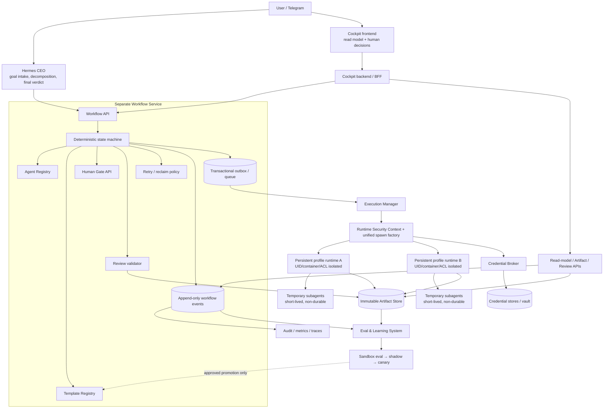

# Target Architecture

Status: `awaiting_review`. This is a proposed destination model, not an approved implementation plan. Phase 1 has not started.

## Design goals

- Separate goal selection, deterministic workflow state, execution, review, authorization, and presentation.
- Treat persistent profiles as security principals only when they have an OS-level boundary.
- Give each invocation the minimum model/tool credential grant required for one purpose.
- Make every state transition, artifact version, review, and human decision attributable and replayable.
- Keep the default single-profile Hermes experience backward compatible while named profiles fail closed.

## Target component architecture



## Role contracts

### Hermes CEO

- Accepts the goal, selects a workflow template, proposes decomposition and role assignment.
- Receives versioned Evidence Packs and review decisions.
- Produces the final verdict.
- Does not own the workflow state machine, mutate authoritative transitions directly, or perform merge/deploy/publish.
- Uses the Workflow API through a narrow capability, never direct workflow database access.

### Workflow Engine

Current-state baseline before migration:

Kanban SQLite является durable source of truth для задач,
запусков, событий и recovery metadata. Полноценного business
workflow source of truth сейчас нет.

- In the target state, becomes the sole source of truth for complete business workflow state and deterministic transitions.
- Owns template versioning, agent/reviewer assignment, retry/reclaim policy, artifact references, review validation, human gates, and append-only audit events.
- Uses a transactional outbox so committed state and dispatch requests cannot diverge.
- Issues idempotent execution attempts with immutable `workflow_id`, `task_id`, `attempt_id`, actor, policy version, and artifact-set version.
- Treats Kanban as a compatibility adapter/read model during migration, not as the final state-machine owner.

### Persistent Hermes profiles

- Represent durable employees with distinct identity, SOUL, skills, config, memory, and explicit capability policy.
- Run only when the Agent Registry says `runtime_enabled=true` and the referenced policy version is valid.
- Execute in a distinct UID/container/ACL boundary with isolated HOME and workspace mount.
- Receive no ambient root credentials. All model/tool access is by brokered lease.
- Exchange work only through Workflow/Kanban APIs and immutable artifacts.

### Agent Registry

Each registered principal has versioned identity and eligibility metadata, including:

- `model_policy_group`
- `model_family`
- `provider_family`
- `review_risk_tier`
- `reviewer_eligibility`

These fields are policy inputs, not self-declared prompt metadata. Runtime and Review APIs reject absent, stale, or incompatible registry versions.

### Workflow Template Registry

- Stores a versioned template for each business process rather than one hard-coded universal flow.
- Represents a stage sequence or DAG. Every stage defines its worker, reviewer, required artifacts, acceptance criteria, maximum revisions and dependencies; the template defines process-specific Human Gates.
- Starts with six proposed template families: `development-feature`, `bug-fix`, `long-form-content`, `ugc-video-ad`, `pinterest-batch`, and `research-report`.
- Feeds a dynamic Cockpit read model; Cockpit must not encode business workflow stages or transitions in frontend code.
- Defines concepts only in Phase 0. No production YAML schema, runtime loader, or live registry is authorized.

### Temporary subagents

- Exist for bounded, short-lived analysis within a parent attempt.
- Are not durable workers, not independent reviewers, and not a security boundary.
- Inherit a subset of parent capabilities through explicit lease delegation, never raw API-key copying.
- Carry the same immutable `RuntimeSecurityContext` through every task/thread hop.

### Cockpit

- Presents workflow read models, artifacts, reviews, audit events, and human gates.
- Sends commands only to the Cockpit backend, which validates user identity and calls narrow domain APIs.
- Holds no model/provider tokens in browser code and performs no direct LLM, dashboard-token, PTY, or workflow-database calls.
- Does not decide state transitions; it requests domain commands and renders accepted/rejected events.

### Security Runtime

Owns one mandatory contract:

```text
RuntimeSecurityContext {
  principal_id, profile_id, workflow_id, task_id, attempt_id,
  runtime_enabled_version, policy_version,
  allowed_tools, allowed_network_targets, allowed_paths,
  env_allowlist, env_denylist,
  credential_grant_ids, parent_context_hash,
  expires_at
}
```

Every terminal, background terminal, execute_code, MCP, Kanban worker, delegate, retry, reclaim, and restart path must pass this context to a single spawn factory. Missing or invalid context fails closed for named profiles.

## Environment policy

1. Start from an empty environment for named-profile children.
2. Add an exact non-secret system baseline: `PATH`, isolated `HOME`, `TMPDIR`, `LANG`, locale fields, `SHELL`, `NO_PROXY`, and `no_proxy`.
3. Add exact task-scoped `HERMES_KANBAN_*`, `HERMES_HOME`, profile and session fields required by the path.
4. Apply a mandatory denylist after all merges, including platform tokens, provider keys, database/service keys, auth headers, relay secrets, and dynamic secret-name patterns.
5. Resolve each requested secret through the Credential Broker; inject it through a purpose-specific channel where possible, not the general environment.
6. Reject explicit MCP/skill env fields that collide with the denylist.
7. Log names, policy decisions, and grant IDs only; never values.

The default single-profile runtime may retain legacy ambient behavior behind an explicit compatibility policy. Named profiles must not silently fall back to it.

## Minimum model-auth design

```mermaid
sequenceDiagram
    participant W as Workflow Engine
    participant R as Runtime Security
    participant B as Credential Broker
    participant P as Profile worker
    participant M as Model provider
    W->>R: start attempt(profile, model policy, purpose)
    R->>B: request grant(profile, provider, model, scope, ttl)
    B-->>R: opaque grant handle + expiry
    R->>P: start isolated runtime with handle
    P->>B: exchange handle from bound runtime identity
    B-->>P: short-lived provider credential/channel
    P->>M: allowed model call
    B-->>W: audit event(grant id, usage, owner; no secret)
```

- The broker stores references to owner-scoped credentials; it does not copy the root pool into profile stores.
- A grant binds profile, attempt, provider, model set, API operation, rate/budget, and TTL.
- OAuth refresh runs under the credential owner, uses compare-and-swap/versioning, and writes only the owning store.
- A named profile with no eligible grant receives a typed fail-closed error; root fallback is disabled.
- Revocation and rollback operate on grant/policy versions, not file copies.

## Artifact, review, and human-gate model

- Artifact upload creates an immutable content hash, media type, producer attempt, policy version, and storage URI.
- An Evidence Pack is a manifest of artifact hashes, command/test evidence, redaction status, and producer identity.
- Review is bound to an exact Evidence Pack version and worker attempt; later artifact changes invalidate the review.
- Reviewer assignment rejects the worker principal and any disallowed relationship.
- Reviewer assignment also requires a different profile and `model_policy_group`; high-risk policy may require a different `model_family` or `provider_family`.
- The reviewer receives only the frozen artifact set, review brief, acceptance criteria, and sanitized Evidence Pack. It receives neither the producer's mutable workspace nor hidden reasoning.
- Human Gate decisions contain actor, scope, presented hashes, decision, reason, timestamp, and authorization policy version.
- Merge/deploy/publish executors require an approved gate and cannot be invoked by Hermes CEO directly.

## Learning system

- Consumes sanitized traces, outcomes, review findings, and evaluation datasets.
- Produces improvement candidates, never direct production policy edits.
- Runs candidates through isolated evaluation, shadow mode, canary, explicit promotion, and rollback.
- Security policy, credential scope, runtime isolation, and human-gate rules are non-self-modifying protected inputs.

## Current-to-target migration

```mermaid
flowchart LR
    C0["Current: Hermes owns ingress, Kanban state, dispatch, execution"] --> C1["Introduce read-only Workflow mirror + stable IDs"]
    C1 --> C2["Workflow Service owns transitions; Kanban compatibility adapter"]
    C2 --> C3["Agent Registry + runtime_enabled fail-closed gate"]
    C3 --> C4["RuntimeSecurityContext + unified spawn factory"]
    C4 --> C5["Credential Broker + isolated profile runtimes"]
    C5 --> C6["Immutable artifacts, independent reviews, Human Gates"]
    C6 --> C7["Cockpit backend/read model; remove direct browser control"]
    C7 --> C8["Eval/shadow/canary learning loop"]
```



Each step requires an explicit future phase approval, rollback plan, and acceptance matrix. This document performs none of those changes.

## Proposed API ownership

| API | Owner | Responsibility |
|---|---|---|
| Workflow API | Separate Workflow Service | Commands and deterministic transitions. |
| Agent Registry API | Separate Workflow Service with Infrastructure enforcement | Profile identity, policy version, runtime enabled state. |
| Artifact API | Separate Workflow Service / Artifact component | Immutable upload, manifest, hash verification, retention. |
| Review API | Workflow Service | Independent assignment, verdict schema, hash binding. |
| Human Gate API | Workflow Service | Durable authorization decisions. |
| Event Stream | Workflow Service | Append-only ordered domain events, read-model feed. |
| Cockpit BFF | Cockpit backend | User auth, query composition, safe command forwarding. |
| Runtime API | Security Runtime / Execution Manager | Start/cancel/status using valid RuntimeSecurityContext. |
| Credential Broker API | Security Runtime | Scoped lease issue/exchange/revoke/refresh audit. |

## Compatibility and rollback principles

- Preserve the existing default-profile gateway until named-profile isolation is proven.
- Gate new behavior by policy version and profile identity; named profiles fail closed, default can use explicit legacy mode.
- Keep `NO_PROXY` and `no_proxy` across the new factory to avoid breaking local control-plane connectivity.
- Use dual-read/shadow comparison before switching workflow authority.
- Never migrate credentials by bulk copying; register owner references and verify one provider at a time.
- Rollback means routing new attempts to the previous policy/service version. It must not re-enable root fallback for named profiles.

## Target acceptance boundary

The target architecture is eligible for implementation planning only after owners approve the decision records, choose the OS isolation mechanism and credential backend, define the workflow schema, and accept every future test in `docs/security/SECURITY_ACCEPTANCE_MATRIX.md`.
