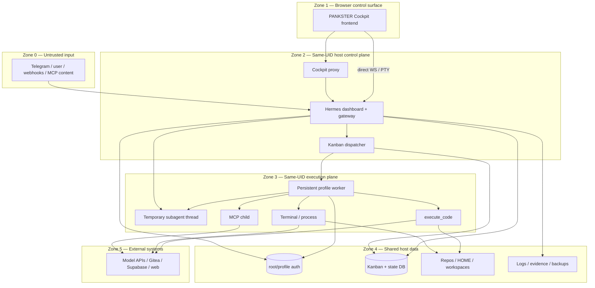

# Trust Boundaries

Status: `awaiting_review`. Threat analysis follows STRIDE-style categories, but does not claim penetration testing or runtime exploit execution.

## Assets

| Asset | Confidentiality/integrity need | Current location |
|---|---|---|
| Gateway bot and relay credentials | Critical confidentiality | Gateway environment / root `.env`; values not inspected. |
| Model credentials and OAuth refresh chains | Critical confidentiality and owner-only mutation | Root/profile `auth.json`, `.env`, external CLI stores. |
| Workflow state and audit events | High integrity and availability | Kanban SQLite. |
| Source code and workspaces | High integrity | Project repos and Kanban workspaces. |
| Artifacts and Evidence Packs | High integrity, provenance, retention | Kanban attachments plus `fleet-control-room/evidence`. |
| Human approvals | Critical authenticity and non-repudiation | Tool callbacks, UI confirmations, operational records. |
| Profile identity, SOUL, skills, memory | High integrity and tenant separation | Profile filesystem directories. |
| Logs and diagnostics | Medium confidentiality, high integrity | Hermes/profile/Kanban/Cockpit logs. |

## Actors and privilege levels

| Actor | Current privilege |
|---|---|
| Host user/operator | Full same-user filesystem, process, Keychain/CLI access. |
| Hermes gateway/dashboard | Long-lived same-user process; owns platform ingress and broad dashboard APIs. |
| PANKSTER Cockpit browser/proxy | Browser receives direct WebSocket/PTY capability; proxy can invoke Hermes APIs. |
| Kanban dispatcher | Reads/writes all boards available to process and spawns named profiles. |
| Named profile worker | Same UID; composite toolset includes terminal/process/file/code/delegation. |
| Temporary subagent | Parent-derived credentials/toolsets; in-process thread. |
| MCP server/dependency | Same-user subprocess or remote service; receives configured env/headers. |
| External content/user | May supply prompts, chat messages, task text, webhook/MCP content. |
| Reviewer | Currently another run of task assignee with review skill; not an enforced independent principal. |

## Actual trust-zone map

The boxes are logical zones, not OS isolation domains. Zones 2–4 execute as the same host UID (`E-RUNTIME-01`).

## Boundary inventory

| Boundary | Confirmed crossing | Current control | Missing control |
|---|---|---|---|
| Untrusted input → gateway | Chat/task/tool content enters agent context | Platform allowlists, prompting, tool approval paths | Deterministic workflow validation and taint-aware policy. |
| Browser → control plane | REST proxy and direct authenticated WS/PTY | localhost binding and dashboard token | Backend-only token custody, CSRF/origin policy evidence, narrow Cockpit API. |
| Gateway → profile worker | Full `os.environ` copied before profile fields | `HERMES_HOME` override; downstream terminal denylist | Profile-specific allowlist and mandatory denylist at spawn. |
| Profile → root credential store | Per-provider fallback reads; OAuth source writes | Mode 0600, auth locks, atomic writes | Named-profile fallback-off and owner-only broker grants. |
| Profile → host HOME | Terminal and child processes use real HOME | Some file-tool blocks and env denylist | UID/container/ACL isolation and isolated HOME. |
| Parent → temporary subagent | Model credential, fallback, toolset, session context | Toolset intersection, role/depth limits | Lease-based credentials and context propagation at every thread hop. |
| Agent → execute_code | Generated code in local child | Secret-name scrub, RPC allowlist, timeout | OS sandbox; deterministic network/filesystem policy; NO_PROXY baseline. |
| Agent → MCP process | Server config/env becomes subprocess | Small env allowlist, suspicious-config check, watchdog | Mandatory denylist on explicit env, per-profile grants, network egress policy. |
| Worker → reviewer | Review dispatch uses same assignee | Forced review skill | Enforced independent reviewer identity and conflict rule. |
| Workflow → artifacts | Paths/comments/results referenced from task | SQLite events and filesystem hashes by convention | Immutable artifact registry and review-to-hash binding. |
| Human → transition | UI/tool confirmations | Ad hoc confirmations and callbacks | Durable signed/attributed Human Gate object. |

## Confirmed threat scenarios

| ID | Category | Scenario and preconditions | Evidence | Current disposition |
|---|---|---|---|---|
| TB-01 | Information disclosure | A Kanban worker receives gateway environment entries because dispatcher begins from `dict(os.environ)`. Exploitation requires the secret to exist in the gateway env and worker-controlled code/tool use. | `hermes_cli/kanban_db.py:8195-8284` | Confirmed structural exposure; actual secret values not inspected. |
| TB-02 | Information disclosure | A named worker uses terminal under the same UID and real HOME to read root auth/project secrets despite file-tool denial. | `agent/file_safety.py:191-296`; `hermes_constants.py:770-832`; `toolsets.py:29-81` | Confirmed capability; no exploit command run. |
| TB-03 | Tampering | Profile OAuth refresh updates a shared root grant when it originated from root fallback. | `agent/credential_pool.py:527-579`, `966-1079` | Intentional current behavior; conflicts with owner-only future policy. |
| TB-04 | Information disclosure / elevation | A child delegation thread loses profile ContextVars at an unwrapped executor hop, so later tool/env resolution can fall back to process scope. | `tools/delegate_tool.py:1971-2013`, `2602-2635`; `tools/thread_context.py:64-120` | Confirmed missing wrapper; exact downstream effect depends on tool path. |
| TB-05 | Elevation / tampering | A directory-created named profile can be spawned because no `runtime_enabled` state is read at dispatch. | `hermes_cli/profiles.py:815-870`, `949-987`; `hermes_cli/kanban_db.py:7439-7904` | Confirmed. Profiles currently remain operationally disabled by convention only. |
| TB-06 | Information disclosure | Explicit MCP `env` is appended after baseline filtering; a misconfigured server can receive arbitrary configured values. | `tools/mcp_tool.py:426-446`, `3933-4017` | Confirmed configuration capability. |
| TB-07 | Spoofing / repudiation | Review run is assigned to the original task assignee; independent reviewer identity is not enforced. | `hermes_cli/kanban_db.py:7824-7895` | Confirmed. |
| TB-08 | Information disclosure | Cockpit frontend obtains a control token and opens direct WS/PTY, expanding browser compromise impact. | `<COCKPIT_ROOT>/public/live.js:349-471` | Confirmed local control path. |
| TB-09 | Repudiation | Artifacts and reviews are not bound by workflow-enforced immutable hashes. | Kanban schema/events and external evidence convention; `E-ARTIFACT-01` | Partially confirmed; some packs contain hashes, but no universal enforcement was found. |
| TB-10 | Denial of service | Background process survives restart and is recovered detached; output handle is unavailable and cancellation semantics are weaker. | `tools/process_registry.py:1919-2010` | Confirmed operational limitation. |

## Current controls

- Profile-scoped `HERMES_HOME` and secret ContextVars on gateway multiplex paths (`gateway/run.py:1580-1612`; `agent/secret_scope.py:123-204`).
- Fail-closed `get_secret()` for unscoped reads while multiplex mode is active (`agent/secret_scope.py:123-160`).
- Atomic, owner-only auth-store writes and locking (`hermes_cli/auth.py:1098-1202`).
- File-tool read blocks for root/profile secret stores (`agent/file_safety.py:238-300`).
- Terminal provider/tool denylist and dynamic secret-name guard (`tools/environments/local.py:199-448`, `496-615`).
- execute_code environment scrub and local RPC boundary (`tools/code_execution_tool.py:135-264`, `1320-1407`).
- MCP baseline env filter, error redaction, watchdog, retry controls (`tools/mcp_tool.py:351-455`, `2212-2290`).
- Context-propagation helper exists and is used in several async paths (`tools/thread_context.py:64-120`; `tools/async_delegation.py:545-549`).
- Kanban atomic claims, heartbeat, reclaim, task events, and run history (`hermes_cli/kanban_db.py:3484-3924`).
- PID start-time validation before background process recovery (`tools/process_registry.py:1952-1967`).

## Missing controls required before isolation claims

1. OS identity/container/ACL isolation for persistent profiles.
2. Profile runtime registry with fail-closed `runtime_enabled` check at every spawn/retry/reclaim/restart path.
3. One `RuntimeSecurityContext` and one audited spawn factory.
4. Mandatory environment allowlist plus denylist; exact preservation of `NO_PROXY` and `no_proxy`.
5. No root-auth fallback for named profiles; no root pool materialization.
6. Credential broker issuing profile-, provider-, model-, purpose-, and TTL-scoped grants.
7. Owner-only OAuth refresh and compare-and-swap rotation.
8. Context propagation across every thread/task/executor boundary.
9. Backend-only Cockpit credentials and no frontend direct model/PTY control.
10. Independent reviewer identity and immutable artifact hash binding.
11. Durable Human Gate API and append-only audit events.
12. Redaction tests for logs, argv, process checkpoints, task events, and Evidence Packs.

## Residual uncertainty

- Secret presence in the live gateway environment is intentionally `UNVERIFIED`; only the presence of a launchd environment dictionary was recorded.
- macOS Keychain ACL behavior, external CLI credential formats, firewall rules, and remote system authorization were not inspected.
- No runtime exploit, canary, model/API call, or database query was executed.
