# RFC: Контент Завод — глобальная контент-платформа (для команды разработки)
_Дата: 2026-06-23. Статус: Draft. Угол: international / global-first. Заземлено на текущих таблицах и lib/factory/* finance-panel._

## 0. Контекст и цель
Расширяем существующий нод-завод вертикального видео до ГЛОБАЛЬНОЙ мульти-платформенной системы: Source → Content → Analysis → Repurposing → Distribution → Analytics → Learning Loop. Переиспользуем существующие абстракции (EngineNode/Graph/Asset/Source/Signal/Rubric), добавляем слои ingest/distribution/analytics, замыкаем обучение, закладываем мульти-тенант и i18n/мульти-регион. Приоритет коннекторов — по мировому охвату; региональные площадки (включая РФ) — как locale-packs.

## 1. ERD / Граф сущностей

Ниже — целевой граф сущностей универсального Контент Завода. Диаграмма покрывает три новых слоя (ИСТОЧНИКИ → ДИСТРИБУЦИЯ → АНАЛИТИКА) поверх уже существующего ядра нод-машины. Для каждой сущности в таблице после диаграммы явно помечено: переиспускаем существующую таблицу или заводим новую.

```mermaid
erDiagram
    WORKSPACE   ||--o{ BRAND          : "владеет"
    WORKSPACE   ||--o{ SOURCE         : "владеет"
    WORKSPACE   ||--o{ CONNECTION     : "владеет"
    WORKSPACE   ||--o{ RECIPE         : "владеет"
    WORKSPACE   ||--o{ CAMPAIGN       : "владеет"
    WORKSPACE   ||--o{ CONTENT_ASSET  : "владеет"
    WORKSPACE   ||--o{ KNOWLEDGE_ITEM : "владеет"

    BRAND       ||--o{ CHANNEL        : "имеет"
    BRAND       ||--o{ CONTENT_ASSET  : "грундирует"
    BRAND       ||--o{ RECIPE         : "грундирует voice/kit"
    BRAND       ||--o{ CAMPAIGN       : "охватывает"

    SOURCE      ||--o{ SOURCE_ITEM    : "вытягивает (ingest)"
    SOURCE      }o--o| CONNECTION     : "тянет через OAuth (in)"
    SOURCE      }o--o{ RECIPE         : "служит входом"
    SOURCE_ITEM ||--o{ CONTENT_ASSET  : "порождает (lineage start)"

    CONNECTION  ||--o{ CHANNEL        : "владеет"
    CONNECTION  ||--o{ PUBLICATION    : "публикует через OAuth (out)"

    CONTENT_ASSET    ||--o{ DERIVATIVE_ASSET : "мастер для"
    CONTENT_ASSET    }o--o{ RECIPE           : "вход/выход"
    CONTENT_ASSET    ||--o{ PUBLICATION      : "публикуется как"
    DERIVATIVE_ASSET ||--o{ DERIVATIVE_ASSET : "потомок (self-lineage)"
    DERIVATIVE_ASSET ||--o{ PUBLICATION      : "публикуется как"

    RECIPE      ||--o{ NODE            : "состоит из"
    RECIPE      ||--o{ DERIVATIVE_ASSET : "производит (lineage)"
    RECIPE      ||--o{ RECIPE          : "форк / A-B (self)"
    RECIPE      ||--o{ SIGNAL          : "журналирует событие"
    RECIPE      }o--o{ SCHEDULE_ITEM   : "что генерить"
    NODE        }o--o{ KNOWLEDGE_ITEM  : "тянет hook/format/niche"

    CHANNEL     ||--o{ PUBLICATION     : "принимает"
    CHANNEL     ||--o{ SCHEDULE_ITEM   : "слоты публикации"
    CHANNEL     }o--o{ FORMAT_CONSTRAINT : "per-platform превью"

    SCHEDULE_ITEM ||--o{ PUBLICATION   : "ставит в очередь"

    CAMPAIGN    ||--o{ PUBLICATION       : "объединяет"
    CAMPAIGN    ||--o{ DERIVATIVE_ASSET  : "объединяет"

    PUBLICATION ||--o{ METRIC          : "порождает (pull)"
    METRIC      ||--o{ KNOWLEDGE_ITEM   : "обучает (winner-петля)"
    KNOWLEDGE_ITEM ||--o{ KNOWLEDGE_ITEM : "реюз (winner→дериватив, R=4)"

    WORKSPACE {
        uuid   id PK
        text   name
        text   tenant_type "seller|agency|internal"
        text   locale
        text   plan_tier
        text   billing_unit "per-run/task"
        uuid   owner_user_id
        jsonb  settings
    }
    BRAND {
        uuid   id PK
        uuid   workspace_id FK
        text   name
        jsonb  voice "тон/стоп-слова/CTA"
        jsonb  visual_kit "палитра/шрифты/лого"
        jsonb  dictionary "артикулы/названия"
        text   default_locale
    }
    SOURCE {
        uuid   id PK
        uuid   workspace_id FK
        text   source_type "viral_corpus|yandex_disk|wb_card|rss|tg|..."
        text   handle_url
        jsonb  config "ключи/фильтры/keywords"
        text   ingest_mode "pull-once|monitor"
        uuid   connection_id FK "nullable"
        timestamptz last_ingested_at
    }
    SOURCE_ITEM {
        uuid   id PK
        uuid   source_id FK
        text   item_type "viral_video|disk_frame|rss_post"
        jsonb  item_data "views/virality/hook/beat"
        text   external_ref
    }
    CONNECTION {
        uuid   id PK
        uuid   workspace_id FK
        text   provider "tiktok|instagram|youtube|x|tg|wb|ozon"
        text   external_account_id
        jsonb  oauth_tokens "шифрованно, НЕ в коде"
        text   scopes
        text   status "active|expired|revoked"
        jsonb  rate_limit_state "retry-backoff"
    }
    CHANNEL {
        uuid   id PK
        uuid   workspace_id FK
        uuid   connection_id FK
        uuid   brand_id FK
        text   platform
        jsonb  format_constraints "9:16 safe-zones, max len"
        jsonb  best_time "engagement heatmap"
        bool   is_billable
    }
    CONTENT_ASSET {
        uuid   id PK
        uuid   workspace_id FK
        uuid   brand_id FK
        text   asset_kind "video|audio|image|post|article|thread|carousel"
        text   role "source|master_render|derivative"
        text   storage_url
        jsonb  layers "фон/субъект/субтитры/звук"
        text   niche
        text   article_sku
        jsonb  analysis
        text   tags "internal|campaign"
        uuid   lineage_parent_id FK "nullable"
    }
    DERIVATIVE_ASSET {
        uuid   id PK
        uuid   parent_asset_id FK "self / content_asset"
        uuid   recipe_id FK
        text   transform_type "video->shorts|article->thread|..."
        uuid   target_channel_id FK "nullable"
        int    variant_idx
        text   output_url
        jsonb  layers
        numeric otk_score
        jsonb  cost_breakdown "reasoning vs render"
    }
    RECIPE {
        uuid   id PK
        uuid   workspace_id FK
        jsonb  run_plan
        jsonb  graph_doc
        text   mode
        text   format_detected
        uuid   parent_graph_id FK "форк/A-B"
        text   built_by
        text   otk_verdict
        text   status
        bool   is_published_api "Workflow-as-API"
        uuid   schedule_id FK "nullable"
        text   webhook_url
    }
    NODE {
        uuid   id PK
        uuid   recipe_id FK
        text   slot
        text   tool
        jsonb  params
        jsonb  agent_suggestion "золото обучения"
        bool   human_edited
    }
    PUBLICATION {
        uuid   id PK
        uuid   workspace_id FK
        uuid   channel_id FK
        uuid   asset_id FK "content/derivative"
        uuid   campaign_id FK "nullable"
        text   status "draft|scheduled|publishing|published|failed"
        timestamptz scheduled_at
        timestamptz published_at
        text   external_post_id "для pull метрик"
        jsonb  per_dest_payload "caption/hashtags/title"
        jsonb  retry_state "backoff"
    }
    SCHEDULE_ITEM {
        uuid   id PK
        uuid   workspace_id FK
        uuid   channel_id FK
        uuid   recipe_id FK "что генерить"
        jsonb  slots "cron/таймзоны/best-time"
        jsonb  route "Source->Recipe->Destinations"
        text   trigger_type "manual|cron|event"
        bool   enabled
    }
    CAMPAIGN {
        uuid   id PK
        uuid   workspace_id FK
        uuid   brand_id FK
        text   name
        text   goal
        text   product_sku
        text   tags
        daterange date_range
        jsonb  roi_rollup
    }
    SIGNAL {
        uuid   id PK
        uuid   recipe_id FK
        text   node_id
        text   event "generated|approved|rejected|published"
        jsonb  axes "ОТК"
        text   reason_chip
    }
    METRIC {
        uuid   id PK
        uuid   publication_id FK
        text   external_post_id
        bigint views
        numeric watch_rate
        numeric ctr
        bigint saves
        numeric engagement
        int    marketplace_orders "атрибуция продаж к ролику"
        numeric revenue
        text   source "platform-API"
        timestamptz pulled_at
    }
    KNOWLEDGE_ITEM {
        uuid   id PK
        uuid   workspace_id FK
        text   knowledge_kind "hook|cta|format|niche_profile|winner|playbook|brief"
        text   niche
        jsonb  payload
        numeric win_rate
        int    usage_count
        uuid   source_metric_id FK "откуда выучено (Metric->Knowledge)"
        uuid   reuse_of FK "winner-цикл"
    }
    FORMAT_CONSTRAINT {
        text   platform PK
        jsonb  spec "аспект/safe-zone/лимиты"
    }
```



### Легенда кардинальностей

- `||--o{` — один-ко-многим (родитель обязателен, потомков 0..N).
- `}o--o{` — многие-ко-многим (через связующую таблицу/JSONB-ребро).
- `}o--o|` — многие-к-одному-опциональному (например, `Source → Connection`: источник может быть и без OAuth, через Virlo/Apify).
- Самоссылки (`RECIPE→RECIPE`, `DERIVATIVE_ASSET→DERIVATIVE_ASSET`, `KNOWLEDGE_ITEM→KNOWLEDGE_ITEM`) — деревья форков / lineage / winner-реюза.

### Таблица сущностей: переиспускаем vs новая

| Сущность ERD | Маппинг на БД | Статус | Что доделать |
|---|---|---|---|
| **WORKSPACE** | `workspaces` | ❇️ **новая таблица** | + `workspace_id` FK во все нижестоящие; бэкфилл «системным» воркспейсом. Миграция + auth → ручное одобрение |
| **BRAND** | `brand_kits` (+ `brandProfiles.ts`) | ♻️ **переиспускаем существующую** | + `voice JSONB`, `dictionary JSONB`, `workspace_id` |
| **SOURCE** | `sources` (реестр коннекторов) | ❇️ **новая таблица** | реестр multi-ingest; для OAuth-источников ссылается на `connections` |
| **SOURCE_ITEM** | `viral_videos`, `content_assets(disk=...)`, `orbit_searches`, `niche_monitors` | ♻️ **переиспускаем существующую** | обобщить в `source_items` (на 1-м шаге — вьюха поверх), поля → `item_data JSONB` |
| **CONNECTION** | `connections` (OAuth in/out) | ❇️ **новая таблица** | полный OAuth-флоу, шифрованные токены. Auth + секреты → ручное одобрение |
| **CHANNEL** | `channels` | ❇️ **новая таблица** | per-platform `format_constraints`; единица биллинга; драйвит ОТК-превью |
| **CONTENT_ASSET** | `content_assets` | ♻️ **переиспускаем существующую** | + `asset_kind` (расширить enum), `role`, `layers`, `tags`, `workspace_id`, `brand_id` |
| **DERIVATIVE_ASSET** | `generation_history` (lineage `parent_id`!) + `reel_variants` | ♻️ **переиспускаем существующую** | + `transform_type`, `target_channel_id`; «золотые» деривативы материализовать в `content_assets role='derivative'` |
| **RECIPE** | `node_recipes` | ♻️ **переиспускаем существующую** | + `is_published_api`, `schedule_id`, `webhook_url` (Workflow-as-API + async-контракт) |
| **NODE** | `node_recipe_nodes` (+ `node_templates`) | ♻️ **переиспускаем существующую** | без изменений; `agent_suggestion`/`human_edited` уже есть |
| **PUBLICATION** | `publications` | ❇️ **новая таблица** | планировщик/постинг; `cf_signals.event='published'` сегодня — лишь журнал, не сущность |
| **SCHEDULE_ITEM** | `schedules` | ❇️ **новая таблица** | очередь слотов + декларативный фоновый маршрут; исполнитель = cron + lease `graphRun` |
| **CAMPAIGN** | `campaigns` (♻️ частично `batch_builds`, `niche_briefs`) | ❇️ **новая таблица** | лёгкий зонтик НАД batch_build'ами и публикациями |
| **SIGNAL** | `cf_signals` | ♻️ **переиспускаем существующую** | как есть (журнал обучения конвейера) |
| **METRIC** | `post_metrics` (схема-задел, пустая) | ♻️ **переиспускаем существующую** | перепривязать FK `recipe_id → publication_id`; + `orders`/`revenue`/`engagement`; наполнить pull-джобой |
| **KNOWLEDGE_ITEM** | `viral_hooks`, `niche_visual_profiles`, `niche_playbooks`, `niche_briefs`, `winners`, `winner_presets` (+ `learningHints`/`abRank`) | ♻️ **переиспускаем существующую** | опционально — унифицирующая вьюха/таблица `knowledge_items`; + ребро `source_metric_id` (Metric→Knowledge) |
| **FORMAT_CONSTRAINT** | (вшито в `channels.format_constraints` JSONB) | ❇️ **новая (как справочник/JSONB)** | справочник per-platform спек для ОТК-превью (AuthoredUp preview-parity) |

**Сводка дельты:** ❇️ полностью новые таблицы — `workspaces`, `connections`, `channels`, `publications`, `schedules`, `campaigns`, `sources` (+ опц. `source_items`, `knowledge_items`). ♻️ переиспускаем с добавлением полей — `node_recipes`, `node_recipe_nodes`, `content_assets`, `generation_history`, `reel_variants`, `brand_kits`, `cf_signals`, `post_metrics`, `viral_videos`, `viral_hooks`, `niche_*`, `winners`/`winner_presets`. Ядро (Recipe/Node/Asset/Lineage/Signal/Knowledge) уже на месте — дельта целиком в слоях ИСТОЧНИКОВ, ДИСТРИБУЦИИ и АНАЛИТИКИ плюс мульти-тенант.

## 2. PostgreSQL модель данных

### 2.0. Соглашения миграции

- **Целевая СУБД:** Postgres 15 (Supabase). PK везде `bigint generated always as identity` — консистентно с текущими `content_assets`/`generation_history`/`node_recipes`.
- **Идемпотентность:** все DDL — `create table if not exists` / `alter table … add column if not exists` / `create index if not exists`. Миграции применяются повторно без ошибок (как принято в проекте — см. шапки существующих файлов).
- **Мульти-тенант:** новая колонка `workspace_id bigint references workspaces(id)` на каждой сущности данных. На существующих таблицах добавляется **nullable** + бэкфилл системным воркспейсом, чтобы не ломать текущие строки и `NOT NULL`-инварианты (урок `b79b1f5` — обязательные поля валят insert).
- **RLS:** включается на каждой таблице с тенант-скоупом. Политика — равенство `workspace_id` JWT-клейму либо membership-проверка. Service-role (наши cron/`internalFetch`/`graphRun`) обходит RLS — фоновые джобы не ломаются. Ниже RLS дан общим хелпером (2.13), а в каждой таблице — короткая RLS-заметка.
- **Секреты:** OAuth-токены (`platform_accounts`) хранятся **зашифрованными** (pgsodium/Vault), не plaintext. Это + миграции + auth → ручное одобрение владельцем по AI-гейту.
- **PostgREST:** после каждой пачки DDL — `notify pgrst, 'reload schema';`.

---

### 2.1. `workspaces` — корень мульти-тенанта (❇️ НОВАЯ)

```sql
create table if not exists workspaces (
  id            bigint generated always as identity primary key,
  name          text not null,
  slug          text not null,
  tenant_type   text not null default 'seller'
                  check (tenant_type in ('seller','agency','internal')),
  locale        text not null default 'ru',           -- снимает hardcode ru: поле, не константа
  plan_tier     text not null default 'free',
  billing_unit  text not null default 'per_run'
                  check (billing_unit in ('per_run','per_channel','per_seat')),
  owner_user_id bigint,                                -- → app_users (auth-проект)
  settings      jsonb not null default '{}'::jsonb,
  status        text not null default 'active'
                  check (status in ('active','suspended','archived')),
  created_at    timestamptz not null default now(),
  unique (slug)
);

-- системный воркспейс для бэкфилла существующих данных (детерминированный id=1)
insert into workspaces (name, slug, tenant_type)
  values ('System (legacy)', 'system', 'internal')
  on conflict (slug) do nothing;
```

**Индексы/ключи.** PK `id`; UNIQUE `slug` (идемпотентный bootstrap + человекочитаемый скоуп).
**RLS.** Включить; членство через будущую `workspace_members(workspace_id,user_id,role)`. Видна только тем воркспейсам, где пользователь — участник.

---

### 2.2. `platform_accounts` — OAuth-учётки платформ (❇️ НОВАЯ; Connection/Account)

```sql
create table if not exists platform_accounts (
  id               bigint generated always as identity primary key,
  workspace_id     bigint not null references workspaces(id) on delete cascade,
  provider         text not null
                     check (provider in (
                       'tiktok','instagram','youtube','x','telegram',
                       'vk','dzen','wb','ozon','yandex_disk','rss')),
  external_account_id text not null,                   -- id аккаунта у платформы
  display_name     text,
  -- секреты: НЕ plaintext. bytea под pgsodium/Vault-шифрование на уровне БД.
  oauth_access_token  bytea,
  oauth_refresh_token bytea,
  token_expires_at  timestamptz,
  scopes            text[] not null default '{}',
  status            text not null default 'active'
                      check (status in ('active','expired','revoked','error')),
  rate_limit_state  jsonb not null default '{}'::jsonb, -- retry/backoff (Repurpose-паттерн)
  meta              jsonb not null default '{}'::jsonb,
  connected_at      timestamptz not null default now(),
  last_used_at      timestamptz,
  -- ИДЕМПОТЕНТНОСТЬ: один аккаунт провайдера на воркспейс — одна строка
  unique (workspace_id, provider, external_account_id)
);
create index if not exists platform_accounts_ws_idx
  on platform_accounts(workspace_id);
create index if not exists platform_accounts_provider_idx
  on platform_accounts(workspace_id, provider, status);
```

**Ключи.** PK `id`; FK `workspace_id`→`workspaces`; UNIQUE `(workspace_id,provider,external_account_id)` — идемпотентный повторный OAuth-коннект не плодит дубли.
**RLS.** Включить, скоуп по `workspace_id`. **Токены читаются только service-role** (фоновые publish/pull-джобы); анонимной/anon-роли — запрет на колонки `oauth_*` (column-level grant либо вьюха без токенов).

---

### 2.3. `connectors_state` — журнал состояния коннекторов/ingest-джоб (❇️ НОВАЯ)

```sql
create table if not exists connectors_state (
  id            bigint generated always as identity primary key,
  workspace_id  bigint not null references workspaces(id) on delete cascade,
  account_id    bigint references platform_accounts(id) on delete cascade,
  source_id     bigint,                                -- → sources (см. 2.4), nullable
  scope         text not null,                         -- 'ingest' | 'publish' | 'metrics'
  cursor        jsonb not null default '{}'::jsonb,    -- пагинация/since-token инкремент. синка
  status        text not null default 'idle'
                  check (status in ('idle','running','ok','error','backoff')),
  last_run_at   timestamptz,
  next_run_at   timestamptz,                           -- планировщик берёт due-строки
  attempt       int not null default 0,
  backoff_until timestamptz,                           -- exponential backoff
  last_error    text,
  updated_at    timestamptz not null default now()
);
create index if not exists connectors_state_due_idx
  on connectors_state(next_run_at) where status in ('idle','backoff');
create index if not exists connectors_state_ws_idx
  on connectors_state(workspace_id);
```

**Назначение.** Персистентное состояние «где остановились» по каждому коннектору (курсор синка, backoff, расписание pull). Партиальный индекс `connectors_state_due_idx` — дешёвый «выбрать готовые к запуску» для cron-исполнителя (переиспользуем `CronCreate`/`CRON_SECRET` + lease-механику `graphRun`).
**RLS.** По `workspace_id`. Пишет service-role.

---

### 2.4. `sources` + `source_items` — унификация источников (❇️ НОВЫЕ)

Обобщают `viral_videos` (вирусный корпус), `content_assets(disk=norvia/design)` (Я.Диск-съёмки), WB/MPStats, RSS/feeds в один реестр.

```sql
create table if not exists sources (
  id            bigint generated always as identity primary key,
  workspace_id  bigint not null references workspaces(id) on delete cascade,
  account_id    bigint references platform_accounts(id) on delete set null,
  source_type   text not null
                  check (source_type in (
                    'viral_corpus','yandex_disk','wb_card','ozon_card','mpstats',
                    'telegram_channel','threads_account','x_account',
                    'youtube_channel','rss_feed','podcast_feed','website','reddit_community')),
  provider      text,                                  -- virlo|apify|wb|ozon|mpstats|rss|...
  handle        text,                                  -- url/@handle/article — человекочитаемый ключ
  external_id   text,                                  -- стабильный id на стороне источника
  config        jsonb not null default '{}'::jsonb,    -- ключи/фильтры/keywords/niche
  ingest_mode   text not null default 'pull_once'
                  check (ingest_mode in ('pull_once','monitor')),  -- monitor = непрерывная прослушка
  status        text not null default 'active'
                  check (status in ('active','paused','error')),
  last_ingested_at timestamptz,
  created_at    timestamptz not null default now(),
  -- ИДЕМПОТЕНТНОСТЬ реестра: один источник типа+ключа на воркспейс
  unique (workspace_id, source_type, external_id)
);
create index if not exists sources_ws_type_idx on sources(workspace_id, source_type, status);

create table if not exists source_items (
  id            bigint generated always as identity primary key,
  workspace_id  bigint not null references workspaces(id) on delete cascade,
  source_id     bigint not null references sources(id) on delete cascade,
  external_id   text not null,                         -- id записи у источника (видео/пост/файл)
  url           text,
  media_type    text,                                  -- video|image|audio|text|article
  item_data     jsonb not null default '{}'::jsonb,    -- сырой импорт: views/virality/hook/beat_structure/raw
  ingested_at   timestamptz not null default now(),
  -- ИДЕМПОТЕНТНОСТЬ импорта: повторный синк не дублирует запись
  unique (source_id, external_id)
);
create index if not exists source_items_source_idx on source_items(source_id);
create index if not exists source_items_ws_idx      on source_items(workspace_id);
create index if not exists source_items_data_gin    on source_items using gin (item_data);
```

**Ключи/идемпотентность.** `sources` UNIQUE `(workspace_id,source_type,external_id)`; `source_items` UNIQUE `(source_id,external_id)` — **главный анти-дубль импорта** (вирусное видео/RSS-пост приходят повторно → `on conflict do update`). GIN по `item_data` — фильтр по virality/hook.
**Маппинг (migration-заметка).** Не дропаем `viral_videos`/`content_assets`. На первом шаге `source_items` наполняется бэкфилл-вставкой из `viral_videos` (`source_type='viral_corpus'`, `item_data` = views/virality_score/hook/beat_structure) и из `content_assets where disk in ('norvia','design')` (`source_type='yandex_disk'`). `orbit_searches`/`niche_monitors` → строки `sources` с `ingest_mode='monitor'` + журнал в `connectors_state`.
**RLS.** По `workspace_id`.

---

### 2.5. `content_assets` — РАСШИРЕНИЕ (♻️ ALTER, без слома path/name/disk)

Текущая схема (`disk`,`path`,`name`,`kind`,`niche`,`article`,`color`,`url`,`analyzed`,`analysis`) сохраняется. Добавляем слой универсальности **только новыми nullable-колонками**.

```sql
-- Все колонки nullable → существующие строки и insert-инварианты (path/name NOT NULL) целы.
alter table content_assets
  add column if not exists workspace_id     bigint references workspaces(id),
  add column if not exists brand_id         bigint,                 -- → brand_kits.id
  add column if not exists source_id        bigint references sources(id) on delete set null,
  add column if not exists media_type       text,                   -- video|audio|image|post|article|thread|carousel
  add column if not exists role             text default 'source'   -- source|master_render|derivative
                                              check (role in ('source','master_render','derivative')),
  add column if not exists canonical_asset_id bigint references content_assets(id) on delete set null, -- мастер для деривативов
  add column if not exists lineage_parent_id bigint references content_assets(id) on delete set null,  -- прямой родитель
  add column if not exists layers           jsonb,                  -- фон/субъект/субтитры/звук раздельно (Riverside)
  add column if not exists tags             text[] default '{}',    -- internal + campaign (Sprout двухтипная модель)
  add column if not exists external_id      text;                   -- стабильный ключ для дедупа

-- Бэкфилл: системный воркспейс + media_type из старого kind, role по disk.
update content_assets set workspace_id = 1 where workspace_id is null;
update content_assets set media_type = kind where media_type is null;
update content_assets
  set role = case when disk = 'gen' then 'master_render' else 'source' end
  where role is null;

create index if not exists content_assets_ws_idx        on content_assets(workspace_id);
create index if not exists content_assets_role_idx      on content_assets(role);
create index if not exists content_assets_canonical_idx on content_assets(canonical_asset_id);
create index if not exists content_assets_source_idx    on content_assets(source_id);
create index if not exists content_assets_media_idx     on content_assets(media_type);
-- идемпотентность медиа-библиотеки (опц., partial — только где external_id задан)
create unique index if not exists content_assets_ext_uq
  on content_assets(workspace_id, external_id) where external_id is not null;
```

**Migration-заметка.** Ноль разрушающих изменений: `kind` остаётся, `media_type` — его надмножество; `disk='gen'` → `role='master_render'` (медиа-библиотека = `role='master_render'`, R-reuse), `disk=norvia/design` → `role='source'`. `canonical_asset_id`/`lineage_parent_id` — самоссылки для родословной финальных деривативов.
**RLS.** Включить после бэкфилла `workspace_id` (иначе legacy-строки выпадут). Скоуп по `workspace_id`.

---

### 2.6. `asset_lineage` — родословная трансформаций (❇️ НОВАЯ; ребро поверх generation_history)

`generation_history` уже хранит lineage **попыток** (`parent_id`/`recipe_id`/`node_id`/`variant_idx`). Чтобы не дублировать тяжёлый журнал, родословную **материализованных** ассетов выносим в лёгкую таблицу-ребро (DAG мастер→дериватив), а сырой журнал расширяем двумя полями.

```sql
create table if not exists asset_lineage (
  id              bigint generated always as identity primary key,
  workspace_id    bigint not null references workspaces(id) on delete cascade,
  parent_asset_id bigint not null references content_assets(id) on delete cascade,
  child_asset_id  bigint not null references content_assets(id) on delete cascade,
  recipe_id       bigint references node_recipes(id) on delete set null,
  gen_history_id  bigint references generation_history(id) on delete set null, -- связь с журналом попытки
  transform_type  text not null,                       -- video→shorts|→carousel|→cover|article→thread|reframe|locale|variant
  target_channel_id bigint,                            -- → distribution_targets (под какой выход сделан)
  variant_idx     int,
  cost_breakdown  jsonb not null default '{}'::jsonb,  -- reasoning vs render раздельно (Descript)
  created_at      timestamptz not null default now(),
  unique (parent_asset_id, child_asset_id)             -- одно ребро на пару
);
create index if not exists asset_lineage_parent_idx on asset_lineage(parent_asset_id);
create index if not exists asset_lineage_child_idx  on asset_lineage(child_asset_id);
create index if not exists asset_lineage_ws_idx     on asset_lineage(workspace_id);

-- Расширяем сырой журнал попыток (а не дублируем его):
alter table generation_history
  add column if not exists transform_type    text,
  add column if not exists target_channel_id bigint,
  add column if not exists workspace_id       bigint references workspaces(id);
update generation_history set workspace_id = 1 where workspace_id is null;
create index if not exists gen_history_ws_idx on generation_history(workspace_id);
```

**Зачем две сущности.** `generation_history` = «каждая попытка/реген/A-B» (журнал обучения, дедупа нет — by design). `asset_lineage` = «золотые» рёбра DAG между уже сохранёнными ассетами для запроса родословной и атрибуции стоимости/ROI вверх по дереву. UNIQUE `(parent,child)` — идемпотентность ребра.
**RLS.** По `workspace_id`.

---

### 2.7. `publications` — акт публикации (❇️ НОВАЯ; Idea ≠ Post ≠ Render)

```sql
create table if not exists publications (
  id              bigint generated always as identity primary key,
  workspace_id    bigint not null references workspaces(id) on delete cascade,
  asset_id        bigint not null references content_assets(id) on delete restrict,
  account_id      bigint not null references platform_accounts(id) on delete restrict,
  target_id       bigint references distribution_targets(id) on delete set null,
  campaign_id     bigint,                              -- → campaigns (опц. зонтик)
  platform        text not null,                       -- денормализ. из account для быстрых выборок/метрик
  status          text not null default 'draft'
                    check (status in ('draft','scheduled','publishing','published','failed','deleted')),
  scheduled_at    timestamptz,
  published_at    timestamptz,
  external_post_id text,                               -- id поста у платформы → ключ pull-метрик
  per_dest_payload jsonb not null default '{}'::jsonb, -- caption/hashtags/title/cover под платформу
  retry_state     jsonb not null default '{}'::jsonb,  -- backoff при publish (Repurpose)
  last_error      text,
  created_at      timestamptz not null default now(),
  updated_at      timestamptz not null default now(),
  -- ИДЕМПОТЕНТНОСТЬ: один и тот же пост платформы не привязывается дважды
  unique (account_id, external_post_id)
);
create index if not exists publications_ws_idx       on publications(workspace_id);
create index if not exists publications_asset_idx    on publications(asset_id);
create index if not exists publications_account_idx  on publications(account_id);
create index if not exists publications_status_idx   on publications(status, scheduled_at);
create index if not exists publications_extpost_idx  on publications(platform, external_post_id);
```

**Идемпотентность.** UNIQUE `(account_id, external_post_id)` — повторный коллбэк/ретрай публикации или повторный pull не плодит дубли. `external_post_id` nullable до фактической публикации (черновик/расписание).
**Migration-заметка.** `cf_signals.event='published'` остаётся журналом события; реальная сущность с расписанием/статусом/ретраями — это `publications`. FK `on delete restrict` на `asset_id`/`account_id` — нельзя удалить ассет/аккаунт с живыми публикациями.
**RLS.** По `workspace_id`.

---

### 2.8. `distribution_targets` + `publish_schedule` — каналы и очередь (❇️ НОВЫЕ)

```sql
-- Конкретный выход (Channel/Destination): профиль публикации внутри аккаунта.
create table if not exists distribution_targets (
  id                bigint generated always as identity primary key,
  workspace_id      bigint not null references workspaces(id) on delete cascade,
  account_id        bigint not null references platform_accounts(id) on delete cascade,
  brand_id          bigint,
  platform          text not null,
  format_constraints jsonb not null default '{}'::jsonb, -- 9:16 safe-zones, max длина, обложка WB/Ozon
  best_time         jsonb not null default '{}'::jsonb,   -- engagement-heatmap (Typefully/Metricool)
  is_billable       boolean not null default true,        -- единица биллинга у конкурентов
  enabled           boolean not null default true,
  created_at        timestamptz not null default now(),
  unique (account_id, platform)
);
create index if not exists dist_targets_ws_idx on distribution_targets(workspace_id);

-- Очередь/слоты + декларативный фоновый маршрут (Buffer Queue + Repurpose Workflow).
create table if not exists publish_schedule (
  id              bigint generated always as identity primary key,
  workspace_id    bigint not null references workspaces(id) on delete cascade,
  target_id       bigint references distribution_targets(id) on delete cascade,
  recipe_id       bigint references node_recipes(id) on delete set null, -- что генерить под слот
  publication_id  bigint references publications(id) on delete cascade,  -- конкретный запланир. пост (если уже есть)
  trigger_type    text not null default 'cron'
                    check (trigger_type in ('manual','cron','event')),
  slots           jsonb not null default '{}'::jsonb,  -- cron/таймзоны/best-time
  route           jsonb not null default '{}'::jsonb,  -- Source→Recipe→Targets event-driven маршрут
  run_at          timestamptz,                         -- следующий due-слот
  enabled         boolean not null default true,
  created_at      timestamptz not null default now()
);
create index if not exists publish_schedule_due_idx
  on publish_schedule(run_at) where enabled;
create index if not exists publish_schedule_ws_idx on publish_schedule(workspace_id);
```

**Назначение.** `distribution_targets` = конкретный канал (per-platform констрейнты для ОТК-превью ДО рендера, AuthoredUp-урок). `publish_schedule` = слоты + event-маршруты; партиальный индекс `publish_schedule_due_idx` — дешёвая выборка due-слотов для cron-исполнителя (lease-механика `graphRun`, event-триггеры: «новый артикул»/«упали SEO»/«новая съёмка на Я.Диске»).
**Идемпотентность.** `distribution_targets` UNIQUE `(account_id, platform)`.
**RLS.** По `workspace_id`.

---

### 2.9. `metrics` — обобщение post_metrics (♻️ перепривязка + time-series) (❇️ НОВАЯ рядом)

`post_metrics` сегодня — пустая схема-задел, привязанная к `recipe_id`, `platform`-колонка не используется. Заводим platform-agnostic **time-series** метрику per-publication. Старую таблицу не дропаем (мягкая деградация), но новые pull-джобы пишут в `metrics`.

```sql
create table if not exists metrics (
  id              bigint generated always as identity primary key,
  workspace_id    bigint not null references workspaces(id) on delete cascade,
  publication_id  bigint not null references publications(id) on delete cascade,
  platform        text not null,
  external_post_id text,                               -- денормализ. для сверки с pull
  captured_at     timestamptz not null default now(),  -- момент снапшота (time-series)
  views           bigint,
  watch_rate      numeric,                             -- удержание
  ctr             numeric,
  likes           bigint,
  comments        bigint,
  shares          bigint,
  saves           bigint,
  engagement      numeric,
  -- замыкание контура на выручку: атрибуция продаж к ролику (Later/HubSpot ROI)
  orders          int,
  revenue         numeric,
  extra           jsonb not null default '{}'::jsonb,  -- platform-специфичные поля
  source          text not null default 'platform_api',
  -- ИДЕМПОТЕНТНОСТЬ time-series: один снапшот на публикацию в момент времени
  unique (publication_id, captured_at)
);
create index if not exists metrics_pub_idx      on metrics(publication_id, captured_at desc);
create index if not exists metrics_ws_idx        on metrics(workspace_id);
create index if not exists metrics_platform_idx  on metrics(platform, external_post_id);

-- Перепривязка задела (если кто-то уже завязан на post_metrics — мягко):
alter table post_metrics
  add column if not exists publication_id bigint references publications(id) on delete cascade,
  add column if not exists workspace_id   bigint references workspaces(id),
  add column if not exists orders         int,
  add column if not exists revenue        numeric;
```

**Идемпотентность.** UNIQUE `(publication_id, captured_at)` — повторный pull в ту же временную метку перезаписывает (`on conflict do update`), а не дублирует. Хранится **history** (несколько `captured_at` на публикацию) → кривые роста, spike-detection («залетел → авто-наделать вариаций» + Burn Guard).
**Migration-заметка.** Pull-метрик джоба регистрируется per `platform_account` (реестр как `balances.ts` + cron). `cf_signals` остаётся **Signal** (внутренний журнал generated/approved/rejected/published) — её НЕ трогаем; `metrics` — внешний перформанс. Это и есть разделение Signal vs Metric.
**RLS.** По `workspace_id`.

---

### 2.10. `knowledge_items` — обучаемая память (❇️ НОВАЯ; унификация поверх существующих)

Унифицирует разрозненные `viral_hooks`/`niche_visual_profiles`/`niche_playbooks`/`niche_briefs`/`winners`/`winner_presets` под единый интерфейс «тянуть знание в ноду» и замыкает петлю Metric→Knowledge.

```sql
create table if not exists knowledge_items (
  id              bigint generated always as identity primary key,
  workspace_id    bigint not null references workspaces(id) on delete cascade,
  brand_id        bigint,
  knowledge_kind  text not null
                    check (knowledge_kind in
                      ('hook','cta','format','niche_profile','winner','playbook','brief','audience')),
  niche           text,
  audience        text,
  payload         jsonb not null default '{}'::jsonb,  -- тело: текст хука/формат/профиль ниши
  score           numeric,                             -- обучаемый скор/win_rate
  win_rate        numeric,
  usage_count     int not null default 0,
  source_metric_id bigint references metrics(id) on delete set null, -- откуда выучено (winner-петля!)
  reuse_of        bigint references knowledge_items(id) on delete set null, -- winner→деривативы (R=4)
  origin_table    text,                                -- viral_hooks|niche_playbooks|... (трассировка бэкфилла)
  origin_id       bigint,
  status          text not null default 'active'
                    check (status in ('active','demoted','archived')),
  created_at      timestamptz not null default now(),
  updated_at      timestamptz not null default now(),
  -- ИДЕМПОТЕНТНОСТЬ бэкфилла из легаси-таблиц
  unique (workspace_id, knowledge_kind, origin_table, origin_id)
);
create index if not exists knowledge_kind_idx  on knowledge_items(workspace_id, knowledge_kind, niche);
create index if not exists knowledge_score_idx  on knowledge_items(knowledge_kind, score desc);
create index if not exists knowledge_payload_gin on knowledge_items using gin (payload);
```

**Замыкание петли.** `source_metric_id` — ребро Metric→Knowledge (winner-ролик породил новый хук/формат). `reuse_of` — winner-цикл (R=4: знание→новые деривативы). GIN по `payload` — поиск хуков/форматов.
**Migration-заметка.** Бэкфилл: `viral_hooks`→`hook`, `niche_visual_profiles`→`niche_profile`, `niche_playbooks`→`playbook`, `niche_briefs`→`brief`, `winners`/`winner_presets`→`winner`. `origin_table`/`origin_id` + UNIQUE дают идемпотентный повторный синк. Можно вместо таблицы начать с **вьюхи** `knowledge_items_v` (UNION ALL поверх легаси) и материализовать позже — на выбор фазы.
**RLS.** По `workspace_id`.

---

### 2.11. `brand_kits` — РАСШИРЕНИЕ (♻️ ALTER)

```sql
alter table brand_kits
  add column if not exists workspace_id bigint references workspaces(id),
  add column if not exists voice        jsonb,   -- тон/стоп-слова/CTA-паттерны (грундит КАЖДУЮ ноду)
  add column if not exists dictionary   jsonb;   -- артикулы/названия для субтитров (Submagic Dictionary)
update brand_kits set workspace_id = 1 where workspace_id is null;
create index if not exists brand_kits_ws_idx on brand_kits(workspace_id);
```

**RLS.** По `workspace_id`.

---

### 2.12. ER-сводка ключей (новые/изменённые рёбра)

| Дочерняя таблица | FK | → Родитель | Идемпотентный UNIQUE |
|---|---|---|---|
| `platform_accounts` | `workspace_id` | `workspaces` | `(workspace_id,provider,external_account_id)` |
| `connectors_state` | `account_id`,`workspace_id` | `platform_accounts`,`workspaces` | — (журнал) |
| `sources` | `workspace_id`,`account_id` | `workspaces`,`platform_accounts` | `(workspace_id,source_type,external_id)` |
| `source_items` | `source_id`,`workspace_id` | `sources`,`workspaces` | `(source_id,external_id)` |
| `content_assets` | `workspace_id`,`source_id`,`canonical_asset_id`,`lineage_parent_id` | `workspaces`,`sources`,self | `(workspace_id,external_id)` partial |
| `asset_lineage` | `parent/child_asset_id`,`recipe_id`,`gen_history_id` | `content_assets`,`node_recipes`,`generation_history` | `(parent_asset_id,child_asset_id)` |
| `publications` | `asset_id`,`account_id`,`target_id` | `content_assets`,`platform_accounts`,`distribution_targets` | `(account_id,external_post_id)` |
| `distribution_targets` | `account_id`,`brand_id` | `platform_accounts` | `(account_id,platform)` |
| `publish_schedule` | `target_id`,`recipe_id`,`publication_id` | `distribution_targets`,`node_recipes`,`publications` | — (очередь) |
| `metrics` | `publication_id` | `publications` | `(publication_id,captured_at)` |
| `knowledge_items` | `workspace_id`,`source_metric_id`,`reuse_of` | `workspaces`,`metrics`,self | `(workspace_id,kind,origin_table,origin_id)` |

---

### 2.13. RLS — общий хелпер (применить к каждой тенант-таблице)

```sql
-- JWT несёт workspace_id в app_metadata. Хелпер читает текущий скоуп.
create or replace function current_workspace_id() returns bigint
  language sql stable as $$
    select nullif(current_setting('request.jwt.claims', true)::jsonb
                  -> 'app_metadata' ->> 'workspace_id', '')::bigint
  $$;

-- Шаблон (повторить для каждой таблицы с workspace_id):
alter table publications enable row level security;

create policy publications_tenant_rw on publications
  for all
  using      (workspace_id = current_workspace_id())
  with check (workspace_id = current_workspace_id());
-- service-role (cron/graphRun/internalFetch) обходит RLS по умолчанию → фоновые джобы целы.
```

**RLS-инвариант миграции.** На таблицах с ALTER (`content_assets`,`generation_history`,`brand_kits`,`post_metrics`) RLS включать **строго после бэкфилла** `workspace_id` — иначе legacy-строки с `null` выпадут из политики и текущий UI/студия «ослепнут». Колонки `oauth_*` в `platform_accounts` доступны только service-role (отдельный column-grant либо вьюха без токенов для anon/authenticated).

```sql
notify pgrst, 'reload schema';
```

---

### 2.14. Порядок применения и риск по AI-гейту

1. `workspaces` (+ bootstrap id=1) → 2. `platform_accounts`/`connectors_state` → 3. `sources`/`source_items` → 4. ALTER `content_assets`/`brand_kits`/`generation_history` + бэкфилл → 5. `distribution_targets`/`publications`/`publish_schedule` → 6. `metrics` (+ ALTER `post_metrics`) → 7. `knowledge_items` (+ бэкфилл) → 8. RLS-включение после бэкфиллов → 9. `notify pgrst`.

**По AI-гейту:** все ALTER с nullable+бэкфилл — относительно безопасны, но это **миграции + auth + секреты (OAuth-токены)** → по правилам репозитория весь пакет уходит **владельцу на ручное одобрение**, не авто-мёрж. Файлы-якоря маппинга: `supabase/migrations/20260619_content_catalog.sql`, `20260620_factory_v3_node_studio.sql`, `20260620_viral_corpus.sql`, `20260621_factory_generation_history.sql`, `20260622_brand_kits.sql`.

All key claims confirmed and current. I have enough verified data to write the section. Let me write the RFC section.

## 3. Интеграции: API + MCP + очередность

> **Контекст и принцип отбора.** Завод производит вертикальные ролики, инфографику, лонгриды и аудио. Распространять их нужно туда, где есть **массовый платёжеспособный охват в глобальном масштабе** и где платформа даёт **программируемый API/SDK** (пригодный для автопилота и идемпотентной постановки в очередь). Поэтому приоритет каналов выстроен **по глобальному охвату и коммерческой ценности**, а не по одной стране. P0/P1 ядро — **YouTube/Shorts, TikTok, Instagram/Reels, Meta(FB), LinkedIn, X, Pinterest, Reddit, RSS/podcasts, Substack/Beehiiv**. РФ-площадки (Telegram, VK, Дзен) — это **один из региональных locale-паков** (RU-локаль), подключаемый тем же Connector SDK, а не приоритет №1.
>
> **Геодоступность и комплаенс — это измерение (per-region), а не блокер всей стратегии.** Каждый коннектор несёт матрицу `availability[region]` и `compliance[region]` (GDPR/CCPA, COPPA, DSA/платформенные политики, требования local-law). Регион, где канал недоступен или зарегулирован, выключается флагом на уровне роутинга, но не вычёркивает канал из продукта.
>
> **Главные риски** (в порядке веса): (1) зависимость от платформенных API и смены политик; (2) OAuth + **app-review / business-verification гейты** (Meta, TikTok, LinkedIn) с неделями ожидания; (3) **rate-limits и тарифные стены** (особенно X API v2); (4) **per-region комплаенс** и i18n/локализация. Все числа, не сверенные с первоисточником, помечены «оценка».

### 3.1. Конкретные API/SDK для P0/P1

| Платформа | Endpoint / SDK | Auth (тип, scopes) | Что используем | Rate-limits (оценка, сверять) | Реальные гейты |
|---|---|---|---|---|---|
| **YouTube** P0 | YouTube Data API v3: `videos.insert` (resumable upload), `videos.list`, `search.list`; YouTube Analytics API; Shorts = тот же upload, вертикаль ≤60с | OAuth2, scopes `youtube.upload`, `youtube.readonly`, `yt-analytics.readonly` | publish (long+Shorts), metrics (Analytics API), ingest (search/comments) | Дефолт **10 000 quota units/день**; `videos.insert` ≈ **1600 units** → ~6 загрузок/день без расширения квоты | **Quota extension request** (Google форма) для объёма; OAuth verification + privacy policy для production-режима |
| **Meta (Instagram/Reels + FB)** P0 | **Graph API**: IG `media`→`media_publish` (Reels=`media_type=REELS`), FB `feed`/`videos`; Insights API | OAuth2 (Facebook Login for Business), scopes `instagram_content_publish`, `instagram_basic`, `pages_manage_posts`, `pages_read_engagement`, `business_management` | publish (Reels/feed), metrics (Insights), ingest (комменты/mentions) | IG Content Publishing **~50 постов/24ч на аккаунт**; общий лимит приложения = rolling 24h по числу юзеров (BUC) | **App Review** обязателен для publish-scopes + **Business Verification**; только IG Business/Creator аккаунты, привязанные к FB Page |
| **TikTok** P0 | **Content Posting API** (`/v2/post/publish/video/init/` → upload → `/publish/`); Display API для метрик; Direct Post vs Upload (черновик) | OAuth2, scopes `video.publish`, `video.upload`, `user.info.basic` | publish (Direct Post / черновик в приложение), metrics, ingest | Per-app QPS квоты; su объём по аудиту; published-video лимиты per-user | **App audit / review** для `video.publish` (до аудита — только private/черновик); подача в TikTok for Developers, привязка домена (URL ownership) |
| **LinkedIn** P0/P1 | Marketing API + **Community Management API**; `ugcPosts`/`posts`, `assets` (video upload), Organization Lookup/Share Statistics | OAuth2 (3-legged), scopes `w_member_social`, `w_organization_social`, `r_organization_social`, `rw_organization_admin` | publish (персона/Company Page), metrics (Share Statistics), ingest | Per-app + per-member дневные лимиты по продукту; throttle на запись | **LinkedIn Partner Program / Development Tier** доступ — самый строгий ревью: заявка на продукт (Community Management API), бизнес-обоснование |
| **X (Twitter)** P0/P1 | **API v2** (`POST /2/tweets`, media upload v1.1/v2, `/2/users/.../tweets`) | OAuth2 PKCE / OAuth1.0a (media), scopes `tweet.write`, `tweet.read`, `users.read`, `media.write` | publish (твиты+медиа), ingest/metrics (по тарифу) | **Free**: ~500 posts/мес, read почти нет; **Basic ($200/мес)** ~3000 posts/мес/app; **Pro ($5000/мес)** выше — стена дорогая | **Платный тариф = гейт**: реальный автопостинг требует ≥Basic; read-объём дорог |
| **Pinterest** P0/P1 | API **v5**: Pins/Boards/Analytics, **Catalogs** (FTP/SFTP/HTTP product feed), RSS-авто-пины, CSV bulk | OAuth2, scopes `pins:write`, `boards:read`, `catalogs:write`, `user_accounts:read` | publish (пины), metrics (Analytics), product feed (каталоги) | **Trial ~1000 req/сут**; **Standard до ~100 rps**; RSS-пины публикуются 24–48ч | **Standard access review** (заявка с описанием use-case) для prod-объёма и каталогов |
| **Reddit** P0/P1 | **Reddit Data API** (`/api/submit`, `/api/comment`, listings); OAuth | OAuth2 (`script`/`web`), scopes `submit`, `read`, `identity`, `history` | publish (саб-постинг), ingest (ресёрч/voice-of-customer), metrics | **OAuth: ~100 QPM/OAuth-client** (60-сек окно); жёсткий контроль на запись/спам | Регистрация app в prefs/apps; **антиспам-репутация** сабреддита важнее лимитов; коммерческий data-access — отдельный платный трек |
| **RSS / Podcasts** P0 | Генерация **RSS 2.0 XML** + медиа на HTTPS-хостинге с byte-range; pull-каталоги (Apple/Spotify/Google) тянут сами | Нет (публичный фид); доступ к S3/CDN | publish (write XML+медиа), schedule (`pubDate`) | Нет (протокол); ограничивает только CDN | Валидный XML (`itunes:category`, `enclosure`, `guid`); Apple/Spotify — submit-once + модерация фида |
| **Substack / Beehiiv** P1 | **Substack** — официальный Publisher интерфейс/MCP (драфты/публикация); **Beehiiv API v2** (`/publications/{id}/posts`, subscriptions, automations) | Beehiiv: API key (Bearer); Substack: офиц. токен/сессия | publish (email-выпуски/посты), ingest (подписчики/метрики у Beehiiv) | Beehiiv: per-key квоты по тарифу; Substack: интерактивные лимиты | Beehiiv API — за платным тарифом; Substack неофиц. обёртки = серая зона ToS → **только официальный путь** |
| **Threads** P1 | **Threads API** (Meta): `threads_publish`, контейнер→publish (аналог IG) | OAuth2, scopes `threads_basic`, `threads_content_publish` | publish, metrics (Threads Insights) | Per-user дневные лимиты публикации (оценка) | Тот же контур Meta App Review + привязка к Meta-аккаунту |

> RU-locale pack (P2, тем же SDK): **Telegram** — Bot API (`sendVideo`/`sendMediaGroup`), 30 msg/s broadcast по умолчанию, **Paid Broadcasts до 1000 msg/s** при ≥10 000 Stars ([core.telegram.org/bots/faq](https://core.telegram.org/bots/faq)); Stories только MTProto. **VK** — `wall.post`/`video.save`, OAuth2 community-токен, SDK vk-io. **Дзен** — размеченный RSS-фид (REST-постинга нет). Включается для RU-региона флагом `availability['RU']`, не входит в глобальное P0/P1 ядро.

### 3.2. Целевые MCP-серверы

**Собственные (строим):**
1. **Content Factory MCP** — обёртка над заводом (нод-студия §15–16, рецепты, ассеты). *Зачем:* единый tool-слой «собери ролик → отдай на дистрибуцию» для Claude/автопилота. **read/write** (read: статусы рендеров/ассеты/балансы; write: запуск графа, постановка в очередь публикации).
2. **Distribution/Connector MCP** — фасад над Connector SDK (§3.3): `publish(channel, content, region)`, `fetchMetrics`, `listChannels(region)`. *Зачем:* один инструмент вместо N платформенных, со встроенным per-region роутингом. **read/write**.
3. **Palmier MCP** (уже подключён локально) — ручной монтажный слой рядом с заводом для доводки рилсов в петле ОТК. **read/write**.

**Сторонние (подключаем) — соцсети, RSS, рабочие хабы:**
4. **Social MCP-слой** — обёртки над YouTube / Meta(IG/FB/Threads) / TikTok / LinkedIn / X / Pinterest / Reddit, по возможности через единый Distribution MCP, а не зоопарк. **read/write**.
5. **RSS MCP** — генерация/валидация фидов для podcasts (Apple/Spotify pull) и любых pull-каталогов; мониторинг чужих фидов для ресёрча. **write** (+read).
6. **Substack / Beehiiv MCP** — драфты/публикация email-контура (официальный путь, не серые обёртки). **read/write**.
7. **Notion MCP** — контент-календарь/бэклог идей (внутренний, не публикация). **read/write**.
8. **Slack + Discord MCP** — Slack: алерты Burn Guard/ОТК и внутренняя оркестрация; Discord: комьюнити-постинг и листенинг (бот-токен, channel scopes). **read/write**.
9. **GitHub MCP** — релизы коннекторов, dev-маркетинг (README/awesome), внутренние воркфлоу. **read/write**.

*Принцип:* любая платформа подключается как профиль коннектора, MCP отдаёт автопилоту только `capabilities` + `region`, а не платформенные детали.

### 3.3. Паттерн «Connector SDK»

Единый интерфейс — каждый коннектор реализует один контракт, плюс измерения доступности и комплаенса:

```ts
interface Connector {
  id: string;                         // "youtube", "tiktok", "meta-ig", "linkedin", "x", "rss"...
  capabilities: Capability[];         // ["publish","ingest","fetchMetrics","schedule","catalog",...]
  availability: Record<Region, boolean | "degraded">;  // per-region гео-доступность
  compliance: Record<Region, ComplianceFlags>;         // GDPR/CCPA/COPPA/DSA, age-gate, consent
  auth(): Promise<AuthState>;         // OAuth2 (scopes) / API key / sig
  refresh(s: AuthState): Promise<AuthState>;  // refresh-token + проактивный re-auth до expiry
  publish(p: PublishPayload, idem: string, region: Region): Promise<PublishResult>;
  ingest?(q: IngestQuery): Promise<Item[]>;
  fetchMetrics?(ref: PostRef): Promise<Metrics>;
  rateLimit: RateLimitPolicy;         // rps/qpm/quota-units, burst, retryAfterHeader, costPerCall
}
```

- **Реестр коннекторов** — `registry.register(connector)`; автопилот/Distribution MCP видят только `capabilities` + `availability[region]`. Новый канал = новый файл-коннектор без правок ядра (паттерн как `brandProfiles.ts`).
- **Очередь** — единая очередь публикаций (BullMQ/PG-based) с приоритетами по платформе и **per-channel concurrency**; для каналов с дорогой квотой (YouTube quota-units, X тарифные посты) — отдельные дроссели, чтобы не выжечь дневной бюджет одним батчем.
- **Ретраи** — экспоненциальный backoff с jitter; уважаем платформенные сигналы: `Retry-After`/`429` (большинство), `403 quotaExceeded` (YouTube — ждать суток, не долбить), `x-rate-limit-reset` (X), BUC-заголовки (Meta). Кап попыток + **DLQ** с алертом в Slack.
- **Идемпотентность** — каждая публикация несёт `idempotencyKey` = хеш(`recipeRunId + channel + region + assetVersion`); коннектор/очередь дедуплицируют, перезапуск не задваивает пост. Сохраняем `platformPostId` per (channel, region) в БД.
- **Rate-limit** — централизованный токен-бакет per `connector.rateLimit`, **раздельные бакеты на разные единицы** (rps vs дневные quota-units vs месячные платные посты X) и на разные токены/аккаунты одного канала.
- **Multi-region proxy** — транспорт-слой с выбором egress per (connector, region): geo-привязанный IP там, где платформа того требует, прокси-пул для региональных аккаунтов; egress конфигурируется декларативно, не в бизнес-логике.
- **Per-region compliance** — перед публикацией прогон через `compliance[region]`: age-gate/COPPA для детского контента, consent/disclosure для рекламы (FTC/ASA), DSA-маркировка, GDPR/CCPA по данным аудитории при ingest. Невалидный по региону пост не уходит в очередь, а помечается и эскалируется.
- **i18n** — payload несёт `locale`; локализация заголовков/описаний/хэштегов и формат-адаптация (длина, вертикаль, cap(caption) под платформу) — часть pipeline до постановки в очередь.

### 3.4. Очередность реализации коннекторов (глобальная)

1. **RSS-движок (P0, S)** — фундамент: один write-XML кормит podcast-каталоги (Apple/Spotify) и любые pull-интеграции. Без OAuth, без app-review, разблокирует канал сразу. Делаем первым.
2. **YouTube + Shorts (P0, M)** — крупнейший глобальный видео-охват и единственный канал с долгоживущим SEO-хвостом. Data API v3 зрелый; ставим рано, но сразу закладываем quota-extension и дроссель по units.
3. **TikTok (P0, M)** — главный виральный вертикальный формат, под который завод уже заточен. Content Posting API; учесть, что до прохождения app-audit публикуем в черновик/private — параллельно запускаем audit.
4. **Meta — Instagram/Reels + FB (P0, M/L)** — огромный охват + commerce-намерение. Самый тяжёлый гейт (**App Review + Business Verification**) → **подаём заявку в самом начале**, реализуем коннектор пока идёт ревью.
5. **X (P0/P1, M)** — быстрый текст+медиа дистрибутив и ресёрч. Технически простой коннектор, но **упирается в платный тариф** (≥Basic) — включаем, когда оправдан бюджет API.
6. **LinkedIn (P1, M/L)** — B2B-охват и тематический контент; высокая коммерческая ценность на узкой аудитории. Гейт = **Partner Program/Community Management API review** → заявку подаём рано, реализуем после прохождения.
7. **Pinterest (P1, M)** — discovery-commerce + продуктовый фид через Catalogs; вечнозелёный трафик. После видео-ядра; проходим Standard-access review.
8. **Reddit (P1, M)** — мощный ресёрч/ingest (voice-of-customer) и точечный органический постинг; ценность больше в listening, чем в broadcast. Аккуратно с антиспам-репутацией сабреддитов.
9. **Substack / Beehiiv (P1, S/M)** — owned email-аудитория (newsletter), не зависящая от платформенных алгоритмов. Beehiiv API первым (чистый REST), Substack — официальным путём.
10. **Threads (P1, S)** — дёшево добавляется поверх уже готового Meta-контура (тот же App Review), реюз инфраструктуры IG.

**RU-locale pack (P2):** Telegram → VK сообщество → VK Видео/Клипы → Дзен — включаются тем же Connector SDK под `availability['RU']`, когда нужен российский регион; Telegram-бот хостим вне РФ + резервный контур (троттлинг с фев 2026). **P3 (доп. хабы):** Discord-комьюнити, self-host Ghost/WordPress как owned-SSOT с фан-аутом по RSS/webhook — после стабилизации глобального P0/P1, без изменений ядра.

—

Файл-основа: `/tmp/cf-sections/rfc-integrations.md`. Источники по RU-locale: [Telegram Bots FAQ](https://core.telegram.org/bots/faq); лимиты платформенных API (YouTube quota, Meta BUC, TikTok audit, LinkedIn Partner Program, X API v2 tiers, Pinterest Standard access, Reddit OAuth QPM) — официальные developer-доки соответствующих платформ, числа помечены «оценка» и подлежат сверке при имплементации коннектора.

## 4. User Stories: MVP / V2 / V3

> Цель раздела — превратить существующий нод-завод видео для WB/Ozon в универсальную мульти-платформенную контент-систему (`ingest → store → analyze → repurpose → distribute → analytics → learn`). Истории сгруппированы по эпикам. Каждой присвоен приоритет **(P0–P3)** и оценка трудозатрат **(S/M/L)**. Истории, опирающиеся на уже существующий код, помечены **[есть основа]**.

**Роли:**
- **Контент-менеджер (КМ)** — гоняет ролики, ревьюит, публикует.
- **Селлер/Бренд-владелец (БВ)** — заказывает контент под артикулы/нишу.
- **Аналитик (А)** — смотрит метрики, ищет что залетает.
- **Оператор/Админ (Адм)** — управляет аккаунтами, доступами, сервисами.
- **Система (Авто)** — автопилот/планировщик/обучающая петля.

---

### 4.1. MVP (V1) — замкнуть контур на том, что есть

> Принцип MVP: НЕ строим новые движки генерации. Берём готовый пайплайн (`autofill → submit → gen-poll → assemble → render → otk → bank`), достраиваем **вход** (ещё 1–2 источника), **выход** (полу-авто постинг в Telegram + VK/Reels) и **обратную связь** (реальные метрики в `post_metrics`, замыкание learning-петли на уровне сигналов).

#### Эпик A — Sources / Ingest

**A1. Ingest вирусного корпуса как первоклассного источника** `(P0, M)` **[есть основа: viral_videos, trendSources, orbit_searches]**
- *Как Аналитик, я хочу одной кнопкой подтянуть свежие залетевшие ролики ниши (Virlo/Apify TikTok) в `viral_videos`, чтобы у завода был актуальный референс-корпус для хуков и структуры.*
- **AC:**
  - Источник `virlo` и `apify_tiktok` запускаются из UI по `niche/subject`, пишут в `viral_videos` (platform, views, virality_score, hook, beat_structure).
  - Дедуп по (platform, external_id); повторный ingest не плодит дубли.
  - Видимый лог ingest-запуска в `cf_signals` (kind=`ingested`).
  - Деградация: если источник недоступен из РФ-локалки — явная ошибка + ретрай через прокси/Vercel, не молчаливый провал.

**A2. Ingest собственных съёмок (Яндекс.Диск) с авто-классификацией** `(P1, M)` **[есть основа: contentDisks, content_assets]**
- *Как Контент-менеджер, я хочу указать папку Я.Диска и получить ассеты в `content_assets` с распознанной нишей/артикулом, чтобы переиспользовать реальные кадры.*
- **AC:** новые файлы появляются в `content_assets` (disk/path/kind/niche/article); повторный скан идемпотентен; пустые/битые файлы пропускаются с записью в лог.

**A3. Унифицированный реестр источников (Source abstraction)** `(P1, S)`
- *Как Оператор, я хочу видеть единый список подключённых источников с их статусом (доступен/ошибка/последний ingest), чтобы понимать, откуда приходит контент.*
- **AC:** экран «Источники» перечисляет коннекторы (virlo, apify, я.диск, WB/MPStats); у каждого — статус, время последнего успешного ingest, счётчик объектов.

#### Эпик B — Repurposing (переработка)

**B1. Запуск рецепта переработки из источника** `(P0, M)` **[есть основа: node_recipes, graphRun, nodeEngine]**
- *Как Контент-менеджер, я хочу выбрать ассет/референс и запустить рецепт переработки (sourcePrep → i2v → assemble), чтобы получить готовый ролик 9:16.*
- **AC:** `submit` строит RunPlan, ноды идут через nodeEngine; статус run виден в UI; повторный submit того же рецепта не ломает state-машину (lease 90s соблюдается).

**B2. ОТК-гейт с прозрачным вердиктом** `(P0, S)` **[есть основа: rubric]**
- *Как Контент-менеджер, я хочу видеть оценку ролика по 5 осям (hook/retention/native/brand/cta) и вердикт ok/rework/trash, чтобы не публиковать слабое.*
- **AC:** вердикт детерминирован, зависит от mode×niche; при `rework` авто-реген до 3 раз; вердикт и оси логируются в `generation_history`.

**B3. Банк готовых роликов** `(P0, S)` **[есть основа: gen-save, content_assets disk=gen, cf_signals]**
- *Как Контент-менеджер, я хочу, чтобы одобренный ролик сохранялся в банк с lineage, чтобы его можно было найти и переиспользовать.*
- **AC:** `bank` пишет в `content_assets (disk=gen)` + `cf_signals (kind=generated/approved)`; сохраняется связь с исходным рецептом/ассетом (lineage в `generation_history`).

#### Эпик C — Distribution / Publish

**C1. Полу-авто публикация в Telegram-канал** `(P0, M)`
- *Как Контент-менеджер, я хочу отправить одобренный ролик в Telegram-канал из UI (с подписью), чтобы выпускать контент без ручного скачивания/загрузки.*
- **AC:**
  - Кнопка «Опубликовать → Telegram» на одобренном ассете; постит видео+caption в заданный канал.
  - Результат публикации (message_id, ссылка) пишется в новую таблицу `publications` + `cf_signals (kind=published, platform=telegram)`.
  - Идемпотентность: повторный клик не дублирует пост (guard по asset_id+channel).

**C2. Полу-авто публикация в VK (Клипы) или Instagram Reels** `(P0, L)`
- *Как Контент-менеджер, я хочу опубликовать ролик в один внешний канал (VK Клипы — приоритет для РФ; Reels — опционально), чтобы выйти за пределы Telegram.*
- **AC:** OAuth/токен канала хранится безопасно (не в коде); публикация через официальный API; статус + внешний id в `publications`; явная обработка ошибок токена/лимитов.
- *Примечание: Instagram/Reels — рискованно из РФ; VK Клипы как primary, Reels за флагом.*

**C3. Очередь «к публикации» (ручной контроль)** `(P1, S)`
- *Как Контент-менеджер, я хочу складывать одобренные ролики в очередь и публиковать их по одному кнопкой, чтобы держать контроль перед автопилотом.*
- **AC:** статусы ассета `approved → queued → published/failed`; очередь видна в UI; failed можно перезапустить.

#### Эпик D — Analytics

**D1. Заполнение `post_metrics` реальными данными** `(P0, M)` **[есть основа: схема post_metrics, post_metrics пуст]**
- *Как Аналитик, я хочу, чтобы после публикации система подтягивала базовые метрики (views/likes/comments) с платформы, чтобы судить о результате по факту, а не на глаз.*
- **AC:**
  - Cron/pull читает метрики опубликованных постов из `publications` и пишет в `post_metrics` (заполняем колонку `platform`, наконец используем её).
  - Минимум для MVP: Telegram (views) + VK (views/likes); поллинг T+1ч, T+24ч, T+72ч.
  - Нет данных → статус `pending`, не падаем.

**D2. Дашборд «Результаты выпуска»** `(P1, M)`
- *Как Аналитик/Селлер, я хочу видеть таблицу опубликованных роликов с метриками и связью с рецептом/нишей, чтобы понимать, что работает.*
- **AC:** список публикаций с метриками (T+24ч), сортировка по views/virality; клик ведёт к рецепту и ОТК-вердикту.

#### Эпик E — Learning

**E1. Замыкание сигнала «результат → корпус»** `(P0, M)` **[есть основа: cf_signals, viral_videos, generation_history]**
- *Как Система, я хочу, чтобы опубликованный ролик с хорошими метриками автоматически попадал в обучающий корпус как «свой успешный кейс», чтобы завод учился на собственных победах, а не только на чужих.*
- **AC:**
  - При превышении порога метрик (напр. views > p75 ниши) ролик помечается `won` и его hook/beat_structure индексируется рядом с `viral_videos` (или флагом `source=own`).
  - Связь публикация → рецепт → вердикт сохранена (полный lineage).
  - Порог конфигурируем на нишу.

**E2. Корреляция ОТК-вердикта с фактом** `(P1, S)`
- *Как Аналитик, я хочу видеть, совпал ли ОТК-вердикт (ok/rework) с реальным результатом, чтобы калибровать рубрику.*
- **AC:** отчёт «вердикт vs факт» по опубликованным; видно расхождения (ОТК=ok, метрики низкие, и наоборот).

---

### 4.2. V2 — масштаб каналов, планирование, A/B, обучение

#### Эпик A — Sources / Ingest
- **A4. Коннекторы официальных API соцсетей (YouTube/TikTok/VK) для ingest референсов** `(P1, L)` — *Как Аналитик, я хочу тянуть тренды из официальных API, а не только Virlo/Apify, чтобы не зависеть от одного агрегатора.* **AC:** ≥2 официальных коннектора; нормализация в общую схему Source; rate-limit-safe.
- **A5. Ingest по RSS/вебхукам** `(P2, M)` — *Как Оператор, я хочу подписать систему на RSS/webhook источники, чтобы новый контент приходил сам.* **AC:** подписка на источник, авто-pull по расписанию, дедуп.

#### Эпик B — Repurposing
- **B4. Мульти-формат из одного источника (9:16 / 1:1 / 16:9)** `(P1, L)` — *Как КМ, я хочу из одного ролика получить версии под разные платформы, чтобы не пересобирать вручную.* **AC:** один Recipe → N выходных форматов; ОТК на каждый формат.
- **B5. Библиотека рецептов-шаблонов** `(P2, M)` **[есть основа: node_templates]** — *Как КМ, я хочу выбирать готовый шаблон рецепта под нишу/формат.* **AC:** галерея `node_templates`, клонирование в рабочий рецепт.

#### Эпик C — Distribution / Publish
- **C4. Планировщик публикаций (календарь)** `(P0, L)` — *Как КМ, я хочу планировать выход роликов на дату/время по каналам, чтобы выпускать регулярно.* **AC:** календарь, отложенный постинг через cron, переносы, отмена; учёт часового пояса.
- **C5. Мульти-канальная публикация одним действием** `(P1, M)` — *Как КМ, я хочу опубликовать ролик сразу в N каналов с пер-канальной подписью.* **AC:** fan-out на выбранные каналы; пер-канальный статус; частичный успех обрабатывается.
- **C6. Расширение каналов (YouTube Shorts, Дзен, Одноклассники)** `(P1, L)` — **AC:** ≥2 новых канала через общий Distribution-интерфейс.

#### Эпик D — Analytics
- **D3. Расширенные метрики + ретеншн-кривые** `(P1, M)` — *Как А, я хочу видеть retention/CTR/доходимость, а не только views, чтобы понимать качество хука.* **AC:** метрики глубины просмотра где доступны API; графики.
- **D4. Сравнение по нишам/брендам/каналам** `(P2, M)` — **AC:** срезы по `brandProfiles`/нише/каналу; экспорт.

#### Эпик E — Learning
- **E3. A/B хуков и обложек** `(P0, L)` **[есть основа: viral_hooks, хук-турнир]** — *Как Система, я хочу публиковать варианты хука и автоматически выбирать победителя по метрикам, чтобы повышать хит-рейт.* **AC:** A/B-группы публикаций; статзначимый выбор победителя; победитель → корпус.
- **E4. Замкнутая обучающая петля (метрики → веса рубрики/промптов)** `(P0, L)` — *Как Система, я хочу, чтобы фактические метрики корректировали веса ОТК и подсказки промптов, чтобы качество росло само.* **AC:** периодический пересчёт; версионирование весов; откат при регрессе.
- **E5. Авто-генерация бриф-рекомендаций из побед** `(P2, M)` **[есть основа: niche_briefs]** — **AC:** из `won`-кейсов формируется обновлённый `niche_brief`.

---

### 4.3. V3 — автопилот, мультитенант, knowledge graph, оптимизатор

#### Эпик A — Sources / Ingest
- **A6. Авто-обнаружение источников и трендов (continuous ingest)** `(P2, L)` — *Как Система, я хочу непрерывно мониторить тренды по всем нишам и сама заводить новые источники.* **AC:** фоновый ingest по расписанию на тенант; авто-приоритизация ниш по росту.

#### Эпик B — Repurposing
- **B6. Обобщённая модель Content / Source / Derivative** `(P1, L)` — *Как Платформа, я хочу единую модель контента (любой источник → любой дериватив), чтобы движки/каналы добавлялись без переписывания ядра.* **AC:** новая модель покрывает текущие кейсы видео; миграция без потери lineage.
- **B7. Кросс-модальный repurpose (видео → пост/карусель/текст)** `(P2, L)` — **AC:** из одного источника генерируются разные типы контента под канал.

#### Эпик C — Distribution / Publish
- **C7. Автопилот мульти-платформенной дистрибуции** `(P0, L)` — *Как Селлер, я хочу включить автопилот, который сам генерит, отбирает по ОТК и публикует по расписанию во все каналы, чтобы контент шёл без меня.* **AC:** end-to-end без ручного шага; budget/safety-гейты (Burn Guard); человек-в-петле только на исключениях; полный аудит-лог.
- **C8. Политики и safety-гейты публикации** `(P1, M)` — **AC:** правила (бюджет, бренд-safe, частота, чёрные слова) блокируют авто-публикацию; эскалация оператору.

#### Эпик D — Analytics
- **D5. Оптимизатор бюджета/портфеля контента** `(P0, L)` — *Как Селлер, я хочу, чтобы система перераспределяла бюджет генерации на выигрышные ниши/форматы/каналы, чтобы максимизировать ROI.* **AC:** целевая функция (напр. views/$ или конверсия); рекомендации + авто-режим за флагом; учёт `balances`/TOOL_COST.
- **D6. Атрибуция к продажам (WB/Ozon)** `(P2, L)` — *Как Селлер, я хочу связать выпуск контента с продажами артикула, чтобы мерить деньги, а не просмотры.* **AC:** связь публикация→артикул→продажи (где данные доступны).

#### Эпик E — Learning
- **E6. Knowledge graph контента** `(P1, L)` — *Как Платформа, я хочу граф «источник↔хук↔рецепт↔дериватив↔метрика↔ниша», чтобы запросы «что сработало и почему» отвечались данными.* **AC:** граф строится из существующих таблиц (lineage уже есть); запросы по связям.
- **E7. Авто-оптимизатор рецептов (self-tuning recipes)** `(P1, L)` — **AC:** система предлагает/применяет правки нод рецепта на основе истории; версионирование + A/B; откат.

#### Эпик F — Tenancy / Платформа
- **F1. Мультитенант (изоляция данных и доступов)** `(P0, L)` — *Как Оператор, я хочу изолированные рабочие пространства по тенанту, чтобы обслуживать несколько брендов/команд.* **AC:** RLS/scoping по tenant_id на всех таблицах; раздельные источники/каналы/балансы; нет утечки между тенантами.
- **F2. Мульти-аккаунты и OAuth-хранилище каналов** `(P0, M)` — **AC:** безопасное хранение токенов per-tenant; рефреш; ревокация.
- **F3. Локализация (снятие hardcode ru)** `(P2, M)` — **AC:** язык интерфейса и генерации параметризуется на тенант/нишу.

---

### 4.4. Definition of Done для MVP

MVP считается завершённым, когда выполнено **всё** ниже:

1. **Контур замкнут end-to-end:** на реальном артикуле/нише проходит полный путь `ingest (≥1 источник) → repurpose (рецепт) → ОТК → bank → publish (Telegram) → метрики в post_metrics → сигнал won в корпус` — без ручного редактирования БД.
2. **Источники:** работают минимум 2 ingest-коннектора (вирусный корпус + Я.Диск или WB/MPStats), оба идемпотентны и логируют в `cf_signals`.
3. **Публикация:** полу-авто постинг в Telegram работает в проде; VK Клипы — работает ИЛИ за флагом с задокументированным статусом; повторная публикация идемпотентна (`publications` guard).
4. **Метрики:** `post_metrics` реально заполняется (колонка `platform` используется), поллинг T+1ч/T+24ч/T+72ч; отсутствие данных не роняет cron.
5. **Learning:** реализовано хотя бы базовое замыкание — ролик с метриками выше порога ниши помечается `won` и индексируется как собственный референс; lineage публикация→рецепт→вердикт сохранён.
6. **Безопасность/доступы:** токены каналов НЕ в коде/коммитах (`.env`/секрет-стор); прод-инвариант `CRON_SECRET`/`AUTH_SECRET` соблюдён; новые `/api/*` за app-level auth-гейтом (proxy.ts + apiGuard на чувствительном).
7. **Наблюдаемость:** каждый этап пишет событие в `cf_signals`; ошибки источников/публикаций видны в UI (статус, не молчаливый провал); деградация при РФ-ограничениях (Virlo/fal) обрабатывается явно.
8. **Без регресса:** существующий пайплайн WB/Ozon (`autofill → submit → … → bank`) и `npm run dev` поднимаются без ошибок; новые таблицы (`publications`) добавлены миграцией, прошедшей AI-гейт.
9. **Дашборд:** оператор видит таблицу «Результаты выпуска» (публикация + метрики T+24ч + ссылка на рецепт/вердикт).
10. **Документация:** обновлены источники/каналы/переменные окружения в `.env.example`; кратко описан флоу в `docs/`.