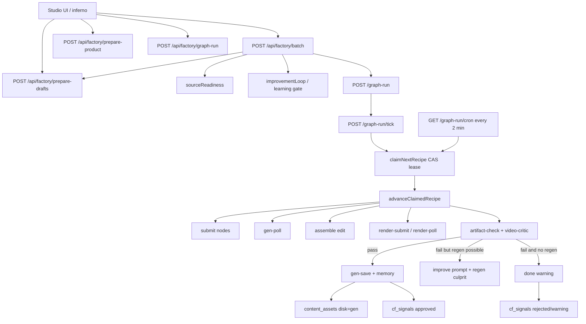
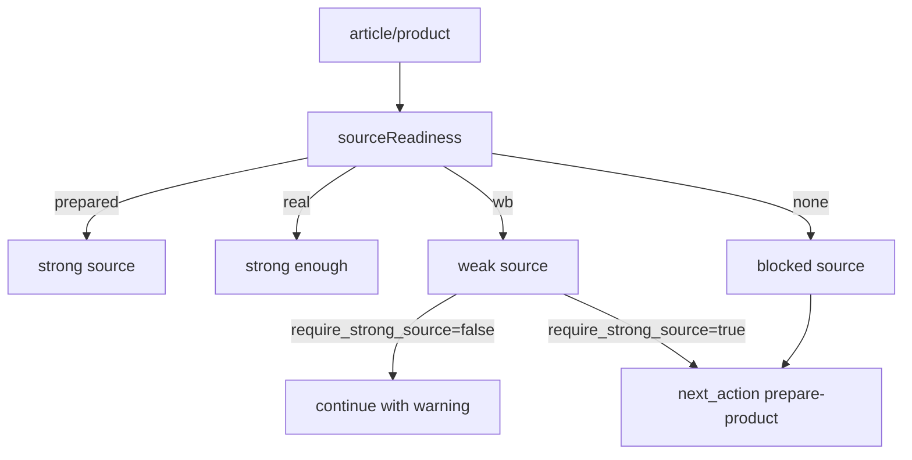
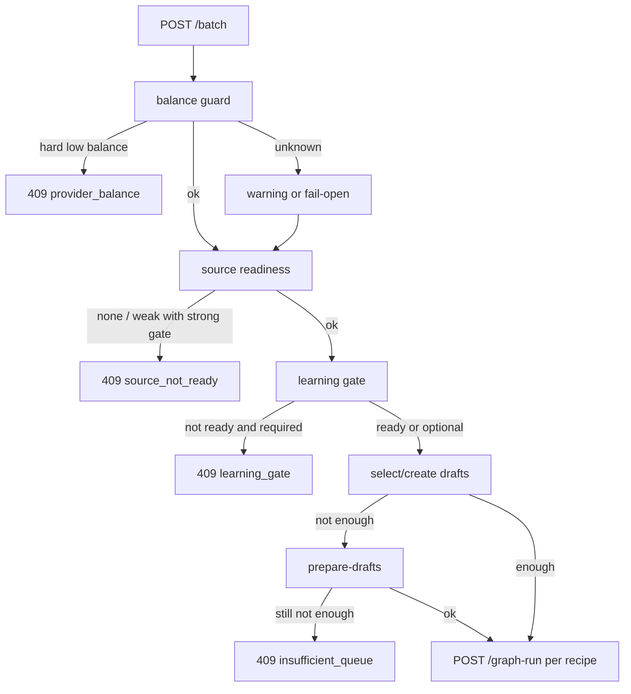
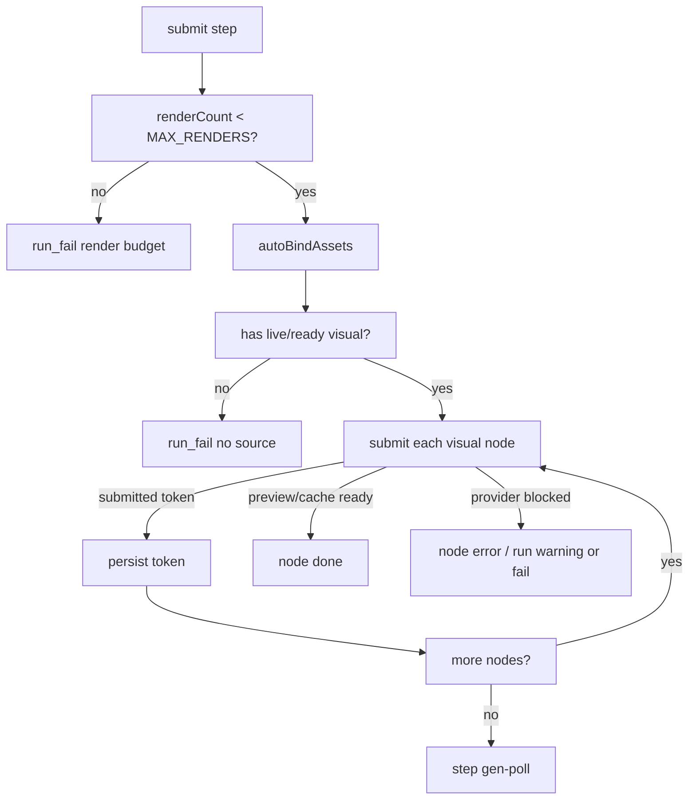
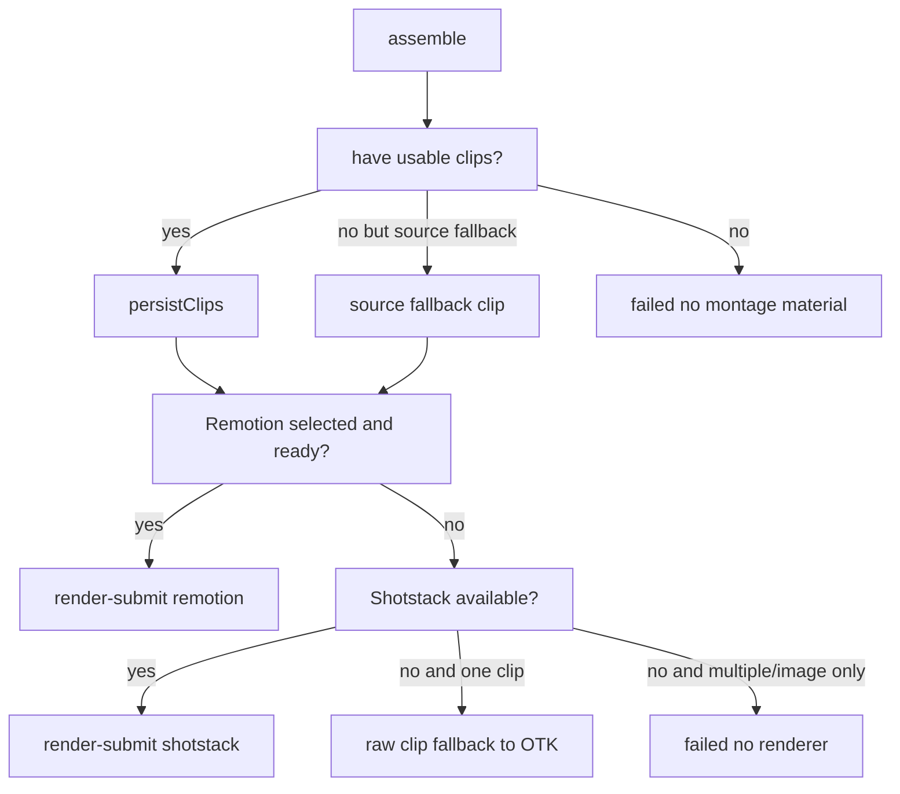
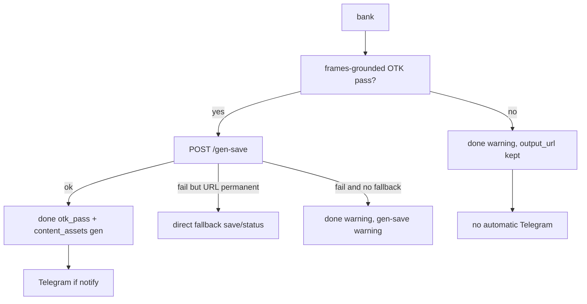
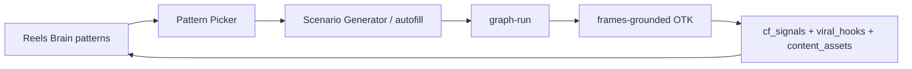
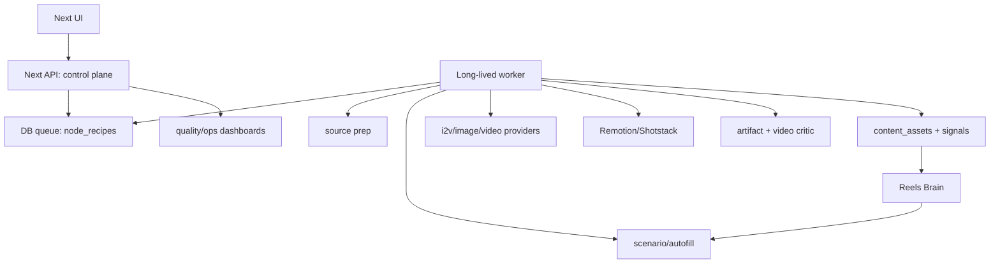

# Content Factory Complete Execution Map

Дата: 2026-06-28  
Зона: контент-завод, Shorts/TikTok/Reels, `app/api/factory`, `lib/factory`, `app/inferno`, `public/inferno/studio.html`

Этот документ описывает, как завод работает сейчас: входы, данные, развилки, точки отказа, качество, память и места, куда безопаснее всего давать следующее ТЗ. Это не план развития и не список хотелок. Это карта текущей машины.

## 1. Короткая модель

Завод состоит из пяти слоев:

1. UI студии - экран в `public/inferno/studio.html` и связанные API. Показывает командный центр, Railway worker, базу видосов, качество, очередь, кнопки запусков и ручные операции.
2. Batch launcher - `/api/factory/batch`. Проверяет деньги, источники, память/обучение, готовит рецепты и запускает `graph-run`.
3. Graph executor - `/api/factory/graph-run`, `/api/factory/graph-run/tick`, `/api/factory/graph-run/cron`. Это конечный автомат одного ролика: submit -> poll -> assemble -> render -> OTK -> bank.
4. Quality and memory - `artifact-check`, `video-critic`, `quality`, `quality-diagnostics`, `feedback-queue/auto`, `cf_signals`, `viral_hooks`, `generation_history`, `content_assets`.
5. Media and providers - Supabase Storage, FAL/Seedance/Nano/Seedream, Remotion, Shotstack, Telegram, optional ElevenLabs/audio.

Главный принцип после стабилизации: один ролик проходит через `node_recipes.run_plan`. Старые параллельные оркестраторы либо отключены, либо оставлены как страховка, чтобы не плодить гонки.

## 2. Главные сущности данных

### 2.1 `node_recipes`

Главная очередь рецептов. Один ряд = один потенциальный ролик.

Ключевые поля:

- `id` - номер рецепта.
- `status` - `draft`, `running`, `done`, `failed` и промежуточные статусы.
- `run_plan` - полный runtime-снимок исполнения. Тут лежат `run_id`, `batch_run_id`, `step`, `nodes`, `warnings`, `execution_log`, `otk`, `bestUrl`, `renderCount`, `lease_until`.
- `output_url` - финальный URL ролика, если он дошел до результата.
- `otk_score`, `otk_verdict` - результат ОТК.
- `render_id` - id внешнего рендера, если сборка ушла в Remotion или Shotstack.
- `updated_at` - используется watchdog/cron для поиска зависших прогонов.

Важная развилка: `done` не всегда означает "хороший ролик". Сейчас `done + warning` может иметь `output_url`, но не попасть в approved memory, если ОТК не прошел frames-grounded pass.

### 2.2 `node_recipe_nodes`

Состав рецепта. Один ряд = один кадр/нода/слот будущего видео.

Ключевые поля:

- `recipe_id` - связь с рецептом.
- `ordinal` - порядок.
- `slot` - смысловой слот, часто `hook`, `proof`, `cta`.
- `node_type` - тип узла.
- `tool` - инструмент генерации: i2v/image/video/render/audio/etc.
- `prompt` - исходный промпт.
- `params` - дополнительные параметры: article, product name, role, source_url, onscreen_text, сценарные куски.
- `asset_url`, `duration_sec`, `agent_suggestion`.

### 2.3 `content_assets`

Каталог всех медиа-активов. Это и память, и библиотека источников.

Важные `disk`:

- `wb` - карточки/исходники с Wildberries. Быстро и дешево, но часто это сырая WB-инфографика.
- `real` - реальные или более качественные исходники.
- `prepared` - подготовленные товарные кадры после `prepare-product`. Бывают платные через FAL, бывают no-FAL fallback через Sharp.
- `gen` - финальные генерации, которые завод сохраняет через `gen-save`.

Важные `kind`:

- `image` - картинка/слайд/подготовленный кадр.
- `video` - готовое видео или клип.

Важные поля `analysis`:

- `source_url` - исходная временная ссылка, нужна для дедупликации.
- `poster` - постер для галереи.
- `otk`, `otk_axes` - качество.
- `batch_role`, `change_axis` - экспериментальная роль в серии.
- `memory_label`, `memory_score`, `memory_confidence` - авторазметка памяти.

### 2.4 `generation_history`

Журнал попыток генерации и сохранения. Пишется через `logGeneration`.

Используется для:

- диагностики, почему ролики не попали в память;
- дедупликации;
- анализа качества;
- отслеживания `artifact_fail`, `generated`, `warning`.

### 2.5 `cf_signals`

Сигналы обучения и эксплуатации:

- `approved` - ОТК-прошедший результат;
- `rejected` - плохой результат или авто-trash;
- `graph_resurrect` - cron/watchdog разбудил зависший graph-run;
- служебные события диагностики.

### 2.6 `viral_hooks`

Корпус хуков. Завод пишет туда сильные хуки:

- `viability_score=4` - авто-сид из `gen-save`, если OTK >= 8.
- `viability_score=5` - winner из auto-feedback или ручной победитель.

`video-critic` читает топ хуков ниши, чтобы калибровать оценку: ролик должен быть не просто "норм", а конкурентен в ленте.

### 2.7 `niche_playbooks`

Playbook ниши. Отсюда `reelsBrainPicker` достает `reels_brain_patterns`, ранжирует паттерны и добавляет выбранный паттерн в `run_plan.reels_brain_pattern`.

Если playbook пустой или сломан, picker работает fail-open: прогон не блокируется.

### 2.8 Supabase Storage

Bucket: `factory-media`.

Типовые папки:

- `prepared/` - подготовленные изображения товара.
- `clips/` - промежуточные клипы.
- `renders/` - Remotion/Shotstack результаты.
- `gen/` - финальные сохраненные генерации.
- `voiceover/` - голос/звук, если используется.

## 3. Точки входа

### 3.1 UI студии

Основной экран: `public/inferno/studio.html`.

Что делает UI:

- показывает командный центр;
- показывает состояние worker/очереди;
- запускает batch;
- показывает последний стресс-тест;
- показывает качество и базу роликов;
- дергает API для обновления;
- дает ручные действия: подготовка источника, прогон, Telegram-review.

UI не должен быть источником бизнес-логики. Он должен только показывать состояние и вызывать API.

### 3.2 `/api/factory/batch`

Главная точка запуска пачки роликов.

Кто вызывает:

- UI;
- ручные скрипты;
- потенциально будущий worker/планировщик.

Что делает:

1. Нормализует вход: niche, limit, mode, notify, dry-run, series options.
2. Проверяет баланс провайдеров.
3. Проверяет source readiness.
4. Проверяет learning gate, если включено.
5. Проверяет preflight budget.
6. Подбирает или создает draft-рецепты.
7. Присваивает batch_run_id, batch_role, change_axis.
8. Подключает Reels Brain pattern.
9. Стартует каждый рецепт через `/api/factory/graph-run`.

Главные развилки:

- Баланса нет -> 409, batch не стартует.
- Баланс неизвестен -> может быть warning/fail-open, зависит от провайдера и режима.
- Источник слабый, а `require_strong_source=true` -> batch не стартует.
- Нет готовых draft-рецептов -> пробует `/prepare-drafts`.
- Learning gate не готов -> batch не стартует, если gate включен жестко.
- Dry-run -> ничего не запускает, только возвращает план.

### 3.3 `/api/factory/prepare-product`

Подготовка товарного источника.

Кто вызывает:

- UI;
- batch/preflight как рекомендуемое next action;
- ручной оператор.

Что делает:

- берет WB/исходный asset;
- если можно и разрешено, вызывает платный FAL/Seedream/Nano prep;
- если FAL нельзя или дорого, делает no-FAL fallback через Sharp;
- сохраняет результат в `content_assets` как `disk='prepared'`.

Развилки:

- Есть платный бюджет -> можно улучшить кадр через генеративный prep.
- Нет FAL или режим no-paid -> fallback через Sharp.
- Нет исходника -> нечего готовить, source readiness останется слабым.

### 3.4 `/api/factory/prepare-drafts`

Создает draft-рецепты из шаблонов и товаров.

Кто вызывает:

- `/api/factory/batch`, если не хватает готовых source-ready draft-рецептов;
- UI/ручной оператор.

Что делает:

- ищет шаблоны `node_templates`;
- ищет товары/артикулы;
- переносит шаблон в новый `node_recipes`;
- копирует ноды в `node_recipe_nodes`;
- специализирует плейсхолдеры под article/product.

Развилки:

- Шаблонов нет -> batch не может расширить очередь.
- Товаров нет -> нечего специализировать.
- Рецепты уже есть -> может не создавать новые.
- Dry-run -> показывает, что было бы создано.

### 3.5 `/api/factory/graph-run`

Запуск или чтение одного рецепта.

POST:

- принимает `recipe_id`;
- если рецепт не бежит, создает `run_plan`;
- если рецепт уже бежит, не затирает его;
- `restart` разрешен только если lease свободен или протух;
- вызывает первый `/graph-run/tick`.

GET:

- read-only статус;
- возвращает `step`, `nodes`, `otk`, `output_url`, `warnings`, `execution_log`, `run_summary`;
- не продвигает граф. Это важно: polling не должен быть вторым оркестратором.

### 3.6 `/api/factory/graph-run/tick`

Один шаг исполнения.

Кто вызывает:

- `/graph-run` после старта;
- сам себя через self-chain;
- cron как backstop;
- ручной оператор.

Что делает:

- `claimNextRecipe` берет один `running` рецепт через CAS lease;
- `advanceClaimedRecipe` делает ровно один шаг state machine;
- если шаг не терминальный, дергает следующий tick.

Развилки:

- Нет доступного рецепта -> `{ idle: true }`.
- Lease занят -> другой исполнитель работает, tick не трогает.
- Шаг успешен и не terminal -> chain продолжается.
- Шаг упал -> `advanceClaimedRecipe` увеличивает attempts; после лимита рецепт становится failed.

### 3.7 `/api/factory/graph-run/cron`

Страховка каждые 2 минуты.

Кто вызывает:

- Vercel Cron с `Authorization: Bearer CRON_SECRET`.

Что делает:

- ищет `status=running` рецепты, где `updated_at` старый или step завис;
- проверяет, что lease свободен;
- синхронно вызывает `advanceClaimedRecipe`;
- пишет `cf_signals.event='graph_resurrect'`.

Зачем нужен:

- Vercel/serverless может не надежно докрутить self-chain;
- cron не должен быть главным runner, только backstop.

### 3.8 Отключенные или вторичные оркестраторы

Стабилизация отключила или понизила роль старых механизмов:

- `/api/factory/batch-build` - старый batch-builder, не основной путь MVP.
- `/api/factory/batch-build/tick` - старый tick batch-builder.
- `/api/factory/self-heal` - старый self-heal, сейчас не главный путь.
- `/api/factory/graph-run/watchdog` - старый watchdog, заменен predictable cron/backstop.

Правило: не включать эти механизмы без отдельного ТЗ. Иначе вернутся гонки: два оркестратора будут менять один `run_plan`.

## 4. Полный путь одного ролика

### Шаг 0. Источник товара

Перед генерацией завод должен понять, есть ли нормальный визуальный источник.

`sourceReadiness` классифицирует готовность:

- `prepared` - лучший вариант для MVP. Есть подготовленный кадр товара.
- `real` - хороший вариант, если это реальное фото/видео.
- `wb` - минимальный вариант. Есть карточка WB, но возможна инфографика/текст/мелкая упаковка.
- `none` - источника нет.

Развилка:

Если цель - качество, `wb` почти всегда проблема: AI тащит в видео сырую инфографику, мелкие надписи и артефакты.

### Шаг 1. Draft recipe

Если готового рецепта нет, `/prepare-drafts` переносит `node_templates` на конкретный article.

Важная проблема текущего состояния: runtime `autofill` внутри `graph-run` сейчас фактически fail-open/skipped. То есть настоящая специализация должна происходить на этапе `prepare-drafts` или будущим отдельным Scenario Generator. Если оставить общий шаблон, ролики становятся клонами.

### Шаг 2. Batch preflight

`/api/factory/batch` перед стартом проверяет:

- баланс FAL/Shotstack/Creatify и других нужных провайдеров;
- хватит ли бюджета с учетом worst-case regeneration;
- есть ли source-ready рецепты;
- можно ли продолжать серию по learning gate;
- не заблокирован ли провайдер последними ошибками;
- есть ли последние результаты, если включен `series_after`.

Развилка batch:

### Шаг 3. `graph-run` создает `run_plan`

`buildRunPlan(rows)` превращает строки `node_recipe_nodes` в runtime-план:

- `run_id` создается через `makeRunId(recipeId)`;
- `step` обычно `submit`, но если batch передал `autofill`, стартует с `autofill`;
- ноды получают runtime status;
- сохраняются `batch_run_id`, `batch_role`, `change_axis`, `notify`.

Идемпотентность:

- если рецепт уже `running`, повторный POST не должен сбрасывать токены генерации;
- `restart` работает только при свободном/протухшем lease.

### Шаг 4. `autofill`

Текущий смысл:

- fail-open checkpoint;
- runtime LLM autofill сейчас пропускается;
- план пересобирается из DB;
- добавляется warning вроде `runtime autofill skipped fail-open`;
- шаг двигается к `submit`.

Развилка:

- Если будущий Scenario Generator будет включен, он должен жить тут или до `graph-run`.
- Сейчас нельзя считать этот шаг реальной специализацией.

### Шаг 5. `submit`

Задача: отправить визуальные ноды в генерацию.

Что происходит:

- проверяется `renderCount`, чтобы не уйти в бесконечные регенерации;
- `autoBindAssets` привязывает source/prepared media к нодам;
- если нет live visual/ready visual, прогон падает `run_fail`;
- ноды отправляются последовательно через `submitNode`;
- после каждого submit план сохраняется, чтобы не потерять provider token.

Развилки submit:

Типовые отказы:

- provider balance collapsed mid-run;
- source_url приватный или не скачивается;
- FAL вернул ошибку;
- нода уже имеет url, но content-type не video/image ожидаемого типа.

### Шаг 6. `gen-poll`

Задача: дождаться результата i2v/video nodes.

Что происходит:

- `pollNode` проверяет provider status;
- pending ноды ждут, но есть лимиты по poll count и wall clock;
- если provider завис, нода получает error;
- если done ноды есть, можно идти в assemble;
- если done нет, но есть source fallback, можно собрать fallback-видео/клип с warning;
- если done нет и fallback невозможен, прогон падает.

Развилки:

- All done -> `assemble`.
- Some pending -> остаться в `gen-poll`.
- Timeout but fallback possible -> `assemble` с warning.
- Timeout and no fallback -> `failed`.

### Шаг 7. `assemble`

Задача: собрать ролик из клипов/кадров/аудио/текста.

Что происходит:

- выбираются visual nodes с url;
- unsafe/private ссылки отбрасываются;
- `persistClips` сохраняет клипы в постоянное хранилище;
- собирается edit JSON: clips, hooks, captions, audio, voiceover;
- выбирается route: Remotion, Shotstack или fallback.

Развилки assemble:

Важная развилка качества: raw clip fallback может дать MP4, но это не равно хороший ролик. Он должен пройти frames-grounded OTK.

### Шаг 8. `render-submit`

Задача: отправить edit в финальный renderer.

Развилки:

- `render_id` уже есть -> не сабмитить повторно, идти в `render-poll`.
- Remotion submit ok -> сохранить render_id, идти в `render-poll`.
- Remotion submit fail, backup есть -> raw fallback to OTK с warning.
- Shotstack submit ok -> сохранить render_id, идти в `render-poll`.
- Shotstack submit fail, backup есть -> fallback.
- Нет renderer и нет backup -> failed.

### Шаг 9. `render-poll`

Задача: дождаться финального MP4.

Развилки:

- Renderer done -> получить output URL, идти в `otk`.
- Renderer pending -> остаться в `render-poll`.
- Retryable error -> продолжить до лимита.
- Timeout/error + backup есть -> raw fallback to OTK с warning.
- Timeout/error + backup нет -> failed.

### Шаг 10. `otk`

ОТК сейчас состоит из трех частей:

1. `extractFrames` - достать кадры из видео.
2. `artifact-check` - vision-check на технические AI-артефакты.
3. `video-critic` - рубрика 1-10 через оси hook, retention, native, brand, cta.

#### 10.1 `extractFrames`

Нужно получить кадры first/middle/last и передать их критику.

Развилки:

- Кадры извлечены -> полноценный frames-grounded OTK.
- Кадров нет -> `video-critic` может использовать storyboard/text fallback, но такой basis не должен считаться полноценным pass.

#### 10.2 `artifact-check`

Проверяет только технический брак:

- искаженный текст/лого;
- текст-блид;
- оплавленные края;
- морфинг объекта;
- лишние/кривые пальцы;
- восковая кожа;
- нереалистичный товар.

Fail-open:

- нет кадров -> clean/note, прогон не блокируется;
- нет Anthropic key -> clean/note;
- crash -> clean/warning.

Если `severity='broken'`, это сильный сигнал на регенерацию.

#### 10.3 `video-critic`

Оценивает ролик по рубрике:

- `hook`;
- `retention`;
- `native`;
- `brand`;
- `cta`.

Возвращает:

- `score` 1-10;
- `weighted`;
- `verdict`;
- `axes`;
- `floor_fail`;
- `basis`: `model`, `text`, `fallback`;
- `basis_reason`;
- `issues`, `fixes`, `regen_hint`.

Развилки:

- Есть кадры и модель вернула tool_use -> лучший путь, `basis='model'`.
- Нет кадров, но есть storyboard -> text prefilter, `basis='text'`.
- Модель недоступна/timeout/empty -> deterministic fallback, `basis='fallback'`.
- Нет кадров и нет storyboard -> 400.

Критичный принцип: pass-rate должен считаться по frames-grounded OTK. Text/fallback basis полезны как диагностика, но не должны превращать слабый ролик в winner.

### Шаг 11. Regen loop

Если ОТК не прошел, `graph-run` пробует улучшить:

- выбирает culprit-ноду;
- берет `regen_hint`/issues;
- вызывает improve-prompt;
- возвращает culprit в `submit`;
- увеличивает `renderCount`;
- повторяет до лимита.

Развилки:

- Score pass и basis frames-grounded -> `bank`.
- Score low, есть culprit, renderCount < max -> regen.
- Score low, culprit нет или лимит исчерпан -> `bank` как warning.
- Critic no score -> warning, чаще всего `bank` без approved memory.

### Шаг 12. `bank`

Финализация.

Что происходит:

- выбирается `bestUrl`/`bestScore`;
- рецепт получает `output_url`;
- если frames-grounded OTK pass, ролик сохраняется через `gen-save` в `content_assets disk='gen'`;
- если score высокий, хук может попасть в `viral_hooks`;
- пишется `cf_signals approved` или rejected/warning;
- если `notify=true` и статус OTK pass, ролик отправляется в Telegram.

Развилки:

Это объясняет важное наблюдение: ролики могут быть с `output_url`, но не попасть в память видосов как approved/winner.

## 5. Quality loop и память

### 5.1 Что считается хорошим роликом

Для MVP качества честный pass должен быть:

- видео реально сгенерировано;
- есть извлеченные кадры;
- `video-critic.basis='model'`;
- score >= порога;
- нет broken artifact-check;
- ролик сохранен в `content_assets disk='gen'`;
- желательно есть market/feedback signal позже.

### 5.2 Что сейчас считается warning

Типовые warning:

- `OTK below threshold`;
- `video-critic did not return score`;
- `artifact-check warning`;
- `runtime autofill skipped fail-open`;
- source fallback rescued render;
- render fallback to raw clip;
- gen-save/catalog warning.

Warning не обязательно блокирует выпуск MP4. Но warning не должен считаться победой.

### 5.3 Auto-feedback

Endpoint: `/api/factory/feedback-queue/auto`.

Что делает:

- сканирует `content_assets disk='gen' kind='video'`;
- вызывает `decideAutoFeedback`;
- может поставить `memory_label`: winner, usable, trash;
- winner пишет `is_winner=true`, `winner_at`, `winner_learnings`;
- winner seed идет в `viral_hooks`;
- trash seed идет в `cf_signals rejected`.

Важный принцип: авторазметка не должна "придумывать победителей" из слабого ОТК. Если объективного winner-сигнала нет, она оставляет keep/usable.

### 5.4 Learning gate

`improvementLoop` строит snapshot:

- последние runs;
- batch windows;
- winners/losers/salvageable;
- dominant warning reason;
- top patterns;
- axis insights;
- next batch gate.

Развилка:

- Есть feedback по текущей партии -> можно запускать следующую с learning context.
- Нет feedback, а gate required -> следующий batch блокируется.
- Gate optional -> batch идет, но без сильного обучения.

## 6. Reels Brain path

Текущий Reels Brain подключен частично.

Что есть:

- `reelsBrainPicker` читает `niche_playbooks.playbook.reels_brain_patterns`;
- выбирает top patterns детерминированно по seed;
- пишет выбранный pattern в `run_plan.reels_brain_pattern`;
- добавляет pattern cues в hook node params/prompt.

Что еще слабое:

- Pattern Picker есть, но не гарантирует глубокую специализацию каждого кадра;
- Scenario Generator/autofill не является полноценным runtime шагом;
- Critic Loop есть, но часто упирается в no-score, fallback basis или артефакты товара;
- Reels Brain не всегда замыкает цикл "плохой ролик -> причина -> следующий batch меняет только один axis".

Идеальная связка:

## 7. Provider and cost branches

### 7.1 FAL

Используется для:

- source prep;
- image/video generation;
- frame extraction;
- possibly i2v.

Отказы:

- low balance;
- provider timeout;
- temporary URL expired;
- response not video;
- model returns bad artifact;
- high spend mid-batch.

Защита:

- balance guard до batch;
- fallback prep без FAL;
- `gen-save` качает временную ссылку в Supabase Storage;
- no-paid smoke для проверки без траты.

### 7.2 Remotion

Используется для финальной сборки, если route выбран и сервис готов.

Отказы:

- render-service недоступен;
- upload path неверный;
- render timeout;
- плохой asset URL.

Fallback:

- Shotstack;
- raw clip fallback.

### 7.3 Shotstack

Второй renderer/backstop.

Отказы:

- API error;
- render timeout;
- недостаточно валидных клипов.

Fallback:

- raw clip, если есть один готовый MP4.

### 7.4 Telegram

Два режима:

- Auto send в `bank`, только если finalStatus `otk_pass` и `notify=true`.
- Manual review через `/api/factory/telegram/send-review`, можно отправлять warning ролики владельцу.

Если Telegram не может отправить video, manual route шлет fallback message со ссылкой.

## 8. Observability

### 8.1 `execution_log`

Каждый шаг должен писать:

- `started_at`;
- `finished_at`;
- step;
- status;
- input/output artifacts;
- error/warning.

Это живет в `run_plan.execution_log`.

### 8.2 `run_summary`

`/graph-run GET` возвращает `run_summary`, собранный из `run_plan`.

Использование:

- UI показывает понятную сводку;
- оператор видит, где стоит recipe;
- stress/smoke отчеты могут читать однообразный контракт.

### 8.3 Quality diagnostics

Маршруты:

- `/api/factory/quality`;
- `/api/factory/quality-diagnostics`;
- `/api/factory/memory-quality`;
- `/api/factory/ops`.

Что смотрят:

- pass-rate;
- fallback ratio video-critic;
- dominant warning reason;
- no-score;
- artifact failures;
- worker/infra state;
- history stress tests.

### 8.4 Smoke and stress docs

Связанные документы:

- `docs/factory-latest-stress.md`;
- `docs/factory-latest-no-paid-smoke.md`;
- `docs/factory-stress-history/`;
- `docs/factory-prod-smoke-history/`.

Назначение:

- не доказывают качество роликов;
- доказывают, что пайплайн проходит и где падает.

## 9. Полная карта API

| Endpoint | Роль | Кто вызывает | Что пишет | Главные отказы |
| --- | --- | --- | --- | --- |
| `/api/factory/batch` | Запуск пачки | UI, scripts | `node_recipes`, `run_plan`, batch metadata | баланс, source readiness, learning gate, draft shortage |
| `/api/factory/prepare-product` | Подготовка источника | UI, operator, preflight action | `content_assets disk=prepared` | нет source, FAL/budget, upload |
| `/api/factory/prepare-drafts` | Создание draft-рецептов | batch, UI | `node_recipes`, `node_recipe_nodes` | нет templates/articles |
| `/api/factory/graph-run` POST | Старт одного recipe | batch, UI | `run_plan`, status running | recipe not found, no nodes, lease conflicts |
| `/api/factory/graph-run` GET | Статус recipe | UI, scripts | ничего | recipe not found |
| `/api/factory/graph-run/tick` | Один шаг executor | graph-run, self-chain, operator | `run_plan`, statuses | step crash, provider error |
| `/api/factory/graph-run/cron` | Backstop зависших | Vercel cron | `run_plan`, `cf_signals` | auth, Supabase, stale detection |
| `/api/factory/artifact-check` | Vision artifact gate | graph-run OTK | ничего, ответ JSON | model missing, timeout, loose JSON |
| `/api/factory/video-critic` | Rubric OTK | graph-run OTK | optional reads hooks | model timeout, empty response, fallback basis |
| `/api/factory/gen-save` | Сохранить результат | graph-run bank | Storage, `content_assets`, `generation_history`, `viral_hooks` | temp URL expired, not video, upload, duplicate |
| `/api/factory/quality` | Pass-rate | UI | ничего | stats query |
| `/api/factory/quality-diagnostics` | Диагностика качества | UI | ничего | stats query |
| `/api/factory/memory-quality` | Качество памяти | UI | ничего | stats query |
| `/api/factory/feedback-queue/auto` | Авторазметка памяти | operator/UI | `content_assets`, `viral_hooks`, `cf_signals` | weak signals, DB optional tables |
| `/api/factory/telegram/send-review` | Ручная отправка роликов | operator/scripts | Telegram side effect | auth, token, Telegram cannot fetch video |
| `/api/factory/ops` | Операционный статус | UI | ничего | missing stats/worker |
| `/api/factory/worker-state` | Worker heartbeat/state | UI/worker | worker state table | table missing, stale heartbeat |
| `/api/factory/batch-build` | Старый batch builder | legacy | legacy | отключен/не основной |
| `/api/factory/batch-build/tick` | Старый tick | legacy | legacy | отключен/не основной |

## 10. Где система реально принимает решения

### 10.1 Решение "можно ли стартовать batch"

Файл: `app/api/factory/batch/route.ts`.

Решение зависит от:

- денег;
- source readiness;
- learning gate;
- preflight estimate;
- наличия рецептов;
- provider block lookback;
- dry-run.

### 10.2 Решение "какой recipe взять"

Файл: `lib/factory/graphRun.ts`.

`claimNextRecipe` берет running recipe с учетом lease. Это защита от двух runner-ов.

### 10.3 Решение "какой шаг выполнить"

Файл: `lib/factory/graphRun.ts`.

`advanceClaimedRecipe` смотрит `plan.step` и вызывает нужный блок.

### 10.4 Решение "достаточно ли хороший ролик"

Файлы:

- `lib/factory/graphRun.ts`, step `otk`;
- `app/api/factory/artifact-check/route.ts`;
- `app/api/factory/video-critic/route.ts`;
- `lib/factory/rubric.ts`.

Критерий должен быть frames-grounded. Если score пришел из text/fallback basis, это диагностический сигнал, не полноценная победа.

### 10.5 Решение "попадает ли ролик в память"

Файлы:

- `lib/factory/graphRun.ts`, step `bank`;
- `app/api/factory/gen-save/route.ts`;
- `app/api/factory/feedback-queue/auto/route.ts`.

Сейчас `gen-save` сохраняет финальные ролики, но банк должен делать это только при ОТК pass. Warning может иметь output_url, но не обязан быть memory winner.

### 10.6 Решение "следующий batch должен отличаться"

Файлы:

- `lib/factory/improvementLoop.ts`;
- `lib/factory/reelsBrainPicker.ts`;
- `app/api/factory/batch/route.ts`.

Используются:

- batch_role: control/experiment;
- change_axis;
- dominant warning;
- latest/previous batch;
- top patterns.

## 11. Основные точки отказа

### P0: Нет нормального source

Симптомы:

- ролики используют сырую WB-инфографику;
- AI искажает упаковку/текст;
- artifact-check ругается;
- OTK ниже порога.

Где чинить:

- `sourcePrep`;
- `prepare-product`;
- правила `require_strong_source`;
- запрет на запуск без `prepared` для quality-first batch.

### P0: `graph-run` может ждать внешние сервисы слишком долго

Симптомы:

- recipe стоит на `render-submit`, `render-poll`, `gen-poll`;
- cron будит, но прогресс медленный;
- оператор вручную дергает tick.

Где чинить:

- long-lived worker;
- более агрессивные timeout decisions;
- явный heartbeat и retry budget.

### P0/P1: `video-critic` no-score или fallback basis

Симптомы:

- `video-critic did not return score`;
- `basis=fallback`;
- pass-rate не растет, потому что качество нечестное;
- warning ролики выходят без понятной причины.

Где чинить:

- structured tool-use extraction;
- timeout budget;
- frame extraction;
- fallback policy: fallback не winner.

### P1: Runtime autofill не делает полноценную специализацию

Симптомы:

- ролики похожи друг на друга;
- один hook повторяется;
- товар не встроен в сценарий;
- Reels Brain не раскрывается.

Где чинить:

- `recipeTransfer`;
- будущий Scenario Generator;
- `autofill` step в `graph-run`;
- проверка уникальности hook/onscreen per article.

### P1: FAL cost burns mid-batch

Симптомы:

- деньги уходят до получения качественных winner;
- batch падает или уходит в fallback;
- много warning MP4.

Где чинить:

- batch budget preflight;
- smaller batch size;
- no-paid prep before paid i2v;
- stop-loss по low pass-rate;
- cheaper first pass, paid only after source and scenario gate.

### P1: Warning outputs выглядят как успешные для человека

Симптомы:

- есть MP4, но он плохой;
- пользователь видит "готово", а память не выросла;
- Telegram auto не отправляет warning.

Где чинить:

- UI labels;
- separate `produced`, `approved`, `needs_review`;
- manual Telegram review for warning;
- status copy.

### P2: Старые оркестраторы могут запутать карту

Симптомы:

- в коде есть batch-build/self-heal/watchdog;
- непонятно, что реально живое;
- риск случайно включить дубль.

Где чинить:

- оставить в docs как deprecated;
- добавить явные disabled responses;
- удалить после worker migration.

## 12. Что является MVP, а что можно отключать

### Обязательно для MVP

- `/api/factory/batch`;
- `/api/factory/prepare-drafts`;
- `/api/factory/prepare-product`;
- `/api/factory/graph-run`;
- `/api/factory/graph-run/tick`;
- `/api/factory/graph-run/cron`;
- `sourceReadiness`;
- `sourcePrep`;
- `gen-save`;
- `artifact-check`;
- `video-critic`;
- `quality`/diagnostics;
- Supabase Storage;
- Telegram manual review.

### Желательно, но не блокер MVP

- Reels Brain pattern picker;
- auto-feedback;
- memory-quality;
- ops dashboard;
- series learning gate;
- Remotion if Shotstack/raw fallback работает.

### Временно отключаемое

- batch-build;
- self-heal;
- old watchdog route;
- hook-judge/scenario-rewrite/variations, если они не участвуют в MP4 path;
- optional ElevenLabs/audio, если видео без голоса лучше стабильно выпускать.

## 13. Как читать следующие ТЗ

Когда ты будешь давать ТЗ, лучше привязывать его к одному из четырех контуров:

### Контур A. Качество ролика

Менять:

- source prep;
- scenario/autofill;
- Reels Brain cues;
- video-critic;
- regen loop;
- artifact-specific prompt repair.

Не трогать без нужды:

- cron;
- auth;
- finance;
- общие marketplace API.

### Контур B. Надежность исполнения

Менять:

- graph-run tick;
- cron/backstop;
- lease;
- provider timeout;
- worker extraction;
- execution_log.

Не смешивать с:

- новыми промптами;
- UI polish;
- большими migration без отдельного окна.

### Контур C. Стоимость

Менять:

- balance guard;
- batch size;
- source prep route;
- paid/free provider selection;
- stop-loss.

Не смешивать с:

- оценкой креатива;
- новым форматом видео.

### Контур D. Память и обучение

Менять:

- feedback-queue/auto;
- cf_signals;
- viral_hooks;
- improvementLoop;
- batch_role/change_axis;
- winner/trash taxonomy.

Не смешивать с:

- provider low-level retries;
- render infra.

## 14. Практический debug checklist

### Если batch не стартует

1. Проверить `/api/factory/batch` response.
2. Смотреть `balance_guard`.
3. Смотреть `source_readiness`.
4. Смотреть `learning_gate`.
5. Смотреть `drafts_found` и `prepare-drafts`.

### Если recipe завис

1. GET `/api/factory/graph-run?recipe_id=...`.
2. Смотреть `step`.
3. Смотреть `lease_until`.
4. Смотреть `execution_log`.
5. Дернуть `/api/factory/graph-run/tick` вручную.
6. Проверить, будит ли `/graph-run/cron`.

### Если MP4 есть, но он плохой

1. Смотреть `otk_score`.
2. Смотреть `run_plan.otk.basis`.
3. Смотреть `warnings`.
4. Смотреть `artifact-check defects`.
5. Смотреть `video-critic issues/fixes`.
6. Проверить, был ли regen или сразу bank.

### Если ролик не попал в память

1. Проверить `content_assets disk=gen`.
2. Проверить `generation_history`.
3. Проверить `gen-save` response.
4. Проверить, был ли frames-grounded OTK pass.
5. Проверить дедуп по `analysis.source_url`.

### Если Telegram не прислал ролик

1. Auto send работает только на `otk_pass`.
2. Для warning использовать `/telegram/send-review`.
3. Проверить `FACTORY_TG_BOT_TOKEN`.
4. Проверить, Telegram может скачать URL.
5. Если не может, endpoint шлет fallback link.

## 15. Рекомендуемая целевая архитектура после карты

Это не новая задача, а ориентир для будущего ТЗ:

Цель такой архитектуры:

- UI и финансы остаются в Next;
- долгие шаги уходят в worker;
- Vercel не держит render/poll;
- ОТК становится реальным gate;
- память замыкается в следующий batch;
- каждый batch меняет ограниченное число параметров, чтобы было понятно, что улучшило результат.

## 16. Короткий словарь

- `recipe` - один будущий ролик.
- `node` - кадр/слот/операция внутри ролика.
- `run_plan` - runtime-состояние одного прогона.
- `batch_run_id` - id пачки роликов.
- `batch_role` - control/experiment внутри серии.
- `change_axis` - что меняем в эксперименте: hook, proof, CTA, format.
- `prepared source` - подготовленный товарный кадр.
- `frames-grounded OTK` - оценка по реальным кадрам ролика, не по тексту.
- `warning output` - MP4 получен, но качество/память не подтверждены.
- `approved memory` - ролик сохранен как достойный сигнал.
- `winner` - ролик с сильным объективным сигналом, может учить следующий batch.

## 17. Самая важная мысль

Завод уже умеет выпускать MP4. Главная проблема не в кнопке запуска. Главная проблема в честной цепочке:

`prepared source -> specialized scenario -> generated video -> frames-grounded OTK -> regen -> approved memory -> next batch uses memory`.

Если любое звено выпадает, система все равно может произвести файл, но он не будет учить завод и не будет стабильно улучшать следующий ролик.
