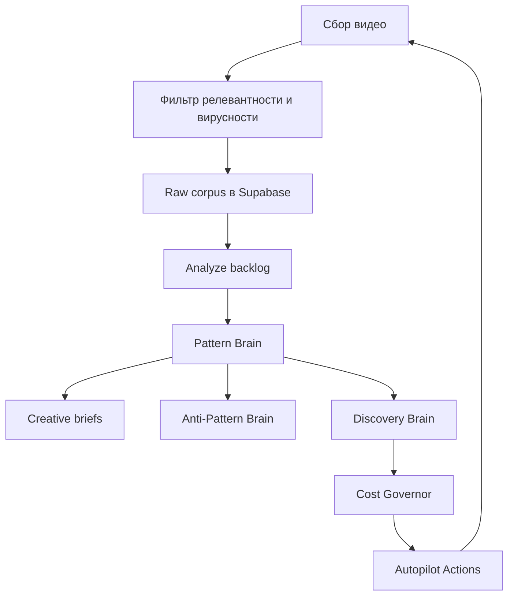

# Reels Brain Operating System

Дата: 2026-07-01

## Что это

Reels Brain - отдельный слой интеллекта поиска и анализа коротких видео. Он не является контент-заводом и не запускает генерацию роликов сам по себе. Его задача - накопить насмотренность, сжать ее в паттерны и дать человеку понятную витрину:

- сколько видео собрано и разобрано;
- насколько можно доверять выводам;
- какие хуки, форматы и retention-механики выигрывают;
- какие паттерны уже можно превращать в creative brief;
- какие источники стоит масштабировать, а какие ограничить;
- сколько стоит полезная единица обучения.

## Закрытый пакет из 10 задач

1. Pattern Memory стала операторской витриной: главный экран показывает прогресс от сырого корпуса до generator-ready паттернов.
2. Creative brief выводится для каждого сильного паттерна: хук, удержание, структура по секундам, visual recipe, product fit, что можно и нельзя копировать.
3. Pattern drawer добавлен в UI: детали паттерна открываются по клику без перегруза главной страницы.
4. Quality gate отделяет high-confidence, medium, experimental и noise.
5. Anti-Pattern Brain показывает, что не стоит масштабировать.
6. Discovery Brain объясняет, какие источники и провайдеры дают полезную насмотренность.
7. Cost Governor ограничивает платный сбор по дневному бюджету, цене полезного видео и low-signal rate.
8. Autopilot Actions превращает данные в read-only список действий для сборщика.
9. Next Intelligence Layers описывает следующие слои: feedback loop, audio/visual, product, audience, experiment, portfolio, editing.
10. Read-only API вынесены отдельно, чтобы интерфейс и worker могли читать решения без запуска платных операций.

## Главные API

- `GET /api/factory/reels-brain/learning-economics` - полный срез насмотренности, экономики, паттернов и решений.
- `GET /api/factory/reels-brain/creative-brief` - creative brief по найденным паттернам.
- `GET /api/factory/reels-brain/autopilot-actions` - операторские действия для discovery/autopilot слоя.
- `GET /api/factory/reels-brain/cost-governor` - бюджетные guardrails и лимиты по источникам.
- `GET /api/factory/reels-brain/report` - короткий отчет для дашборда или ежедневного дайджеста.
- `GET /api/factory/reels-brain/feedback` - текущая обратная связь от опубликованных роликов.
- `POST /api/factory/reels-brain/feedback` - запись outcome опубликованного ролика через `post_metrics`.

## Как работает петля

## Почему это удешевляет сбор

Система не должна покупать все подряд. Она смотрит на yield источников, low-signal rate, стоимость полезного видео и готовность ниш. Если источник дает мусор или цена стала выше лимита, Cost Governor переводит режим в `pause_or_review`. Если источник дает полезные RU-видео и сильные паттерны, Autopilot Actions предлагает масштабировать только его.

## Что видит пользователь

Пользователь не видит настройки, ключи и технические джобы. Экран должен отвечать на пять вопросов:

- чему мозг уже научился;
- насколько этому можно доверять;
- какие хуки и механики выигрывают;
- какие паттерны можно использовать как creative brief;
- дешевеет ли обучение и можно ли продолжать платный сбор.

## Что дальше

Следующий безопасный слой - feedback loop от наших опубликованных роликов. После публикации нужно возвращать в Reels Brain фактические `views`, `saves`, `CTR`, `retention`, `orders`. Тогда мозг будет отличать не только чужие вирусные паттерны, но и то, что реально сработало для наших товаров и аудиторий.

## Пакет 1-10 после дошлифовки

1. PR/ветка: Reels Brain cockpit вынесен в отдельную feature-ветку и может сливаться без прямой записи в `main`.
2. Feedback loop: добавлен read/write endpoint `/api/factory/reels-brain/feedback`, который использует существующий `post_metrics`.
3. Audio / Visual Intelligence: `learning-economics` возвращает `audio_visual_intelligence` с текущими rule-based сигналами и списком следующих extractors.
4. Product Brain: `product_brain` группирует паттерны по типам товаров и visual proof.
5. Audience Brain: `audience_brain` группирует паттерны по аудиториям и стилю подачи.
6. Experiment Brain: `experiment_brain` строит A/B matrix, где меняется один axis.
7. Portfolio Manager: `portfolio_manager` предлагает weekly content mix на основе паттернов и feedback.
8. Smart RU collection: discovery/autopilot продолжает работать через `autopilot_actions`, но с бюджетными ограничениями.
9. Design QA surface: cockpit показывает эти слои без настроек, через витрину прогресса, бюджета и инсайтов.
10. Worker enforcement: `reels-brain-cron` перед платным bulk проверяет autopilot/cost guard и при паузе переключается на analyze.
