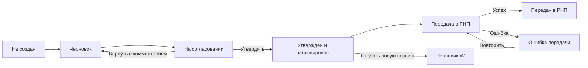

# ТЗ на дизайн: «План продаж» по кабинетам Wildberries

Версия: 1.0  
Дата: 15 июля 2026  
Статус: готово к передаче продуктового дизайнеру

## 1. Цель

Добавить в финансовую панель рабочий контур ежемесячного планирования продаж по дням. Для каждого кабинета Wildberries — Optima, Retail Family, Galerin и будущих кабинетов — создаётся отдельный план. Менеджеры вводят план заказов, цену, процент выкупа и долю рекламных расходов. Руководитель утверждает план, после чего он блокируется и передаётся в РНП для сравнения с фактом.

Ключевая единица планирования — цветовая вариация товара. Родительский артикул модели нужен только для группировки. Размеры одного цвета на первом этапе агрегируются.

## 2. Границы задачи

В дизайн первой версии входят:

- отдельный план на кабинет и месяц;
- дневной план заказов по каждой цветовой вариации;
- цена, выкуп и реклама в процентах;
- расчёт дневной и месячной заказной выручки, ожидаемого выкупа, плановой выручки и рекламы;
- добавление существующих и новых товаров/цветов;
- черновик, согласование, утверждение, блокировка и версии;
- передача утверждённого плана в РНП;
- план-факт в РНП;
- история действий и системные состояния.

Не входят в первую версию:

- автоматическое утверждение;
- автоматическое изменение цены;
- AI-прогноз как замена ручного плана;
- одновременное редактирование как в Google Sheets;
- отдельное планирование каждого размера;
- производственный календарь и полноценный модуль закупок.

## 3. Термины и сущности

| Термин | Значение |
|---|---|
| Кабинет | Отдельное юридическое лицо / кабинет Wildberries |
| План | Набор дневных значений одного кабинета на один месяц |
| Модель | Родительский артикул, например `NV-08-35`; используется как группа |
| Цветовая вариация | Отдельный продаваемый цвет модели; самостоятельная строка плана |
| nmID | Артикул карточки Wildberries |
| Заказы | Планируемое количество заказанных единиц до выкупа |
| Заказная выручка | Заказы × цена |
| Ожидаемый выкуп | Заказы × процент выкупа |
| Плановая выручка | Ожидаемый выкуп × цена |
| Реклама | Процент и сумма рекламных расходов от заказной выручки |
| РНП | Операционный экран, принимающий утверждённый план и показывающий план-факт |

## 4. Неподлежащие изменению правила

1. План принадлежит ровно одному кабинету. Сводный режим возможен только для чтения и аналитики.
2. Утверждение выполняется отдельно для каждого кабинета и месяца.
3. Нельзя планировать модель одной строкой. Каждая цветовая вариация — отдельная строка.
4. Если модель имеет пять цветов, в таблице должно быть пять дочерних строк.
5. Строка модели показывает суммы и не содержит редактируемого дневного плана.
6. Размеры одной цветовой вариации агрегируются.
7. Процент рекламы применяется к заказной выручке до выкупа.
8. Утверждённая версия не редактируется. Исправление создаёт новую версию.
9. В РНП передаётся только утверждённая версия.
10. Все изменения, утверждения и повторы передачи фиксируются в аудите.

## 5. Роли и права

| Роль | Возможности |
|---|---|
| Менеджер | Создать черновик, заполнить план, импортировать, добавить цвет, отправить на согласование |
| Руководитель | Просмотреть, вернуть с комментарием, утвердить, инициировать повтор передачи |
| Аналитик / сотрудник РНП | Просматривать утверждённый план и план-факт |
| Администратор | Создать новую версию из утверждённой, восстановить доступ с обязательной причиной |

Интерфейс скрывает недоступные действия либо показывает их disabled с объяснением причины.

## 6. Навигация и информационная архитектура

В тёмной левой навигации в разделе «Операции» появляется пункт «План продаж». Это самостоятельная страница планирования. В РНП не редактируют план — там смотрят утверждённые значения и факт.

Страница плана:

1. вкладки кабинетов;
2. заголовок и статус;
3. выбор месяца и версии;
4. KPI;
5. панель инструментов;
6. основная дневная таблица;
7. боковая панель редактирования;
8. история версий.

Вкладки: Optima, Retail Family, Galerin. Для каждого кабинета показывается индикатор: нет плана, черновик, на согласовании, утверждён или ошибка передачи. Пункт «Все кабинеты» в режиме редактирования отсутствует.

## 7. Жизненный цикл плана



Статус и доступные действия всегда видны. После утверждения показываются версия, утвердивший, время утверждения и состояние передачи.

## 8. Шапка страницы

Обязательные элементы:

- хлебные крошки «Операции / План продаж»;
- заголовок «План продаж»;
- выбранный кабинет;
- месяц;
- версия;
- ответственный;
- статус;
- время автосохранения;
- кнопки согласно статусу.

Действия черновика: «Импорт», «Добавить товар/цвет», «Сохранить», «Отправить на согласование».  
Действия согласования: «Вернуть», «Утвердить и передать в РНП».  
Действия утверждённого плана: «Открыть в РНП», «История версий», «Создать новую версию».

## 9. KPI

Компактные карточки показывают:

1. заказы, шт.;
2. ожидаемый выкуп, шт. и средневзвешенный %;
3. плановую выручку после выкупа, ₽;
4. рекламный бюджет, ₽ и средневзвешенный %;
5. число цветовых вариаций и ошибок заполнения.

Карточки пересчитываются сразу после изменения ячейки. При несохранённых изменениях допускается локальный optimistic-пересчёт с индикатором сохранения.

## 10. Формулы

Для цветовой вариации `v` и дня `d`:

```text
Заказная выручка(v,d) = Заказы(v,d) × Цена(v)
Ожидаемый выкуп(v,d) = Заказы(v,d) × Выкуп(v) / 100
Плановая выручка(v,d) = Ожидаемый выкуп(v,d) × Цена(v)
Реклама(v,d) = Заказы(v,d) × Цена(v) × Реклама%(v) / 100
```

Процент рекламы считается от заказной выручки до выкупа. Пример: 8 заказов × 13 500 ₽ × 12% = 12 960 ₽ рекламного бюджета за день.

Округление:

- заказы вводятся целыми числами;
- ожидаемый выкуп можно считать с дробной частью, а в UI показывать с одним знаком либо округлённое значение с подсказкой;
- деньги хранятся и суммируются без визуальных копеек, если источник не требует иначе;
- проценты — до одного десятичного знака.

## 11. Главная таблица

### 11.1. Закреплённая область

- модель / цвет;
- внутренний артикул вариации и nmID;
- цена;
- выкуп, %;
- реклама, %;
- остаток / в пути.

### 11.2. Календарная область

Все дни выбранного месяца. В заголовке — число и короткий день недели. Выходные имеют мягкий нейтральный фон. Горизонтальный скролл синхронен для заголовка и тела. Текущий день может быть отмечен тонким акцентом.

### 11.3. Итоговая область

- заказы;
- ожидаемый выкуп;
- реклама, ₽;
- заказная выручка;
- плановая выручка;
- индикатор риска дефицита.

### 11.4. Иерархия строк

Родительская строка модели содержит название, артикул, бренд, число цветов и суммы. Она сворачивает/разворачивает дочерние строки, но дневные значения в ней не редактируются.

Дочерняя строка — конкретный цвет. В ней обязательно отображаются цвет, внутренний артикул вариации и nmID, если он известен.

### 11.5. Режимы метрик

- «Заказы, шт.» — редактируемый режим;
- «Реклама, ₽» — расчётный read-only режим;
- «Заказная выручка, ₽» — расчётный read-only режим.

При переключении сохраняются текущая прокрутка, раскрытые группы и выделенная строка.

## 12. Ввод данных

Клик по дневной ячейке открывает popover или правую панель. Поля:

- дата;
- модель и цвет;
- заказы;
- цена;
- выкуп;
- реклама;
- рассчитанный дневной рекламный расход;
- заказная выручка;
- плановая выручка.

В таблице нужно поддержать:

- ввод с клавиатуры;
- переход Tab / Shift+Tab;
- копирование и вставку прямоугольного диапазона;
- протягивание значения по периоду;
- заполнение будней или выходных;
- очистку диапазона;
- отмену последнего изменения.

Массовое изменение цены, выкупа или рекламы показывает подтверждение: какие цвета и даты будут затронуты, старое и новое значение.

## 13. Добавление товара и цвета

### 13.1. Существующий товар

Поиск по модели, цвету, внутреннему артикулу вариации и nmID. Результаты сгруппированы по модели. Пользователь может отметить несколько цветов. Уже добавленные цвета заблокированы и имеют подпись «Уже в плане».

### 13.2. Новый товар вручную

Обязательные поля:

- название;
- родительский артикул модели;
- цвет;
- внутренний артикул цветовой вариации;
- бренд;
- категория;
- дата старта продаж;
- цена;
- выкуп, %;
- реклама, %.

nmID необязателен. Кнопка «Добавить ещё один цвет» создаёт следующий блок цвета в рамках той же модели. После появления карточки WB временную вариацию можно связать с nmID без потери плана.

## 14. Валидация

Блокирующие ошибки:

- кабинет или месяц не определён;
- отсутствует ответственный;
- у вариации нет цвета или внутреннего артикула;
- одна цветовая вариация добавлена дважды;
- у модели нет дочернего цвета;
- заказ отрицательный или дробный;
- цена равна нулю или отрицательна;
- выкуп или реклама вне диапазона 0–100%;
- существующий nmID конфликтует с другой строкой.

Предупреждения:

- нулевые заказы во всём месяце;
- дата старта позже первой заполненной даты;
- план выше доступного остатка без поставки;
- необычно резкий дневной скачок;
- нет nmID у нового товара.

Ошибки показываются в ячейке, строке и сводной панели. Клик по ошибке прокручивает таблицу к проблемному месту.

## 15. Согласование и утверждение

Перед утверждением модальное окно показывает:

- кабинет;
- месяц и версию;
- ответственного;
- количество моделей и цветов;
- заказы;
- ожидаемый выкуп;
- заказную и плановую выручку;
- рекламный бюджет;
- предупреждения.

Утверждение требует явного подтверждения. После него поля становятся read-only, появляется отметка «Утверждено: имя, дата, время», создаётся снимок версии и запускается передача в РНП.

Возврат на доработку требует комментария. Создание новой версии из утверждённого плана также требует причины.

## 16. Передача в РНП и самовосстановление

Передача должна иметь видимое состояние: ожидает, выполняется, успешно, ошибка. При временной ошибке система выполняет автоматические повторы. Пользователь может нажать «Повторить передачу»; операция должна быть идемпотентной и не создавать дубль плана в РНП.

Интерфейс показывает дату последней успешной синхронизации и краткую понятную причину ошибки. Ручной повтор не требует повторного утверждения неизменённой версии.

## 17. РНП: режим «План-факт»

В существующем РНП появляется переключатель «Факт» / «План-факт». Контекст кабинета и периода сохраняется.

На уровне цветовой вариации и дня отображаются:

- заказы: план, факт, отклонение, выполнение %;
- реклама: план и факт;
- ДРР: план и факт;
- заказная или плановая выручка;
- итоги по модели и кабинету.

Отклонения кодируются цветом и текстом/числом. При отсутствии утверждённого плана показывается пустое состояние: «Для Optima на июль 2026 утверждённого плана нет» и действие «Открыть план продаж» при наличии прав.

## 18. История и аудит

Для каждой версии фиксируются:

- номер;
- статус;
- автор и ответственный;
- создание и последнее изменение;
- отправка на согласование;
- возврат и комментарий;
- утверждение;
- передача и повторы;
- причина создания новой версии;
- краткое сравнение с предыдущей версией.

Прошлые версии доступны только для чтения.

## 19. Системные состояния

Дизайн обязан покрыть:

- первичную загрузку и скелетон;
- пустой кабинет/месяц;
- автосохранение, успешно сохранено, офлайн, ошибка сохранения;
- конфликт версии при работе в двух вкладках;
- частичную ошибку импорта;
- потерю прав во время работы;
- длинные названия и 20+ цветов у модели;
- отсутствие факта в РНП;
- ошибку передачи и успешный повтор.

Для конфликта изменений пользователь не должен молча потерять данные: показать новую серверную версию и предложить обновить страницу либо сохранить локальную копию.

## 20. Адаптивность

Desktop 1440–1920 px: полная таблица, закреплённые столбцы, горизонтальный скролл.  
Tablet 1024 px: свёрнутая навигация, менее важные метаданные скрыты в tooltip/drawer, календарь остаётся таблицей.  
Mobile 375 px: обзор KPI и список моделей; детальное дневное редактирование выбранного цвета открывается отдельным экраном. Не пытаться уместить 31 день в статичную сетку без прокрутки.

## 21. Визуальный стиль

- sidebar `#1a1a2e`;
- primary `#7c3aed`;
- рабочий фон `#f5f5f5`;
- surface `#ffffff`;
- границы светло-серые;
- стандартный текст почти чёрный;
- выходные — мягкий нейтральный фон;
- редактируемые ячейки имеют спокойную визуальную подсказку;
- рассчитанные ячейки выглядят read-only;
- красный используется только для ошибок и критических отклонений;
- зелёный — для успешного статуса, а не как декоративный акцент.

Дизайн должен быть плотным и табличным, соответствовать существующим экранам финансовой панели и РНП.

## 22. Обязательные макеты

1. Пустой план.
2. Черновик — заказы.
3. Черновик — рекламный бюджет.
4. Добавление существующих цветов.
5. Добавление новой модели и нескольких цветов.
6. Ошибки валидации.
7. На согласовании.
8. Подтверждение утверждения.
9. Утверждённый заблокированный план.
10. Ошибка передачи.
11. История версий.
12. РНП план-факт.
13. Tablet и mobile для ключевого сценария.

## 23. Критерии приёмки дизайна

- План нельзя случайно создать, изменить или утвердить сразу по нескольким кабинетам.
- На тестовой модели `NV-08-35` каждый цвет представлен отдельной строкой.
- Родительская модель не содержит редактируемого дневного плана.
- Видны все дни месяца и выходные.
- Заказы вводятся по каждому цвету и дню.
- Цена, выкуп и реклама задаются по цвету.
- Реклама рассчитана от заказной выручки, а не от выкупа.
- Пользователь видит дневную и месячную сумму рекламы.
- Новый товар можно завести до появления nmID и добавить несколько цветов.
- План проходит понятную валидацию перед согласованием.
- Утверждённый план заблокирован и имеет версию.
- В РНП присутствует план-факт на уровне цвета и дня.
- Ошибка синхронизации не приводит к повторному утверждению или дублям.
- Макет визуально выглядит частью текущей финансовой панели.

## 24. Тестовый сценарий

Кабинет Optima, июль 2026. Модель «Куртка демисезонная» `NV-08-35`:

| Цвет | Вариация | Цена | Выкуп | Реклама |
|---|---|---:|---:|---:|
| Graphite | `NV-08-35-GRF` | 13 500 ₽ | 29% | 12% |
| Black | `NV-08-35-BLK` | 13 500 ₽ | 26% | 14% |
| Milk | `NV-08-35-MLK` | 13 900 ₽ | 31% | 11% |

Для Graphite на 1 июля введено 8 заказов. Интерфейс должен показать заказную выручку 108 000 ₽ и рекламный бюджет 12 960 ₽.

